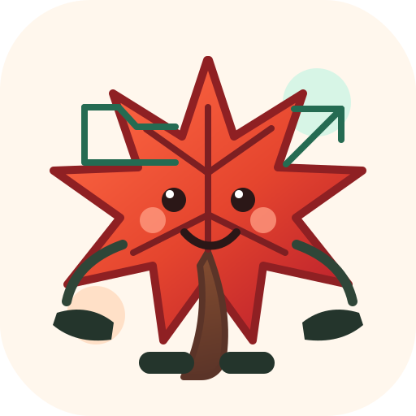
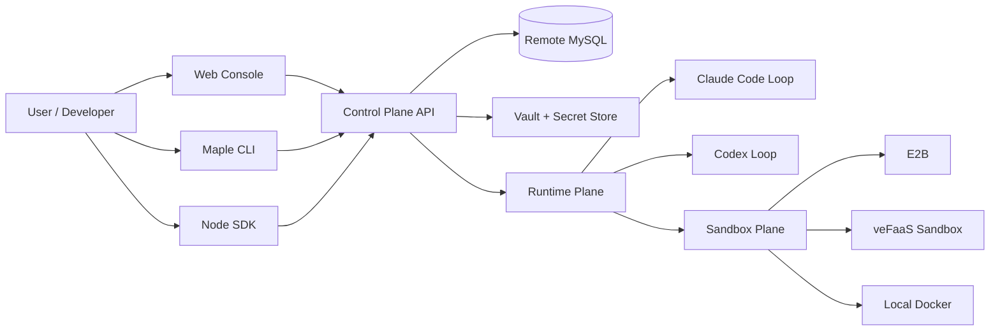
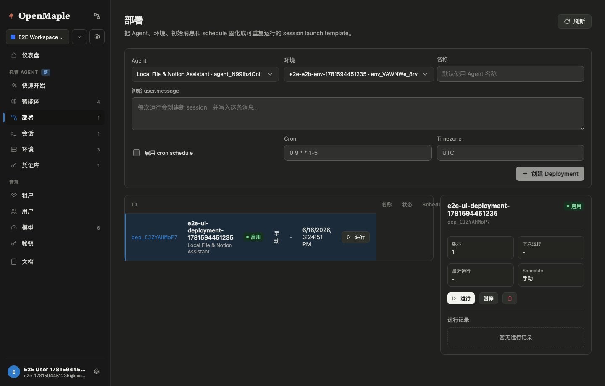
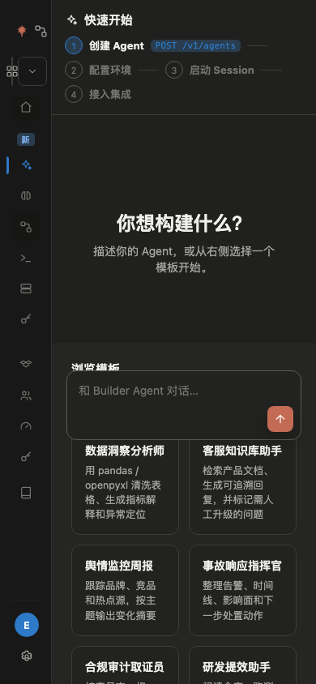

# OpenMaple

OpenMaple is an open managed agent platform. It gives teams one control plane for agents, sessions, vaults, environments, model configs, runtime providers, sandbox providers, SDKs, and CLI workflows.

OpenMaple 是开放的 managed agent 平台：用一个控制面管理 Agent、Session、Vault、Environment、模型接入点、Runtime Provider、Sandbox Provider、SDK 和 CLI。

[Website](https://dragonforce2010.github.io/openmaple/) · [Docs](https://dragonforce2010.github.io/openmaple/docs/) · [Reference README](reference/README.md) · [npm CLI](https://www.npmjs.com/package/maple-agent-cli) · [npm SDK](https://www.npmjs.com/package/maple-agent-sdk)



## What It Is

OpenMaple is built for running agents as managed cloud software, not one-off local demos.

- **Control Plane**: tenants, workspaces, agents, environments, vaults, model configs, sessions, events, API keys.
- **Runtime Plane**: agent loops through Claude Code, Codex, local runtime, and veFaaS runtime pool.
- **Sandbox Plane**: isolated tool execution through E2B, veFaaS Sandbox path, or local Docker.
- **Provider Identity**: tenant-side cloud identity for Volcengine, Alibaba Cloud, AWS, and GCP expansion.
- **Interfaces**: Web Console, REST API, `maple-agent-sdk`, and `maple-agent-cli`.

## Architecture



## Current Product Screens

These screenshots are captured from the current OpenMaple console E2E run. Legacy product-manual screenshots are not used on the public homepage.

| Desktop console | Mobile quickstart |
|---|---|
|  |  |

## Quick Deploy

Local development:

```bash
bun install
cp .env.example .env
bun run dev
```

Open:

```text
Web Console: http://127.0.0.1:5173/
API Server:  http://127.0.0.1:27951/
```

Docker Compose:

```bash
docker compose up --build
curl http://127.0.0.1:27951/health
```

## CLI

```bash
npm install -g maple-agent-cli
maple config set api.baseUrl http://127.0.0.1:27951
maple config login --api-key <maple_ws_...>
maple init --name repo-auditor --loop codex_open_source --runtime e2b --yes
maple build --project ./repo-auditor
maple deploy --project ./repo-auditor --json
```

## SDK

```bash
npm install maple-agent-sdk
```

```ts
import { MapleClient } from "maple-agent-sdk";

const client = new MapleClient({
  baseUrl: process.env.MAPLE_BASE_URL,
  apiKey: process.env.MAPLE_API_KEY
});
```

## More

- Long-form setup, provider notes, Docker details, and troubleshooting: [reference/README.md](reference/README.md)
- Architecture docs: [docs/architecture/maple-platform-overview.md](docs/architecture/maple-platform-overview.md)
- SDK/CLI onboarding: [docs/product-manual/maple-sdk-cli-onboarding.md](docs/product-manual/maple-sdk-cli-onboarding.md)
- Runtime contract: [docs/design/2026-06-04-vefaas-runtime-contract.md](docs/design/2026-06-04-vefaas-runtime-contract.md)
