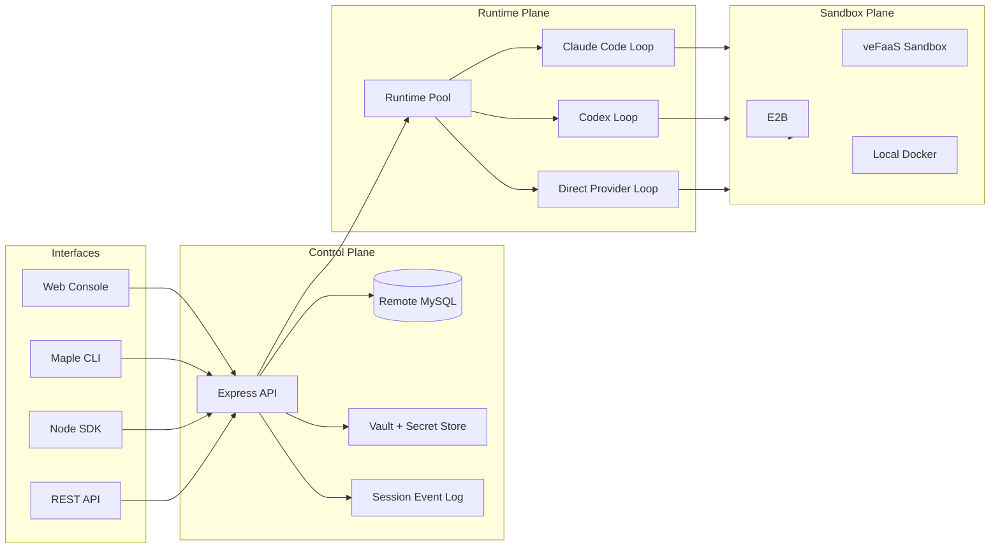

# OpenMaple

[](https://github.com/dragonforce2010/openmaple/actions/workflows/ci.yml)
[](https://github.com/dragonforce2010/openmaple/actions/workflows/pages.yml)
[](https://www.npmjs.com/package/maple-agent-sdk)
[](https://www.npmjs.com/package/maple-agent-cli)

**Open-source managed agents without cloud lock-in.**

OpenMaple is an open-source managed-agent control plane for teams that want the Anthropic Managed Agents operating model without binding their stack to one cloud. It gives you sessions, sandboxes, runtime pools, vault-backed tools, model configs, SDKs, CLIs, and audit logs behind stable interfaces.

OpenMaple 是开放的 managed agent 控制面：把 Session、Sandbox、Runtime Pool、Vault、Tool、模型接入点、SDK、CLI 和审计事件流放进同一套可二开的工程栈。

OpenMaple is not an Anthropic official product. It implements the same platform idea in an open stack: decouple the brain from the hands, persist session state, isolate computation, and keep agent harnesses replaceable.

[Website](https://dragonforce2010.github.io/openmaple/) · [Evaluation guide](EVALUATION.md) · [Provider readiness](PROVIDER_READINESS.md) · [中文 README](README.zh-CN.md) · [Roadmap](ROADMAP.md) · [Contributing](CONTRIBUTING.md) · [Support](SUPPORT.md) · [Code of Conduct](CODE_OF_CONDUCT.md) · [Security](SECURITY.md) · [Release](https://github.com/dragonforce2010/openmaple/releases/tag/v0.1.0) · [Launch discussion](https://github.com/dragonforce2010/openmaple/discussions/30) · [npm CLI](https://www.npmjs.com/package/maple-agent-cli) · [npm SDK](https://www.npmjs.com/package/maple-agent-sdk)


_Screenshots are public-safe crops from the running OpenMaple console. Workspace labels and resource IDs are omitted._

Feedback wanted: join the [launch discussion](https://github.com/dragonforce2010/openmaple/discussions/30) to challenge the resource model, provider priorities, and first proof you would need before trying OpenMaple inside an engineering team.

Evaluating for an internal platform spike? Start with the [30-minute evaluation guide](EVALUATION.md).

Prefer video first?

<a href="https://dragonforce2010.github.io/openmaple/#tour"></a>

The [2-minute OpenMaple platform tour](https://dragonforce2010.github.io/openmaple/#tour) plays on the project site and is also available on [YouTube](https://www.youtube.com/watch?v=zYhgkFomZ7M). It is built from the running console and real end-to-end screenshots.

## First Proofs

| Need to verify | Start here |
|---|---|
| It is a real product surface, not only architecture copy | [Watch the 2-minute product tour](https://dragonforce2010.github.io/openmaple/#tour) and inspect [real console screenshots](assets/screenshots/). |
| A local managed-agent path can start without cloud credentials | `docker compose up --build`, then run `npm run smoke:local` and open `http://127.0.0.1:27951/`. The default Compose path uses `local_docker` for both runtime and sandbox pools. |
| It has a coherent managed-agent model | Follow the [30-minute evaluation guide](EVALUATION.md). |
| It keeps provider claims honest | Check [provider readiness](PROVIDER_READINESS.md) before assuming an adapter is production-ready. |
| It exposes UI, API, SDK, and CLI paths | Check the [SDK](packages/sdk/), [CLI](packages/cli/), and API surface below. |

## 60-Second Read

- **For platform teams**: build a self-hostable managed-agent platform instead of wiring one-off agent demos.
- **For enterprise IT**: keep cloud identity, runtime, sandbox, storage, and model access behind replaceable provider adapters.
- **For engineering teams**: start from the web console, automate through REST, then package repeatable workflows with `maple-agent-sdk` and `maple-agent-cli`.
- **For local evaluation**: run the console, API, MySQL, local Docker runtime pool, and local Docker sandbox pool with Docker Compose before connecting cloud credentials.
- **For long-running agents**: keep session state outside the model context window and isolate tool execution from credentials.
- **For contributors**: the public repo includes the console, API, SDK, CLI, provider contracts, and deployable runtime adapters.

## Run It Locally

Start the control plane, web console, local MySQL database, and local dev login with one command:

```bash
docker compose up --build
```

Then verify and open:

```bash
npm run smoke:local
```

```text
Console: http://127.0.0.1:27951/
Health:  http://127.0.0.1:27951/health
Login:   http://127.0.0.1:27951/v1/auth/bootstrap
```

The Compose path is self-contained for local evaluation: it builds OpenMaple, starts MySQL 8, enables local dev login, and persists data in the `mysql_data` volume. It defaults both the agent runtime provider and sandbox provider to `local_docker`, mounts the host Docker socket, and prewarms runtime/sandbox pools without E2B or veFaaS credentials. OAuth/SSO providers are hidden in local Docker mode; model keys are only needed when you run real model-backed agent loops.

For host-side tests or scripts, Compose also exposes MySQL on `127.0.0.1:${MAPLE_MYSQL_HOST_PORT:-3307}`.

## Try the SDK Path

Clone the repo, fill a workspace API key plus one agent/environment pair, then run one managed-agent session through the repo SDK source:

```bash
cp examples/minimal-sdk-run/.env.example examples/minimal-sdk-run/.env
node examples/minimal-sdk-run/index.mjs
```

See [examples/minimal-sdk-run](examples/minimal-sdk-run/) for required variables and expected output.

## Why OpenMaple

Anthropic Managed Agents turns agent deployment into a platform problem: keep the model loop, tool execution, state, credentials, sandboxing, and orchestration behind stable interfaces. OpenMaple takes that operating model and makes the control plane open, self-hostable, and provider-portable.

| Managed-agent concern | OpenMaple primitive | Why it matters |
|---|---|---|
| Define what the agent is | `Agent` | Model, system prompt, tools, MCP servers, skills, and loop type are versioned as a managed resource. |
| Decide where it runs | `Environment` | Separates `AgentRuntime` from `SandboxRuntime`, so reasoning and tool execution can move independently. |
| Keep work durable | `Session` + event log | User messages, tool calls, status changes, artifacts, and failures become replayable state, not terminal scrollback. |
| Keep secrets scoped | `Vault` + `secret_ref` | Agents receive credential references instead of raw secrets; workspaces decide which vaults sessions can use. |
| Operate repeatably | `Deployment` | Persist an agent, environment, initial message, and schedule into a reusable launch template. |
| Expose stable interfaces | Console, REST API, SDK, CLI | Users can start in the UI, automate with API calls, then package repeatable workflows through `maple-agent-cli`. |

## Architecture



### Resource Lifecycle

1. **Create an agent**: `POST /v1/agents` stores the model, prompt, tools, MCP servers, skills, and loop adapter.
2. **Attach an environment**: `POST /v1/environments` chooses runtime provider, sandbox provider, networking, and runtime pool behavior.
3. **Add tool credentials**: `POST /v1/vaults/:vaultId/credentials` writes encrypted secret material and returns credential references.
4. **Start a session**: `POST /v1/sessions` binds `agent`, `environment_id`, optional `vault_ids`, resources, and metadata.
5. **Send and stream work**: `POST /v1/sessions/:sessionId/events` writes user/tool events; `GET /v1/sessions/:sessionId/events/stream` exposes the live timeline.
6. **Operate repeatably**: `POST /v1/deployments` saves the same launch path as a manual or scheduled run template.

### API Surface

| Area | Endpoints | Notes |
|---|---|---|
| Auth/bootstrap | `/v1/auth/*`, `/v1/bootstrap`, `/v1/console_snapshot` | Cookie or API-key auth; list endpoints are workspace-scoped. |
| Agents | `/v1/agents`, `/v1/agents/:agentId/versions`, `/v1/agents/:agentId/runtime` | Agent configs are versioned and runtime state is inspectable. |
| Environments | `/v1/environments`, `/v1/workspaces/:workspaceId/runtime_pool`, `/v1/workspaces/:workspaceId/sandbox_pool` | Runtime pool members provision in the background. |
| Sessions | `/v1/sessions`, `/v1/sessions/:sessionId/events`, `/v1/sessions/:sessionId/events/stream` | Durable event log for user, agent, tool, artifact, and failure records. |
| Vaults + MCP | `/v1/vaults`, `/v1/vaults/:vaultId/credentials`, `/v1/mcp_servers`, `/v1/mcp_servers/:mcpId/oauth/start` | OAuth and API-key credentials stay workspace-scoped. |
| Deployments | `/v1/deployments`, `/v1/deployments/:deploymentId/run`, `/v1/deployments/:deploymentId/invoke` | Reusable launch templates with manual and scheduled execution. |
| Files + artifacts | `/v1/files`, `/v1/sessions/:sessionId/files`, `/v1/sessions/:sessionId/artifacts` | Session file uploads and downloadable artifacts. |
| Skills + memory | `/v1/skills`, `/v1/memory_stores`, `/v1/memory_stores/:memoryStoreId/memories/*path` | Packaged instructions and workspace-scoped persistent memory. |

## What You Can Verify Today

| Claim | Evidence |
|---|---|
| Control plane is implemented | Express routes under `apps/control-plane-api/src/routes/` and typed SDK calls in `packages/sdk/`. |
| Runtime and sandbox are separate | Environment and runtime pool contracts, veFaaS/E2B/Docker provider paths, and session event streaming. |
| API, SDK, and CLI are first-class | `maple-agent-sdk`, `maple-agent-cli`, route contracts, and package tests. |
| Provider lock-in is not the model | Runtime, sandbox, storage, model, and cloud identity are represented as provider choices. |

### Runtime Boundary

- **Brain/hands split**: agent loops run through runtime adapters; commands, files, and network access run through sandbox providers.
- **Secret isolation**: secrets are stored through `secret_ref` records; agents receive references and scoped tool access, not plaintext keys in config.
- **Workspace scoping**: every list route must filter through the user's accessible workspaces. No global table scans in user-facing APIs.
- **Remote MySQL**: the data store exposes a synchronous better-sqlite3-style API, but the backing database is remote MySQL through a worker bridge.
- **Provider portability**: veFaaS, E2B, Docker, and future Lambda/FC-style runtimes can sit behind the same session contract.

## Product Surface

| Quickstart builder | Agents registry |
|---|---|
|  |  |
| Runtime environments | Credential vaults |
|  |  |

- **Quickstart**: generate an agent draft, bind an environment, attach vaults, and start a session.
- **Agents**: version agent configs, tools, MCP servers, skills, models, and loop type.
- **Deployments**: persist reusable launch templates and invoke them through API/CLI/SDK paths.
- **Sessions**: inspect transcript, event log, status, runtime metadata, files, and artifacts.
- **Environments**: configure runtime provider, sandbox provider, pool behavior, and workspace defaults.
- **Vaults**: attach credentials by reference without exposing raw secret material in API responses.

## Repository Map

```text
apps/admin-web/             React console, docs view, route sync, design system
apps/control-plane-api/     Express API, auth, storage, runtime orchestration
packages/sdk/               Node SDK: MapleClient and typed API helpers
packages/cli/               Maple CLI: init, build, deploy, api, session, vault
agents/                     Packaged agent skills and runtime-facing assets
tests/contracts/            Contract tests for docs, routes, branding, runtime behavior
```

## Local Development

```bash
bun install
cp .env.example .env
bun run dev
```

Open:

```text
Web Console: http://127.0.0.1:5173/
API Server:  http://127.0.0.1:27951/
```

Verify:

```bash
bun run typecheck
bun run lint
bun run build
```

Docker Compose:

```bash
docker compose up --build
npm run smoke:local
curl http://127.0.0.1:27951/health
curl http://127.0.0.1:27951/v1/auth/bootstrap
```

The compose stack starts the OpenMaple API/web console, local MySQL 8, local dev login, and default `local_docker` runtime/sandbox pools. It uses `MAPLE_MYSQL_PASSWORD=maple` when no password is set, keeps database files in the `mysql_data` volume, hides OAuth/SSO providers in local Docker mode, and only needs model keys when you run real model-backed agent loops.

## CLI

```bash
npm install -g maple-agent-cli
maple config set api.baseUrl http://127.0.0.1:27951
maple config login --api-key <maple_ws_...>
maple init --name repo-auditor --loop codex_open_source --runtime e2b --yes
maple build --project ./repo-auditor
maple deploy --project ./repo-auditor --json
```

## SDK

```bash
npm install maple-agent-sdk
```

```ts
import { MapleClient } from "maple-agent-sdk";

const client = new MapleClient({
  baseUrl: process.env.MAPLE_BASE_URL,
  apiKey: process.env.MAPLE_API_KEY
});

const { session, done } = await client.createSessionAndStream({
  agent: "agent_...",
  environment_id: "env_...",
  vault_ids: ["vault_..."],
  message: "Audit this repository and summarize the risky files."
});

await client.sendSessionMessage(session.id, "Focus on auth and storage code paths.");
await done;
```

## More

- Managed Agents platform pattern: [Anthropic engineering essay](https://www.anthropic.com/engineering/managed-agents)
