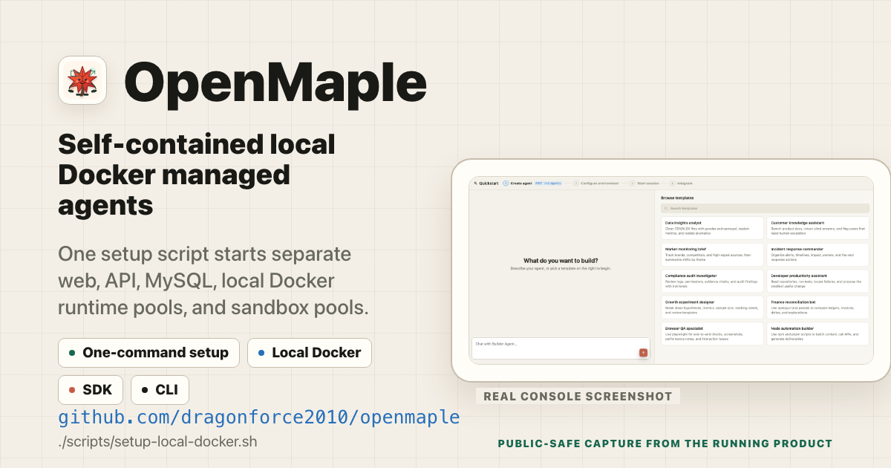
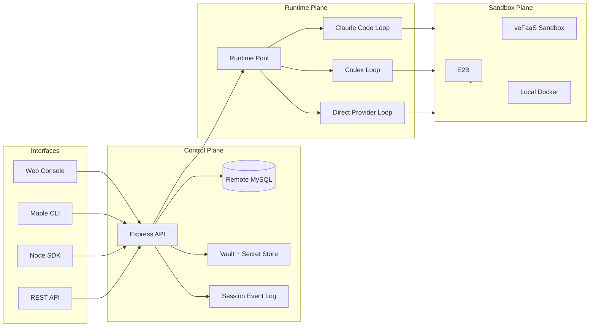

# OpenMaple

[English](README.md) · [官网](https://dragonforce2010.github.io/openmaple/) · [Evaluation guide](EVALUATION.md) · [Provider readiness](PROVIDER_READINESS.md) · [Roadmap](ROADMAP.md) · [Contributing](CONTRIBUTING.md) · [Support](SUPPORT.md) · [Code of Conduct](CODE_OF_CONDUCT.md) · [Security](SECURITY.md) · [npm CLI](https://www.npmjs.com/package/maple-agent-cli) · [npm SDK](https://www.npmjs.com/package/maple-agent-sdk) · [Latest release](https://github.com/dragonforce2010/openmaple/releases/latest) · [Launch discussion](https://github.com/dragonforce2010/openmaple/discussions/30)

**不绑定单一云厂商的开源 managed-agent 控制面。**

OpenMaple 面向想自建企业级 Agent 平台的研发团队和 IT 团队。它把 Agent 从本地 demo 升级成一套可运行、可审计、可二开的平台能力：Session、Sandbox、Runtime Pool、Vault、Tool、模型配置、REST API、SDK、CLI 和事件日志都在同一套开源工程里。

OpenMaple 不是 Anthropic 官方产品。它实现的是类似 Managed Agents 的平台思想：把“负责思考的 AgentRuntime”和“负责执行工具的 SandboxRuntime”分开，把状态持久化，把凭证隔离，把运行时、沙箱、存储和模型接入层做成可替换 provider。


_截图来自正在运行的 OpenMaple 控制台。公开版本已裁掉 workspace 标签和资源 ID。_

欢迎在 [launch discussion](https://github.com/dragonforce2010/openmaple/discussions/30) 里直接挑战资源模型、provider 优先级，以及一个企业工程团队试用前最需要看到的证据。

最快试用路径：本机运行 `./scripts/setup-local-docker.sh`，或打开 [GitHub Codespaces](https://codespaces.new/dragonforce2010/openmaple?quickstart=1) 后运行同一个 setup 命令。你会得到 `http://127.0.0.1:8080/` 上的 Web Console、API、MySQL、本地开发登录、本地 Docker runtime pool 和本地 Docker sandbox pool；默认路径不需要 E2B、veFaaS 或 OAuth 凭证。只有运行真实模型驱动的 loop 时才需要模型 key。

如果你在做内部平台评估，先看 [30-minute evaluation guide](EVALUATION.md)。

想先看视频：

<a href="https://dragonforce2010.github.io/openmaple/#tour"></a>

[2 分钟 OpenMaple 平台总览](https://dragonforce2010.github.io/openmaple/#tour) 可以在项目官网直接播放，也可以在 [YouTube](https://www.youtube.com/watch?v=zYhgkFomZ7M) 观看，素材来自真实运行的控制台和端到端截图。

## 第一批证据

| 需要验证什么 | 从哪里开始 |
|---|---|
| 它是真实产品界面，不只是架构文案 | 看 [2 分钟产品视频](https://dragonforce2010.github.io/openmaple/#tour)，再检查 [真实控制台截图](assets/screenshots/)。 |
| 本地 managed-agent 路径不需要云凭证也能启动 | 运行 `./scripts/setup-local-docker.sh`，打开 `http://127.0.0.1:8080/`。本地栈的 runtime pool 和 sandbox pool 都使用 `local_docker`。 |
| 它有一致的 managed-agent 资源模型 | 按 [30-minute evaluation guide](EVALUATION.md) 走一遍。 |
| 它没有夸大 provider 能力 | 看 [provider readiness](PROVIDER_READINESS.md)，先确认哪些 adapter 已实现、哪些只是配置入口。 |
| 它同时暴露 UI、API、SDK、CLI 路径 | 看 [SDK](packages/sdk/)、[CLI](packages/cli/) 和下面的 API/架构说明。 |

## 为什么值得看

- **给平台团队**：不是一个单点 Agent demo，而是一套可自托管的 managed-agent 平台骨架。
- **给企业 IT / 工程部门**：运行时、沙箱、存储、模型和云身份都通过 provider 适配，不把平台锁死在单一云厂商。
- **给 Agent 工程团队**：可以先用控制台跑通，再用 REST API、`maple-agent-sdk`、`maple-agent-cli` 自动化重复流程。
- **给本地评估**：先用 Docker Compose 拉起 Console、API、MySQL、本地 Docker runtime pool 和本地 Docker sandbox pool，再接云凭证。
- **给长任务 Agent**：Session 状态、事件流、工具调用、文件和产物都沉淀在控制面，而不是散落在终端输出里。
- **给二开团队**：公共仓库包含 Console、API、SDK、CLI、provider contract 和可部署 runtime adapter。

## 本地跑起来

一个命令启动控制面、Web 控制台、本地 MySQL 和本地开发登录：

```bash
./scripts/setup-local-docker.sh
```

脚本会检查 Docker，在 macOS 上尽量自动安装缺失组件，生成 `.env.local`，启动服务，等待健康检查，并返回访问地址。

```text
Web console: http://127.0.0.1:8080/
Local login:  http://127.0.0.1:8080/?dev_login=1
API health:   http://127.0.0.1:27951/health
```

本地栈对评估是自包含的：它会构建 OpenMaple，启动独立的 `web`、`api`、`mysql` 服务，打开本地开发登录，并把数据保存在 `mysql_data` volume。默认 runtime provider 和 sandbox provider 都是 `local_docker`，API 服务会挂载宿主机 Docker socket，并初始化 runtime/sandbox 池，不需要 E2B 或 veFaaS 凭证。本地 Docker 模式隐藏 OAuth/SSO 登录；只有运行真实模型驱动的 agent loop 时才需要模型 key。

Local Docker 模式默认模型池为空，也不会隐式读取宿主机 provider key。需要显示默认模型时，复制 `config/local-model.example.json` 到 `config/local-model.json`，填写 `base_url`、`model_name` 和 `api_key_env` 后重新运行 setup。除非显式设置 `MAPLE_SEED_DEFAULT_MODELS=true`，本地 Docker 模式不会自动写入 VolcoEngine 预置模型。

可选测试数据在 `docker/local-demo-data.sql`。运行 setup 前设置 `MAPLE_SEED_DEMO_DATA=true`，或写入 `.env.local`，即可导入 2 个测试租户、测试用户、测试 Agent、runtime/sandbox pool 记录和测试 session。

需要从宿主机跑测试或脚本时，本地栈也会把 API 暴露到 `127.0.0.1:27951`，把 MySQL 暴露到 `127.0.0.1:${MAPLE_MYSQL_HOST_PORT:-3307}`。

本机没有 Docker 环境时，可以直接打开 [GitHub Codespaces](https://codespaces.new/dragonforce2010/openmaple?quickstart=1)，等待 devcontainer 初始化完成后运行 `./scripts/setup-local-docker.sh` 和 `npm run smoke:local`。Codespaces 会转发 Web Console 和 API 端口。

## 先跑一个 SDK 路径

clone repo 后，填一个 workspace API key，再填一组 agent/environment，就能用仓库里的 SDK 源码跑一轮 managed-agent session：

```bash
cp examples/minimal-sdk-run/.env.example examples/minimal-sdk-run/.env
node examples/minimal-sdk-run/index.mjs
```

变量说明和预期输出见 [examples/minimal-sdk-run](examples/minimal-sdk-run/)。

## 它解决什么问题

| managed-agent 问题 | OpenMaple 抽象 | 价值 |
|---|---|---|
| Agent 到底是什么 | `Agent` | 把模型、系统提示词、工具、MCP server、skills、loop type 作为可版本化资源管理。 |
| Agent 在哪里运行 | `Environment` | 拆开 `AgentRuntime` 和 `SandboxRuntime`，推理循环和工具执行环境可以独立迁移。 |
| 长任务如何持久化 | `Session` + event log | 用户消息、模型增量、工具调用、状态变化、产物和错误都进入可追踪事件流。 |
| 凭证如何隔离 | `Vault` + `secret_ref` | Agent 使用凭证引用，不直接持有明文 secret；workspace 决定可用 vault。 |
| 如何重复运行 | `Deployment` | 把 agent、environment、初始消息和调度配置固化成可复用启动模板。 |
| 如何接入系统 | Console、REST API、SDK、CLI | UI、API、SDK、CLI 使用同一套资源模型。 |

## 产品界面

| Quickstart builder | Agent registry |
|---|---|
|  |  |
| Runtime environments | Credential vaults |
|  |  |

## 架构视角



## 本地运行

```bash
bun install
bun run dev
```

打开：

```text
Web Console: http://127.0.0.1:8080/
API Server:  http://127.0.0.1:27951/
```

验证：

```bash
bun run typecheck
bun run lint
bun run build
```

本地 Docker 栈会启动独立的 OpenMaple Web、API、本地 MySQL 8 和本地开发登录：

```bash
./scripts/setup-local-docker.sh
npm run smoke:local -- --base http://127.0.0.1:27951
curl http://127.0.0.1:27951/health
curl http://127.0.0.1:8080/health
```

未设置密码时，本地栈默认使用 `MAPLE_MYSQL_PASSWORD=maple`，数据库文件保存在 `mysql_data` volume。`.env.example` 只保留 local Docker 设置和可选模型 key；OAuth、veFaaS、TOS、E2B、MCP client 这类线上变量不会污染默认本地配置。

## CLI

```bash
npm install -g maple-agent-cli
maple config set api.baseUrl http://127.0.0.1:27951
maple config login --api-key <maple_ws_...>
maple init --name repo-auditor --loop codex_open_source --runtime e2b --yes
maple build --project ./repo-auditor
maple deploy --project ./repo-auditor --json
```

## SDK

```bash
npm install maple-agent-sdk
```

```ts
import { MapleClient } from "maple-agent-sdk";

const client = new MapleClient({
  baseUrl: process.env.MAPLE_BASE_URL,
  apiKey: process.env.MAPLE_API_KEY
});

const { session, done } = await client.createSessionAndStream({
  agent: "agent_...",
  environment_id: "env_...",
  vault_ids: ["vault_..."],
  message: "Audit this repository and summarize the risky files."
});

await client.sendSessionMessage(session.id, "Focus on auth and storage code paths.");
await done;
```

## 适合谁

- 想自建企业级 Agent 平台，但不想从零写 control plane 的团队。
- 想评估 Anthropic Managed Agents 思想，但需要开源、可二开、可自托管实现的团队。
- 想把 Claude Code / Codex / 自定义 Agent loop 接入统一 Session、Sandbox、Vault、Runtime Pool 的团队。
- 想避免 provider lock-in，把运行时和沙箱迁移能力留在平台层的团队。

如果这个方向对你有价值，可以 star 这个 repo。star 是这个项目继续公开打磨文档、示例和 provider adapter 的最直接信号。
