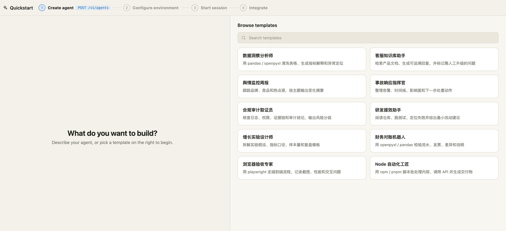
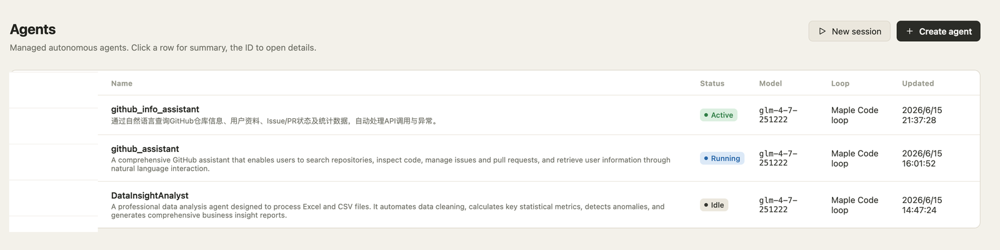
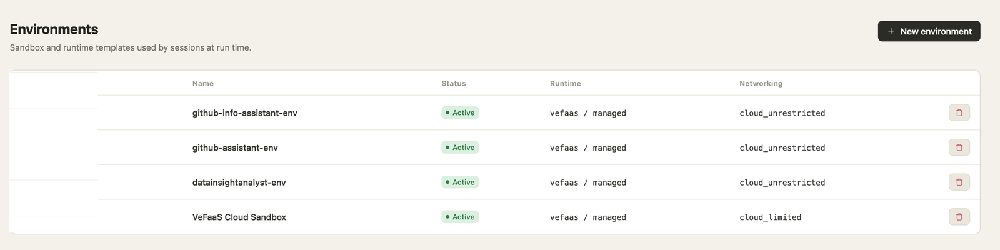
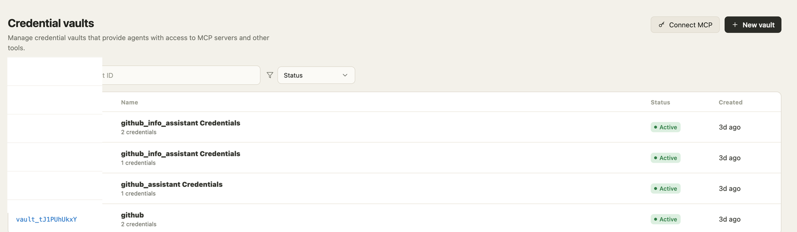
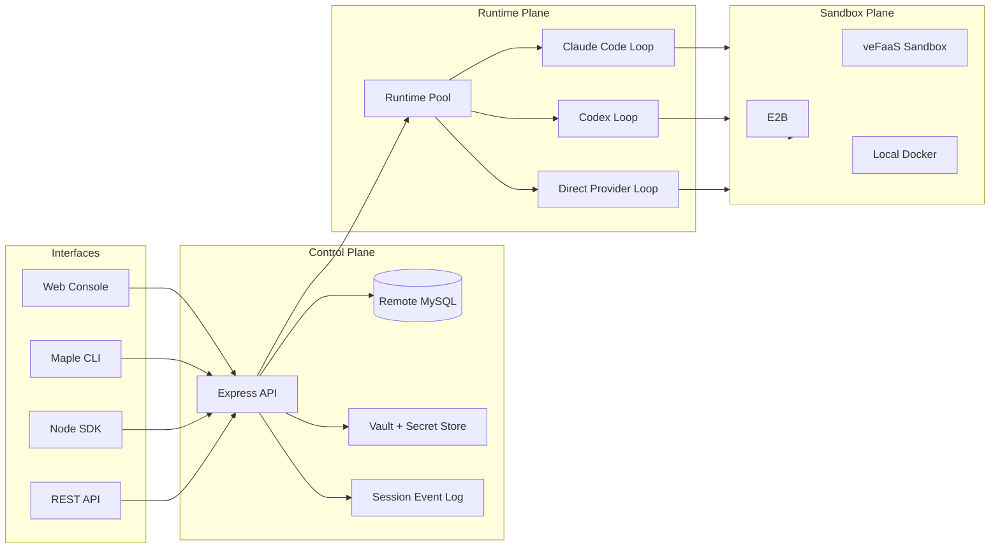

# OpenMaple

[English](README.md) · [官网](https://dragonforce2010.github.io/openmaple/) · [Roadmap](ROADMAP.md) · [Contributing](CONTRIBUTING.md) · [Support](SUPPORT.md) · [Code of Conduct](CODE_OF_CONDUCT.md) · [Security](SECURITY.md) · [npm CLI](https://www.npmjs.com/package/maple-agent-cli) · [npm SDK](https://www.npmjs.com/package/maple-agent-sdk) · [v0.1.0 Release](https://github.com/dragonforce2010/openmaple/releases/tag/v0.1.0)

**不绑定单一云厂商的开源 managed-agent 控制面。**

OpenMaple 面向想自建企业级 Agent 平台的研发团队和 IT 团队。它把 Agent 从本地 demo 升级成一套可运行、可审计、可二开的平台能力：Session、Sandbox、Runtime Pool、Vault、Tool、模型配置、REST API、SDK、CLI 和事件日志都在同一套开源工程里。

OpenMaple 不是 Anthropic 官方产品。它实现的是类似 Managed Agents 的平台思想：把“负责思考的 AgentRuntime”和“负责执行工具的 SandboxRuntime”分开，把状态持久化，把凭证隔离，把运行时、沙箱、存储和模型接入层做成可替换 provider。



_截图来自正在运行的 OpenMaple 控制台。公开版本已裁掉 workspace 标签和资源 ID。_

## 为什么值得看

- **给平台团队**：不是一个单点 Agent demo，而是一套可自托管的 managed-agent 平台骨架。
- **给企业 IT / 工程部门**：运行时、沙箱、存储、模型和云身份都通过 provider 适配，不把平台锁死在单一云厂商。
- **给 Agent 工程团队**：可以先用控制台跑通，再用 REST API、`maple-agent-sdk`、`maple-agent-cli` 自动化重复流程。
- **给长任务 Agent**：Session 状态、事件流、工具调用、文件和产物都沉淀在控制面，而不是散落在终端输出里。
- **给二开团队**：公共仓库包含 Console、API、SDK、CLI、provider contract 和可部署 runtime adapter。

## 先跑一个 SDK 路径

clone repo 后，填一个 workspace API key，再填一组 agent/environment，就能用仓库里的 SDK 源码跑一轮 managed-agent session：

```bash
cp examples/minimal-sdk-run/.env.example examples/minimal-sdk-run/.env
node examples/minimal-sdk-run/index.mjs
```

变量说明和预期输出见 [examples/minimal-sdk-run](examples/minimal-sdk-run/)。

## 它解决什么问题

| managed-agent 问题 | OpenMaple 抽象 | 价值 |
|---|---|---|
| Agent 到底是什么 | `Agent` | 把模型、系统提示词、工具、MCP server、skills、loop type 作为可版本化资源管理。 |
| Agent 在哪里运行 | `Environment` | 拆开 `AgentRuntime` 和 `SandboxRuntime`，推理循环和工具执行环境可以独立迁移。 |
| 长任务如何持久化 | `Session` + event log | 用户消息、模型增量、工具调用、状态变化、产物和错误都进入可追踪事件流。 |
| 凭证如何隔离 | `Vault` + `secret_ref` | Agent 使用凭证引用，不直接持有明文 secret；workspace 决定可用 vault。 |
| 如何重复运行 | `Deployment` | 把 agent、environment、初始消息和调度配置固化成可复用启动模板。 |
| 如何接入系统 | Console、REST API、SDK、CLI | UI、API、SDK、CLI 使用同一套资源模型。 |

## 产品界面

| Quickstart builder | Agent registry |
|---|---|
|  |  |
| Runtime environments | Credential vaults |
|  |  |

## 架构视角



## 本地运行

```bash
bun install
cp .env.example .env
bun run dev
```

打开：

```text
Web Console: http://127.0.0.1:5173/
API Server:  http://127.0.0.1:27951/
```

验证：

```bash
bun run typecheck
bun run lint
bun run build
```

Docker Compose 会同时启动 OpenMaple API/Web 控制台和本地 MySQL 8：

```bash
docker compose up --build
curl http://127.0.0.1:27951/health
curl http://127.0.0.1:27951/v1/auth/bootstrap
```

未设置密码时，compose 默认使用 `MAPLE_MYSQL_PASSWORD=maple`，数据库文件保存在 `mysql_data` volume，并为 demo 容器打开本地开发登录。

## CLI

```bash
npm install -g maple-agent-cli
maple config set api.baseUrl http://127.0.0.1:27951
maple config login --api-key <maple_ws_...>
maple init --name repo-auditor --loop codex_open_source --runtime e2b --yes
maple build --project ./repo-auditor
maple deploy --project ./repo-auditor --json
```

## SDK

```bash
npm install maple-agent-sdk
```

```ts
import { MapleClient } from "maple-agent-sdk";

const client = new MapleClient({
  baseUrl: process.env.MAPLE_BASE_URL,
  apiKey: process.env.MAPLE_API_KEY
});

const { session, done } = await client.createSessionAndStream({
  agent: "agent_...",
  environment_id: "env_...",
  vault_ids: ["vault_..."],
  message: "Audit this repository and summarize the risky files."
});

await client.sendSessionMessage(session.id, "Focus on auth and storage code paths.");
await done;
```

## 适合谁

- 想自建企业级 Agent 平台，但不想从零写 control plane 的团队。
- 想评估 Anthropic Managed Agents 思想，但需要开源、可二开、可自托管实现的团队。
- 想把 Claude Code / Codex / 自定义 Agent loop 接入统一 Session、Sandbox、Vault、Runtime Pool 的团队。
- 想避免 provider lock-in，把运行时和沙箱迁移能力留在平台层的团队。

如果这个方向对你有价值，可以 star 这个 repo。star 是这个项目继续公开打磨文档、示例和 provider adapter 的最直接信号。
