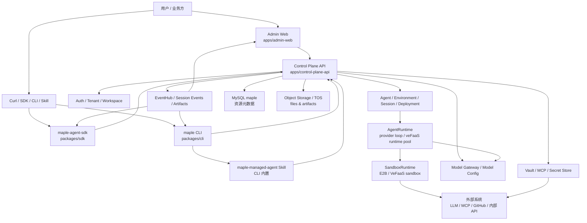
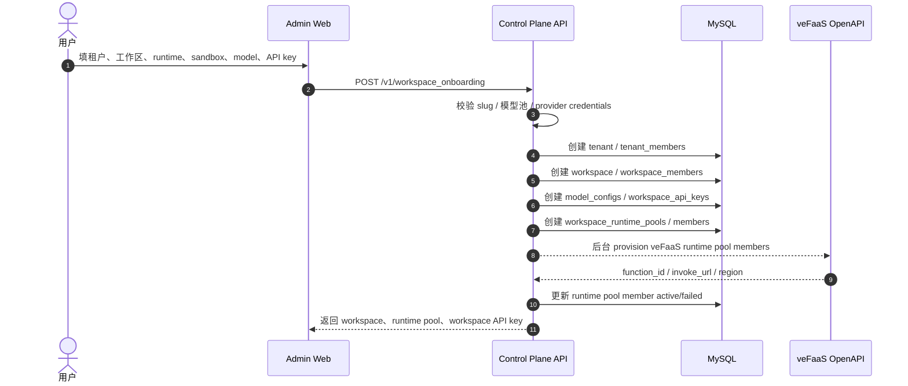
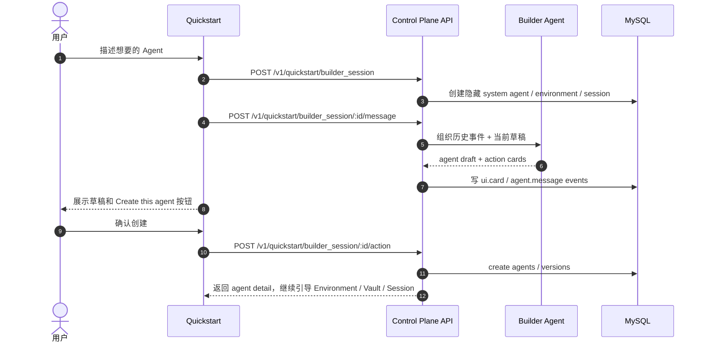
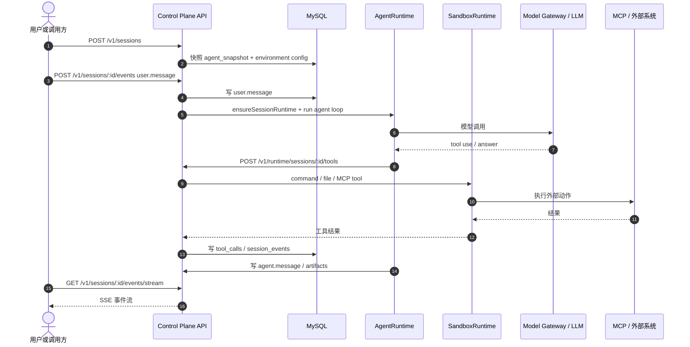
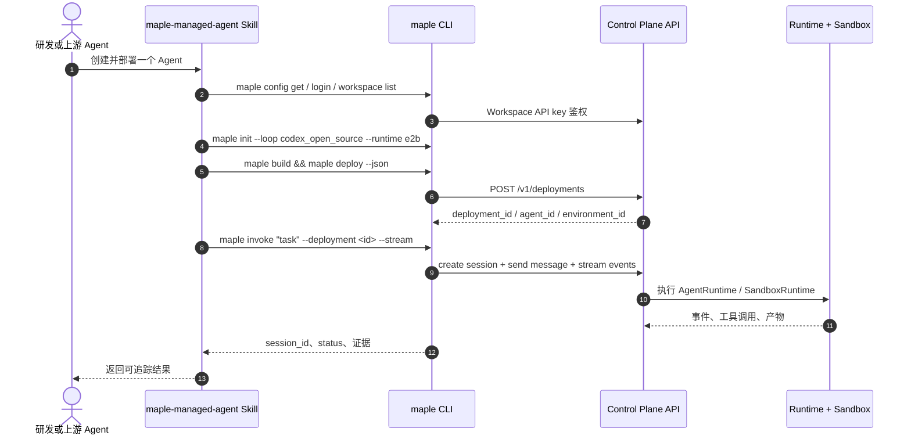
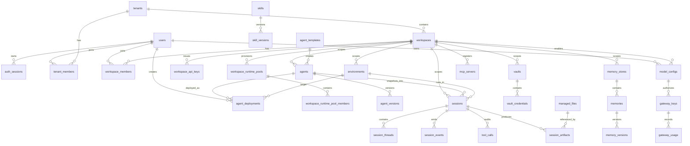
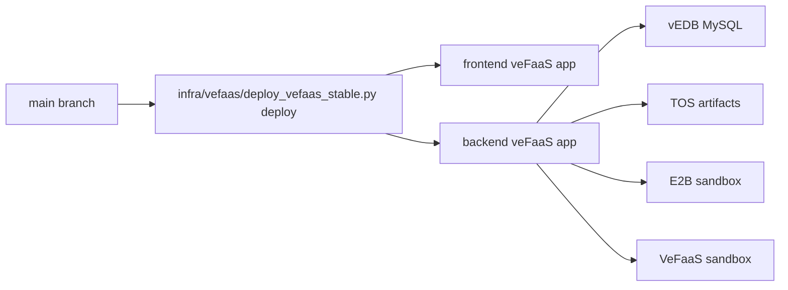

# Maple 平台架构设计说明

> 版本：2026-06-10，基于 `main` 当前实现。目标读者：业务接入方、平台研发、Agent 研发、运维同学。

## 1. 一句话

Maple 是一个托管 Agent 控制面：用户在控制台或 API 里创建 Agent、配置运行环境和凭证，平台把 Agent Loop 调度到 AgentRuntime，把命令执行、文件读写、MCP 工具调用隔离到 Sandbox，再把 session 事件、工具调用、产物、AskMaple 分析沉淀回来。

核心理念：

- 控制面统一：租户、工作区、Agent、Environment、Vault、Model、Session、Skill 都走一套 API 和权限模型。
- 运行时可插拔：AgentRuntime 负责跑 Agent Loop；Sandbox 负责跑工具和文件操作。两者拆开，生产上可组合 `vefaas runtime + e2b sandbox` 或 `vefaas runtime + vefaas sandbox`。
- 凭证不出域：Vault/MCP/OAuth/API key 只保存密文或 secret 引用，API 响应只给 hint。
- 事件即事实：所有会话都沉淀 `session_events`、`tool_calls`、`session_artifacts`，控制台、SDK、CLI、Skill 都看同一条事件流。
- 多入口同语义：Web Console、REST API、SDK、CLI、AI Skill 都是同一套 Control Plane 的不同入口。

## 2. 总体架构



这张图有三层：

- 入口层：Admin Web 给人用；REST/SDK/CLI 给系统和自动化用；Skill 给其他 Agent 用。
- 控制面层：只做资源管理、权限、配置归一化、事件写入、密钥引用，不直接把用户任务硬编码进服务。
- 执行层：AgentRuntime 跑 Agent Loop；SandboxRuntime 跑工具。执行过程中不断把事件回写控制面。

## 3. Monorepo 包结构

```text
.
├── apps/
│   ├── admin-web/              # React 控制台
│   └── control-plane-api/      # Express Control Plane API
├── agents/
│   └── super-agent/            # Builder Agent / Quickstart 系统 Agent 能力
├── packages/
│   ├── chat-kit/               # 会话事件和角色归一化
│   ├── components/             # 平台通用前端组件出口
│   ├── sdk/                    # Node/TypeScript SDK
│   ├── cli/                    # Go Maple CLI + 内置 Skill
│   ├── runtime-core/           # AgentRuntime provider 抽象
│   ├── runtime-vefaas/         # veFaaS AgentRuntime provider 包
│   ├── sandbox-core/           # Sandbox provider 抽象
│   ├── sandbox-e2b/            # E2B Sandbox provider 包
│   └── sandbox-vefaas/         # VeFaaS Sandbox provider 包
├── infra/
│   └── vefaas/                 # 云端部署与 runtime 模板
├── tests/
│   ├── contracts/              # API/SDK/CLI/文档/运行时契约
│   └── e2e/                    # 端到端用户链路
└── docs/
```

`apps/*` 是可部署服务；`packages/*` 是可复用库或工具；`agents/*` 是平台内置系统 Agent。这样前端、后端、Go CLI、运行时抽象可以在一个仓库里统一演进，但每个包仍保留自己的边界。

## 4. 核心组件

### 4.1 Admin Web

路径：`apps/admin-web`

职责：

- 登录、租户选择、工作区选择。
- 首次开通：租户、工作区、veFaaS runtime pool、sandbox provider、模型池、workspace API key。
- Agent 管理：创建、查看版本、选择 agent_loop。
- Environment 管理：绑定 sandbox provider 和运行参数。
- Session 管理：对话、事件、debug、AskMaple、产物。
- Vault/MCP：凭证库、OAuth 启动、MCP 目录。
- 管理页：Users、Models、API Keys、Docs、Usage。

当前导航主线来自 `apps/admin-web/src/config/navigation.ts`：

| 组 | 页面 |
|---|---|
| 首页 | Dashboard |
| 托管 Agent | Quickstart, Agents, Sessions, Environments, Vaults |
| 管理 | Tenant, Users, Models, API Keys |
| 文档 | Docs |

### 4.2 Control Plane API

路径：`apps/control-plane-api`

职责：

- 认证：`/v1/auth/*`，支持 local/OAuth/OIDC/Lark SSO/ByteSSO 形态。
- 租户/工作区：`/v1/workspace_onboarding`、`/v1/workspaces/*`、members/admins/API keys。
- Agent/Environment：`/v1/agents`、`/v1/environments`。
- Session：`/v1/sessions`、`/events`、`/events/stream`、AskMaple。
- Vault/MCP：`/v1/vaults`、`/v1/mcp_catalog`、`/v1/mcp_servers`、OAuth callback。
- Model：`/v1/model_configs`、模型测试。
- Memory/Skill/Template/File/Artifact/Deployment。
- Runtime bridge：`/v1/runtime/sessions/:sessionId/tools`，给外部 AgentRuntime 回调控制面工具能力。

服务端按模块拆分：

```text
src/
├── routes/        # HTTP route
├── runtime/       # AgentRuntime / SandboxRuntime / runner
├── storage/       # store + schema + hydrator + workspace provisioning
├── agents/        # Builder Agent / AskMaple
├── files/         # managed files + session artifacts + object storage
├── catalog/       # model gateway + MCP catalog
├── auth/          # auth/session provider
├── skills/        # skill files and writer
└── infra/         # env/mysql/paths/secrets
```

### 4.3 AgentRuntime

AgentRuntime 是“跑脑子”的地方，负责执行 Agent Loop：

- 读取 session 的 agent snapshot。
- 绑定模型配置和工具清单。
- 调用 LLM / Claude Code / Codex-style agent loop。
- 需要工具时，通过 runtime tool bridge 回到 Control Plane。
- 把 `agent.message`、`tool.call`、`error` 等事件写回 session。

当前核心路径：

- 抽象：`packages/runtime-core`
- veFaaS 包：`packages/runtime-vefaas`
- 服务端适配：`apps/control-plane-api/src/runtime/vefaasAgentRuntime.ts`
- 调度入口：`apps/control-plane-api/src/runtime/runtimeManager.ts`

生产推荐：工作区开通时创建 veFaaS runtime pool。pool 成员记录在 `workspace_runtime_pools` / `workspace_runtime_pool_members`，session 启动时选择可用 runtime 成员执行 Agent Loop。

### 4.4 SandboxRuntime

SandboxRuntime 是“跑工具”的地方，负责隔离命令、文件、包安装、MCP 工具副作用：

- E2B sandbox：适合云端隔离 workspace、命令执行、文件读写。
- VeFaaS sandbox：适合内部云统一基建，接口与 E2B 对齐，开通时配置 function id 和 gateway url。

当前核心路径：

- 抽象：`packages/sandbox-core`
- E2B 包：`packages/sandbox-e2b`
- VeFaaS 包：`packages/sandbox-vefaas`
- 服务端适配：`apps/control-plane-api/src/runtime/e2bRuntime.ts`
- 服务端适配：`apps/control-plane-api/src/runtime/vefaasSandboxRuntime.ts`

AgentRuntime 和 SandboxRuntime 不混在一起：AgentRuntime 可以跑在 veFaaS，工具 sandbox 可以是 E2B 或 veFaaS。这让平台可以独立替换“Agent Loop 执行位置”和“工具隔离环境”。

### 4.5 Environment

Environment 是 session 的运行环境快照：

- 选择 sandbox provider：`e2b` 或 `vefaas`。
- 携带 sandbox 配置：workspace path、timeout、envs、provider-specific config。
- 可携带 agent_runtime override，但生产主路径由 workspace runtime pool 管。

创建 session 时，平台把 Agent 当前版本和 Environment 当前配置一起快照到 session。后续 Agent 或 Environment 改了，不影响已存在 session 的可追溯性。

### 4.6 Vault / MCP / Secret

Vault 是凭证库；MCP Server 是工具入口。两者共同解决“Agent 要干活，但不能拿明文密钥到处跑”的问题。

- `vaults` 保存凭证库元信息。
- `vault_credentials` 保存凭证项，明文进入 secret store，表里只留 `secret_ref`、hint、metadata。
- `mcp_servers` 保存 MCP endpoint、provider、auth_type。
- OAuth 流程通过 `/oauth/start` 和 callback 绑定 credential。

Agent 执行时只拿到可用工具和授权上下文，不直接暴露 API key 原文。

### 4.7 Builder Agent

Builder Agent 是 Quickstart 背后的系统 Agent：

- 用户输入自然语言需求。
- 平台创建隐藏的 system session。
- Builder Agent 根据需求生成 agent draft。
- 用户确认后，平台创建 Agent、引导选择或创建 Environment/Vault，再启动 session。

核心路径：

- `agents/super-agent`
- `apps/control-plane-api/src/agents/builderAgent.ts`
- `apps/admin-web/src/pages/quickstart`

它的价值不是“生成一段配置”，而是把新用户从“想法”带到“可运行 Agent + 可观察 session”。

### 4.8 AskMaple

AskMaple 是 session 内的上下文问答助手：

- 读取 session detail、事件、tool calls、artifacts、错误。
- 回答“这个 Agent 现在在干什么”“失败原因是什么”“下一步怎么处理”。
- 控制台按钮和 CLI `maple session ask` 走同一能力。

核心路径：

- `apps/control-plane-api/src/agents/askMapleAgent.ts`
- `apps/admin-web/src/pages/sessions/AskMapleDrawer.tsx`

### 4.9 API / SDK / CLI / Skill

四个入口同源：

| 入口 | 适用人群 | 典型动作 |
|---|---|---|
| REST API | 后端服务、平台集成 | 创建 Agent、Session、Environment，拉事件流 |
| SDK | Node/TypeScript 应用 | `createSession`、`sendSessionMessage`、`streamSessionEvents` |
| CLI | 研发、CI、自动化 | `maple init/build/deploy/invoke/status` |
| Skill | 其他 AI Agent | 让 Codex/Claude/Cursor 通过 `maple` 操作 Maple |

CLI 是 Go 实现，包名 `maple-agent-cli`，内置 `maple-managed-agent` Skill。Skill 的职责是告诉其他 Agent：先检查登录、再创建/部署/调用、最后返回 `session_id`、`deployment_id`、事件证据。

## 5. 核心流程时序图

### 5.1 租户开通



开通节点里的 sandbox 配置在 runtime 之后。E2B 需要 `E2B_API_KEY`；VeFaaS sandbox 需要 `VEFAAS_SANDBOX_FUNCTION_ID` 和 `VEFAAS_SANDBOX_GATEWAY_URL`，AK/SK/region 复用 veFaaS provider credentials。

### 5.2 Builder Agent 创建 Agent



### 5.3 Session 执行



### 5.4 CLI / Skill 自动化



## 6. ER 视图

这是产品视角的逻辑 ER 图，突出资源关系。实际 DDL 由 `apps/control-plane-api/src/storage/storeSchema.ts` 和迁移补列共同维护。



关键数据设计：

- `tenants` 和 `workspaces` 定义资源边界。
- `tenant_members` 和 `workspace_members` 分别表达租户管理权和工作区访问权。
- `workspace_api_keys` 是自动化接入的主要身份，key hash 入库，完整 key 只在创建响应出现。
- `agents` 保存当前定义，`agent_versions` 保存 append-only 版本快照。
- `sessions` 保存一次运行的 agent/environment 快照；事件、工具调用、产物都挂在 session 下。
- `workspace_runtime_pools` 和 members 描述 veFaaS runtime pool 的目标容量和实际函数实例。
- `vault_credentials` 只保存 secret 引用，不保存明文。

## 7. API 视图

高频 API：

| 能力 | Endpoint |
|---|---|
| 平台版本 | `GET /v1/platform/version` |
| 当前用户 | `GET /v1/auth/me` |
| 开通状态 | `GET /v1/workspace_onboarding/status` |
| 首次开通 | `POST /v1/workspace_onboarding` |
| 工作区 | `GET/POST/PATCH /v1/workspaces` |
| 成员和管理员 | `POST /v1/workspaces/:workspaceId/members`, `POST /v1/workspaces/:workspaceId/admins` |
| Runtime pool | `GET /v1/workspaces/:workspaceId/runtime_pool` |
| API Key | `POST /v1/workspaces/:workspaceId/api_keys` |
| Agent | `GET/POST/PATCH /v1/agents` |
| Agent runtime | `GET /v1/agents/:agentId/runtime` |
| Environment | `GET/POST/PATCH /v1/environments` |
| Session | `GET/POST /v1/sessions`, `GET /v1/sessions/:sessionId/detail` |
| 事件流 | `POST /v1/sessions/:sessionId/events`, `GET /v1/sessions/:sessionId/events/stream` |
| AskMaple | `POST /v1/ask_maple/sessions/:sessionId/message` |
| Vault | `GET/POST /v1/vaults`, `POST /v1/vaults/:vaultId/credentials` |
| MCP | `GET /v1/mcp_catalog`, `POST /v1/mcp_servers`, OAuth start/callback |
| Model | `GET/POST /v1/model_configs`, `POST /v1/model_configs/:id/test` |
| Skill | `GET/POST/PATCH /v1/skills`, `GET/PUT /v1/skills/:skillId/files/*` |
| Deployment | `GET/POST /v1/deployments`, `POST /v1/deployments/:deploymentId/invoke` |

鉴权：

- Web 登录态：`Cookie: maple_session=...`
- 自动化：`X-Maple-API-Key: maple_ws_...`
- 兼容 bearer：`Authorization: Bearer ...`

## 8. 部署和运行

当前生产链路：



稳定部署验收口径：

- 前端健康：`/`
- 后端健康：`/health`
- Provider 配置：`/v1/auth/providers`
- 核心 E2E：workspace onboarding、runtime pool、Builder Agent、template/API agent、session、AskMaple、artifact、SDK、CLI、Skill、真实 E2B sandbox。

最近一次稳定部署验证：

- Stable URL：`https://sd8ihq8v316pc5mf9c1j0.apigateway-cn-beijing.volceapi.com`
- frontend revision：`21`
- backend revision：`22`
- full E2E：通过

## 9. 扩展点

| 扩展点 | 新增位置 | 要补的契约 |
|---|---|---|
| 新 AgentRuntime provider | `packages/runtime-*` + `apps/control-plane-api/src/runtime/*AgentRuntime.ts` | `ensure`, invoke, timeout, event bridge |
| 新 Sandbox provider | `packages/sandbox-*` + `apps/control-plane-api/src/runtime/*Runtime.ts` | command/file/read/write/pause/terminate |
| 新 Agent Loop | `apps/control-plane-api/src/runtime/agentLoops.ts` | loop type、config、driver |
| 新 MCP provider | `catalog/mcpCatalog.ts` + MCP routes | auth_type、OAuth start/callback、tool schema |
| 新前端页面 | `apps/admin-web/src/pages/*` + navigation | bootstrap data、权限、空态、错误态 |
| 新 CLI 命令 | `packages/cli/cmd/*` | JSON output、raw API fallback、contract test |
| 新 Skill | `packages/cli/skills/*` | SKILL.md frontmatter、commands reference、deploy-run 验证 |

## 10. 设计取舍

- Runtime 和 Sandbox 分离：让 Agent Loop 扩缩容与工具隔离分别演进。
- Environment 做运行快照：保证历史 session 可复盘，避免 Agent 配置漂移影响旧 session。
- API/SDK/CLI/Skill 同源：减少“控制台能做但自动化不能做”的断层。
- Builder Agent 前置：降低接入门槛，让业务方先跑通闭环，再调细节。
- AskMaple 内置：把 session debug 变成产品能力，而不是让用户翻原始日志。

## 11. 风险和后续

- schema 仍有历史兼容字段，新增功能应优先用 workspace/tenant scope，不再引入全局游离资源。
- VeFaaS sandbox 接入要继续补真实 pause/resume 策略、超时、清理和用量审计。
- Model Gateway、Usage、Logs 页需要继续和真实计费/观测数据打通。
- README 里仍有早期本地优先描述，后续应统一成当前云端稳定链路。
