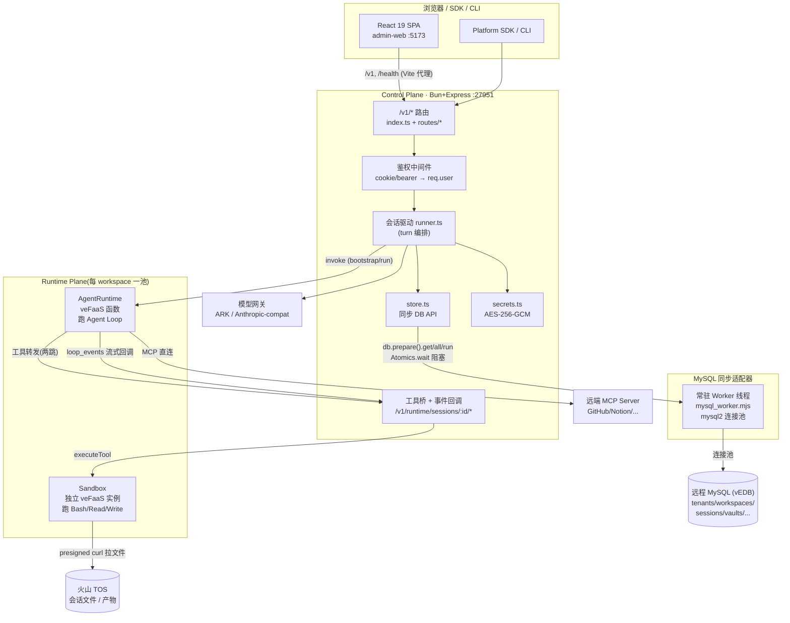
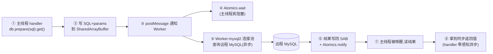
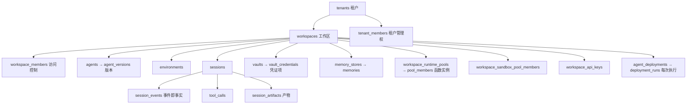
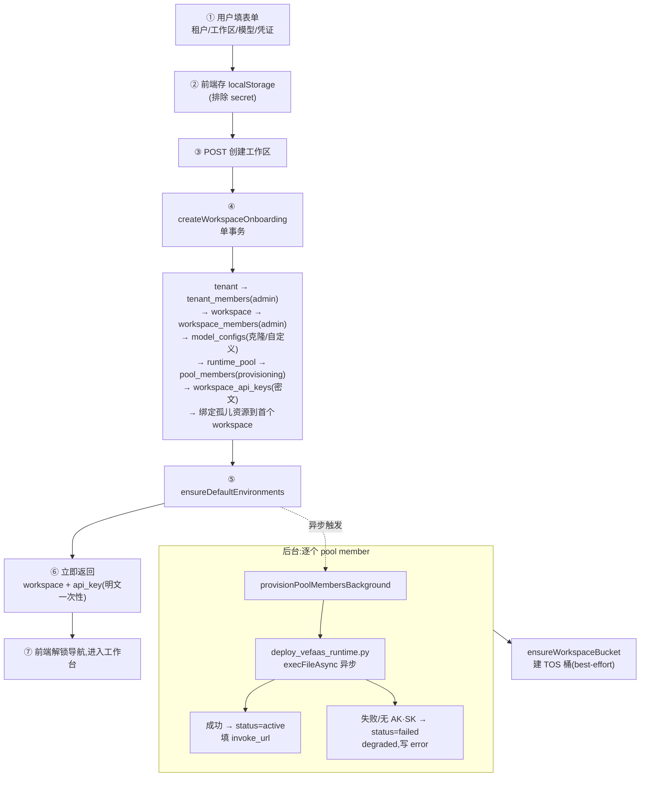
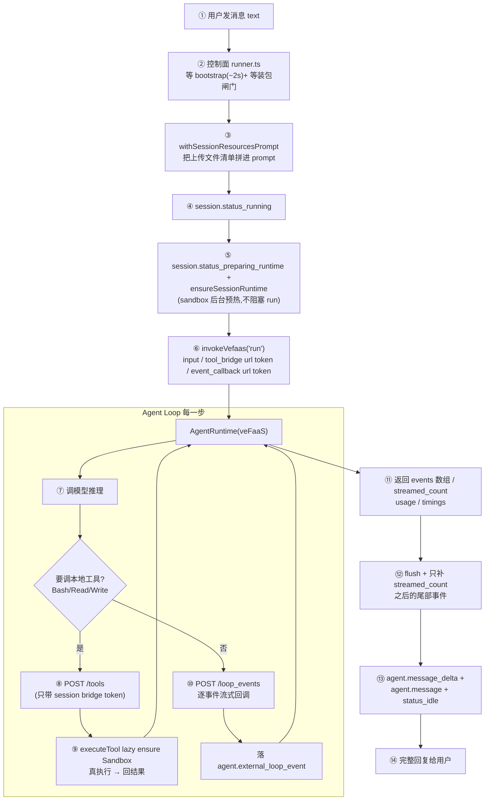
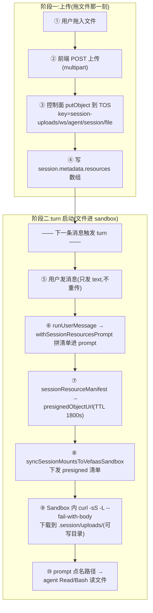
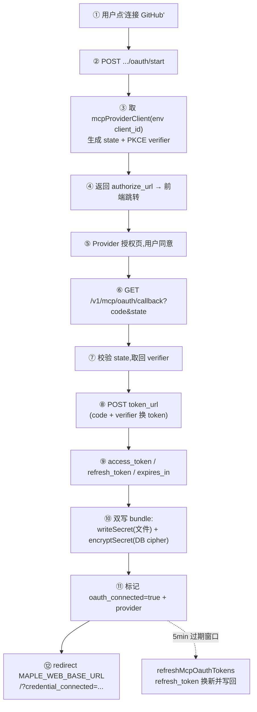
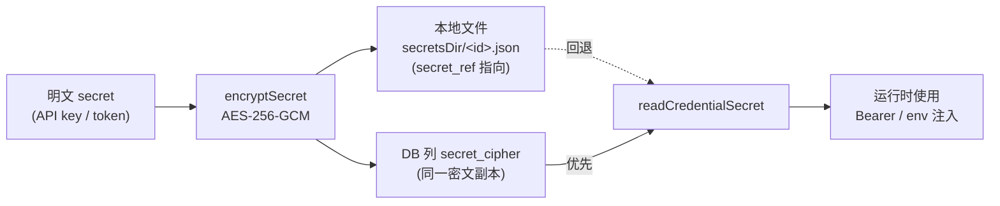

# Maple 托管 Agent 平台 · 架构与核心链路

> 面向接入方与新同事的一份"看完就能上手"的技术说明。不堆术语,讲清楚:平台是什么、一条请求怎么走、四条关键链路(租户开通 / 会话运行时 / 文件上传 / MCP / 凭证)在代码里到底发生了什么。
> 所有结论都对得上代码,带 `文件:行号`。读代码时拿这份当地图。

---

## 1. 一句话:Maple 是什么

你写一段自然语言("帮我做个每天读 GitHub PR 写周报的 agent"),Maple 帮你把它变成一个**能跑、能挂工具、能定时执行、全程可回放**的托管 Agent。你不碰服务器、不管沙箱、不存密钥——这些平台替你扛。

平台分成两个面,这是理解全局的第一刀:

| 面 | 干什么 | 跑在哪 |
|----|--------|--------|
| **Control Plane(控制面)** | 管资源、权限、配置、密钥引用、事件落库。不跑用户代码。 | `apps/control-plane-api`(Bun + Express 5) |
| **Runtime Plane(执行面)** | 真正跑 Agent Loop("跑脑子")+ 跑工具("跑手")。 | veFaaS 函数实例(AgentRuntime)+ 独立 veFaaS Sandbox |

把这两个面分开是整个系统的地基:控制面是稳定、持久、握有所有凭证的"大脑皮层";执行面是用完即弃、零凭证、可被不可信代码污染的"四肢"。后面四条链路反复体现这条分界线。

---

## 2. 架构总图



读图要点:

- **前端只跟控制面说话**。Vite 把 `/v1`、`/health` 代理到 `:27951`。
- **控制面到 DB 的每一跳都是"同步阻塞"**——这是个反直觉的设计,见 §3.1。
- **AgentRuntime 不直接连 Sandbox**。它要跑 Bash/Read/Write 时,POST 回控制面的工具桥,由控制面拿着凭证去打 Sandbox。这一"两跳"是安全设计,不是绕远路,见 §5.2。

---

## 3. 进程模型与数据

### 3.1 那个最该先知道的怪点:DB 是远程 MySQL,但 API 是同步的

打开 `store.ts`,你会看到满屏 `db.prepare(sql).get()` / `.all()` / `.run()`——一眼 better-sqlite3 的同步写法。但**底层根本不是 sqlite,是一台远程 MySQL(vEDB)**。`.managed-agents/platform.sqlite` 是早就废弃的旧文件,别被它误导。

同步的表象是这样兑现的(`infra/mysql.ts` + `infra/mysql_worker.mjs`):



**为什么这么干**(ADR-0001):早期版本每个 query 都 `execFileSync` spawn 一个 node 子进程连 MySQL,约 **0.4s/query** 还同步卡住 event loop——这是当初"会话页面卡顿"的真凶。换成常驻 Worker(mysql2 连接池)+ `Atomics.wait` 桥接后,单 query 降到 **~0.02s**,而 `store.ts` 和所有 handler 的同步代码**一行没改**。

**代价**:per-query 延迟仍是一次 MySQL RTT,且 Worker 串行处理(主线程在 `Atomics.wait` 上真阻塞)。所以 handler 里**绝不能 N+1**——要么批量查(看 `listVaults` 怎么用一条 `GROUP BY` 把 N 个 `COUNT(*)` 合成一条,`storeVaultMcpMemory.ts:24`),要么认账接受串行成本。
> 想直接看/清数据,用 helper:`echo '{"op":"query","mode":"all","sql":"...","params":[]}' | node apps/control-plane-api/src/infra/mysql_child.mjs`(`mysql_child.mjs` 是 spawn-per-query 的旧 fallback,仅 `MAPLE_MYSQL_FORCE_HELPER=true` 时启用)。

技术栈一句话:**Bun 跑 Express 5 后端 + React 19 单页前端,单仓**。后端入口 `index.ts` 挂全部 `/v1` 路由;前端 `App.tsx` 是 console 外壳(已冻结,新页面单独开文件,不许往里塞)。

### 3.2 数据模型:资源就是这么一层套一层

核心层级一句话记住:

```
tenants(租户)
  └─ workspaces(工作区)         ← workspace_members 控访问
       ├─ agents / agent_versions
       ├─ environments
       ├─ sessions ─ session_events / tool_calls / session_artifacts
       ├─ vaults ─ vault_credentials
       ├─ memory_stores ─ memories
       ├─ workspace_runtime_pools ─ ...pool_members
       ├─ workspace_sandbox_pool_members
       ├─ workspace_api_keys
       └─ agent_deployments ─ deployment_runs
```



几个不看代码会困惑的点:

- **agent snapshot**:建 session 时,把 Agent 当前版本 + Environment 当前配置**快照**进 `sessions.agent_snapshot_json`(`storeSchema.ts:34`)。之后 Agent/Environment 怎么改,都不影响这条已存在 session 的可追溯性。运行时读的是快照,不是活配置。
- **事件即事实(event-as-truth)**:一次会话的所有动静都落到 `session_events` / `tool_calls` / `session_artifacts`。Console、SDK、CLI、AskMaple 看的是**同一条事件流**,没有"前端自己攒的状态"。
- **凭证不进明文列**:`vault_credentials` 有 `secret_ref`(指向本地 secret store 文件)和 `secret_cipher`(同一密文的 DB 副本),就是没有明文 token 列。`model_configs` 同理用 `api_key_ref` / `api_key_ciphertext`。见 §6 凭证链路。

### 3.3 多租户隔离:list 端点凭什么不串户

这是安全红线。规则只有一条:**任何 list / auth 端点必须按"当前用户可访问的工作区"过滤,绝不裸查全表**。

落地是两个函数(`index.ts` / `routes/routeHelpers.ts:151`):

- `accessibleWorkspaceIds(userId)` — 查 `workspace_members` 得到该用户能看的 workspace id 列表。
- `scopeByWorkspace(...)` — 把这批 id 拼进 `WHERE workspace_id IN (...)`。

没带 `workspace_id` 参数的 list 端点,默认就过滤到 member 工作区。`routeHelpers.ts:151` 的注释直接写了为什么:*"never the whole table (that leaked other tenants' resources)"*——这是修过的真实越权,不是假想。

---

_(接下文:四条核心链路)_

## 4. 核心链路一:租户开通(从"没工作区"到"能用")

新用户登录后没有任何工作区。这时**左侧导航和工作区切换器都是 disabled**——供给没完成前不让你乱点(`onboarding lock`,前端态)。表单填的内容实时存 `localStorage`(`maple_onboarding_<userId>`,secret 字段排除),刷新不丢。

提交后,后端在**一个事务里**把整套资源建出来,然后立即返回,把"真正费时的 veFaaS 供给"甩到后台异步跑。



代码锚点(`storeWorkspaceCreate.ts`):

- `createWorkspaceOnboarding`(:62)是全新用户首次开通的入口——它在 `db.transaction` 里一口气建完 tenant、tenant_members、workspace、workspace_members、model_configs、runtime_pool、pool_members、api_key,事务尾部还做一次数据迁移:把历史上没有 workspace 归属的孤儿资源(agents/environments/sessions/vaults/memory_stores)绑到这个首个 workspace(:209)。
- `createWorkspaceForUser`(:232)是已有租户、再加一个 workspace 的入口——逻辑类似但不重建 tenant。
- **pool member 初始就是 `status='provisioning'`**(:191),`invoke_url`/`cloud_function_id` 先留空,等后台填。
- 事务一结束,`provisionPoolMembersBackground`(`storeWorkspaceProvisioning.ts:96`)逐个 member 去 veFaaS 部署:成功填 `invoke_url` 转 `active`,失败转 `failed` 并把错误写进 `config.provisioning_error`(:108)。**本地没配 veFaaS AK/SK 时,member 必然 `failed`,这是预期的降级,不是 bug。**
- 部署脚本通过 `execFileAsync` 异步 shell-out(不阻塞),顺带 `ensureWorkspaceBucket` 建该租户的 TOS 桶(best-effort,失败就推迟到首次上传时再建)。

API key 的明文**只在创建响应里返回这一次**(`storeWorkspaceCreate.ts:227` 把 `apiKey.raw` 拼回去),DB 里只存 `key_hash` + `key_ciphertext`。

---

## 5. 核心链路二:会话运行时(一条消息怎么变成 agent 回复)

这是平台最核心的链路,也是最容易讲错的。先记住**三条执行路径**,`runner.ts` 按 agent 配置分流(`shouldUseExternalAgentLoop`,`agentLoopDrivers.ts:62`):

| 路径 | 触发条件 | 工具在哪跑 |
|------|----------|-----------|
| **Provider Loop**(默认) | agent 没挂 MCP server,且 `execution` ∈ {provider, legacy_provider, simulated} | 直接打模型;要用工具时**懒加载** sandbox,经 `executeTool` 在 sandbox 跑 |
| **veFaaS Agent Loop** | environment 绑了 veFaaS agent runtime | agent loop 跑在 veFaaS 函数里,工具**转发**回控制面工具桥,再到独立 sandbox |
| **External Loop**(claude_code / codex) | agent 挂了 MCP server,或 `execution` 是非 provider 值 | 跑真实 CLI(claude / codex);claude_code 又分 SDK NDJSON 常驻 runner 与 CLI batch 两种 protocol |

> 判定优先级很关键:**只要 agent 挂了 MCP server,就强制走 external loop**(`hasMcpServers` 短路,`agentLoopDrivers.ts:63`),因为 provider loop 不具备 MCP 调用能力。

### 5.1 一次 turn 的完整时序(以 veFaaS Agent Loop 为例)



### 5.2 流式回调契约:`streamed_count` 前缀(改任一侧必读)

veFaaS 的 agent loop 跑在远端函数里,turn 可能要几十秒。为了让用户**边跑边看**,而不是等整个 turn 结束才出字:

- AgentRuntime 每产生一个可展示事件,就 POST 回控制面的 `/v1/runtime/sessions/:id/loop_events`(`runtimeManager.ts:212`);SDK `system` 心跳/ready 这类 debug-only 事件在 runtime-app 过滤,避免用户可见 delta 排在调试事件 HTTP 回调后。
- turn 结束时,函数返回结果里带一个 `streamed_count` = "我已经成功回调了几条"。
- 控制面拿到最终 `events[]` 后,**只补 `streamed_count` 之后的尾部**(`runner.ts:156-166`),前缀部分已经通过实时回调落库了,避免重复写。

铁律(CONTEXT.md / ADR):**`streamed_count` 必须是 events 数组的干净前缀**——一旦某次回调失败,就永久降级(后续都不算流式),控制面用返回值兜底。控制面侧把 delta 累积成全文再落 `agent.message_delta`。**改 runtime-app 或 runner.ts 任一侧,必须同步另一侧**,否则要么丢事件要么重复。

`invokeVefaas` 还有一个超时分流(`vefaasAgentRuntime.ts:118`):control 类动作(`bootstrap`/`health`)用短超时(默认 20s,`MAPLE_VEFAAS_CONTROL_TIMEOUT_MS`)**快速失败**,避免一个挂掉的 runtime 把整个 agent 超时拖满;只有 `run` 用完整的 agent timeout。

### 5.3 工具为什么必须在独立 Sandbox 跑(ADR-0004)

这是个有取舍、看代码会困惑的硬决策。**Agent Loop 的本地执行类工具(Bash/Read/Write/Grep)不在 runtime 容器里跑,而是转发到该 session 专属的独立 veFaaS Sandbox。**

为什么不图省事直接在容器里跑?因为 **runtime pool member 是 workspace 级共享的**——一个容器里并存多个 session 的 agent loop(按 `active_session_count` 负载均衡)。如果 bash 直接在容器跑,A session 的 `cat` 就能读到 B session 的文件,`safe_path` 只管 read/write 路径、管不住 bash 命令本身。**隔离是硬要求**,所以把工具执行位置反转出去。

转发机制有个绕不开的命门(claude-agent-sdk 的限制):**SDK 的 `can_use_tool` 钩子只能 allow/deny,不能改写执行位置**。所以唯一可行的转发办法是:

1. runtime-app 用 `create_sdk_mcp_server` 注册一组 `mcp__maple_sandbox__*` 自定义工具;
2. 用 `disallowed_tools` 把内置的 `Bash/Read/Write/Edit/Glob/Grep` 全禁掉,逼模型只能用上面那组 MCP 工具;
3. 每个 MCP 工具体 POST 到控制面工具桥 `/v1/runtime/sessions/:id/tools`(**只带 session 级 bridge token**);
4. 控制面 `executeTool`(`runtimeTools.ts:38`)用**自己持有的**凭证去打 sandbox gateway 真执行。

**凭证零落容器**是这套设计的目的:sandbox 跑 agent 生成的不可信 bash,runtime 跑可能被 prompt 劫持的 LLM——任何一处只要能读到明文凭证,恶意代码就能 `env | curl` 外传。所以 sandbox 的 `gateway_url` + `api_token` **只在控制面持有**,`runtimePublicMetadata`(`runtimeCommon.ts`)对 vefaas_sandbox 专门裁掉了这两个字段,容器里永远只有那个仅能调工具桥的 bridge token。这就是图里"两跳"(runtime → 控制面 → sandbox)而非"一跳直连"的原因:多一跳换"凭证永不进容器"。

**远端 MCP 工具(GitHub/Notion 等)不走这条路**——它们的执行端本身就是远端隔离服务,runtime 直连即可,绕道 sandbox 无安全收益还更慢(见 §7 MCP 链路)。只有"动文件系统 / 跑命令"的本地工具才进 sandbox。


---

## 6. 核心链路三:文件上传(从浏览器拖一个文件,到 agent 能 `Read` 它)

用户在会话里拖一个 PDF/图片进去,期望 agent 能读到。难点在于:agent 的工具跑在**独立 sandbox** 里(见 §5.3),而文件是从浏览器传到**控制面**的——两者隔离。Maple 用 TOS 当中转,让 sandbox **自己**把文件拉进去。



链路拆开看:

1. **上传**(`artifactFileRoutes.ts`):走 `createManagedFileFromRequest`,文件落 TOS,object key 形如 `session-uploads/<workspaceId>/<agentId>/<sessionId>/<file>`(:80),并把一条 `{type:'file', file_id, mount_path}` 追加进 `session.metadata.resources`(:89-91)。注意是**追加去重**,同名文件覆盖旧的。
2. **进 sandbox 用 presigned URL**(`runtimeResources.ts`):turn 启动时 `sessionResourceManifest`(:32)分两条路——workspace 开了 TOS(`objectStorageEnabled`)就走 `presignedResourceManifest`,为每个文件生成一个 **presigned URL(TTL 默认 1800s,`MAPLE_SESSION_UPLOAD_PRESIGN_TTL_SECONDS`)**;没 TOS 的本地/开发环境退化成 `base64ResourceManifest`,把字节内联进清单。
3. **sandbox 内 curl 拉取**(`vefaasSandboxRuntime.ts`):`syncSessionMountsToVefaasSandbox`(:206)拿 presigned 清单,对每个文件在 sandbox 里跑 `curl -sS -L --fail-with-body --max-time 120 --retry 1`(:241)下载。presigned URL 是 used-then-discarded,sandbox 自己拉,文件**字节从不经过 runtime 容器**。
4. **prompt 注入**(`sessionResourcePrompt.ts`):前端只发用户文本,`withSessionResourcesPrompt`(:13)把这条 session 的文件清单拼成一段 manifest 前置进 prompt,告诉 agent "这些文件在你工作目录下,用相对路径读"。

### 6.1 一个真实踩过的坑:/mnt 只读(commit d7042cfa)

最初 sandbox 把文件下载到 `/mnt/session/uploads/`。**真机(space-stg)验证发现 veFaaS sandbox 以非特权用户运行,`/mnt` 对它是只读的**——`mkdir /mnt/session` 直接 `Permission denied`。更糟的是这个 mkdir 抛异常后,**整个 tool turn 被中断**:那一轮所有 bash/read_file 在跑之前就全挂了。

修法(`vefaasSandboxRuntime.ts:234` `sandboxUploadTarget`):

- **改写到可写目录**:把 `/mnt/session/uploads/<rel>` 重映射成 `<sandbox_workspace_path>/.session/uploads/<rel>`——agent 的 cwd,永远可写。presigned-curl 和 host-bytes 两条路径都套用。
- **单文件容错**:某个文件下载失败只 `console.warn`(:217),不再 throw,坏一个文件不拖垮整个 turn。
- **错误可诊断**:`--fail-with-body` 让 403/签名过期的 HTTP body 进 stderr,而不是吞成空失败。
- **prompt 同步改口径**:`sessionResourcePrompt.ts` 现在让 agent 优先用相对路径 `.session/uploads/<rel>`,`/mnt` 老路径作 fallback——跟文件真正落地的位置对上。

> 图片(多模态)和普通文档走的是**同一条链路**:平台只负责"把文件放到 agent 够得着的地方并在 prompt 里点名"。一张图能不能被**理解**,取决于 agent 绑的模型是不是多模态——这是模型能力,不是上传链路的事(`sessionResourcePrompt.ts:11` 注释明确了这条边界)。

---

## 7. 核心链路四:MCP(让 agent 能调 GitHub/Notion 这些外部能力)

MCP(Model Context Protocol)是 agent 接外部工具的标准。Maple 里有**两种来源**:

| 来源 | 是什么 | 存哪 |
|------|--------|------|
| **预设 catalog** | 平台内置的 9 个 provider,OAuth 一键连 | `catalog/mcpCatalog.ts`(代码常量) |
| **用户自管理** | 用户填自己的 MCP endpoint | `mcp_servers` 表 |

预设 catalog 清单(`mcpCatalog.ts:25`):**Notion、GitHub、Vercel、Google Drive、Gmail、Google Calendar、Canva、Figma、Atlassian**。每个带 `authorize_url` / `token_url` / `scopes` / PKCE 标记,以及一个 env 前缀(如 `MAPLE_MCP_NOTION`)用来在运行时取 OAuth client 凭证(`MAPLE_MCP_NOTION_CLIENT_ID` / `_CLIENT_SECRET`)。

### 7.1 OAuth 授权 + 凭证落库(端到端闭环)



代码锚点(`mcpRoutes.ts`):

- 两个授权入口:`/v1/mcp_servers/:id/oauth/start`(:117,连用户自管理的 server)和 `/v1/vaults/:vaultId/credentials/:credId/oauth/start`(:142,连 vault 里的 catalog 凭证)。都用 PKCE,把 state→verifier 暂存内存。
- 统一回调 `/v1/mcp/oauth/callback`(:170):用 `code` + `code_verifier` 打 `token_url` 换 token,组成 bundle `{access_token, refresh_token, token_type, expires_at, scope}`。
- **双写**(关键):bundle 既 `writeSecret` 进本地文件(拿到 `secret_ref`),又 `encryptSecret` 进 DB 的 `secret_cipher` 列。原因见 §8.1。然后把凭证标记 `oauth_connected=true` + `provider`,跳回 `MAPLE_WEB_BASE_URL`。
- **平台托管刷新**:`refreshMcpOauthTokens`(:215 起)定期轮询所有已连接凭证,**在 token 过期前 5 分钟内**用 refresh_token 换新 token 并写回。用户无感。

### 7.2 凭证怎么注入到 agent 调用

agent 要真正调起 MCP,得带着 OAuth token。注入发生在 agent config 被交给 runtime **之前**(`mcpCredentialInjection.ts`):

- `injectMcpCredentials(mcpServers, workspaceId)`(:9):遍历 agent 的每个 MCP server,用 `findWorkspaceProviderToken(workspaceId, provider)` 找到该 workspace 已连接的 token,塞进 `headers.Authorization = Bearer <token>`,并把 server 类型规整为 `http`。
- 两条执行路径都注入:external loop 在 `runner.ts:188` 调 `withInjectedMcpCredentials`;veFaaS loop 在 `vefaasAgentRuntime.ts:57` 把注入后的 config 序列化进 `MAPLE_AGENT_TEMPLATE` 再下发到 sandbox loop。
- 注入后,**agent 直连远端 MCP server**(不走 §5.3 的 sandbox 工具桥)——因为 MCP server 本身就是隔离的远端服务,绕道 sandbox 无收益。

### 7.3 共享凭证模型(ADR-0005,一个要知道的限制)

当前 MCP OAuth 凭证是 **workspace 共享**的:token 存 `vault_credentials`,绑 vault→workspace,**不绑 user**。`findWorkspaceProviderToken`(`storeVaultMcpMemory.ts:119`)按 `(workspace_id, provider)` 取最近连接的那条。

含义要讲明白:**同一 workspace 内任何成员调这个 agent,用的都是同一条 token(凭证连接者的身份)**。"获取我的 PR"这种随调用者身份变化的语义,在共享模型下只会返回**凭证连接者**的数据,不是当前调用者的。这是模型 A 的固有限制,不是 bug。per-user 凭证(模型 B)是已记录的未来 TODO(ADR-0005),不是现状。

---

## 8. 核心链路五:凭证(密钥从输入到使用,全程不落明文)

平台帮用户扛着一堆密钥:workspace API key、模型 provider key(ARK / Anthropic)、veFaaS AK/SK、MCP OAuth token。原则只有一条:**明文绝不进数据库列,绝不进 sandbox 容器**。

### 8.1 secret store:加密、双写、解密



实现(`secrets.ts` + `storeVaultMcpMemory.ts`):

- **加密**:`encryptSecret`(`secrets.ts:17`)用 AES-256-GCM,产 `{algorithm, iv, tag, ciphertext}` JSON。master key 来源:**优先 `MAPLE_SECRET_MASTER_KEY`(base64 env)**,否则落 `secretsDir/master.key`(`:49`)。
- **secret_ref 模式**:DB 表里凡涉及密钥的列都不存明文——`vault_credentials.secret_ref` / `.secret_cipher`、`model_configs.api_key_ref` / `.api_key_ciphertext`、`workspace_api_keys.key_ciphertext`。列指向 secret store,不是密钥本体。
- **读取优先级**:`readCredentialSecret(row)`(`storeVaultMcpMemory.ts:97`)**先读 `secret_cipher`(DB),回退 `secret_ref`(文件)**。

### 8.2 为什么密文要进 DB(ADR-0006)

云端把 `MAPLE_DATA_DIR` 设成 `/tmp/maple-managed-agents`,而 veFaaS 的 `/tmp` **实例重启/扩缩容即清空、多实例不共享**。如果 secret 只存文件:DB 里的 `secret_ref` 会悬空,`readSecret` 抛错,OAuth 存的 token 活不过一次冷启动——端到端闭环在云端根本站不住。

所以密文**同时进 DB 的 `secret_cipher` 列**(远程 MySQL,持久 + 跨实例共享)解决持久性;master key 走 env 解决"密钥本身也在 /tmp"的鸡生蛋问题。这就是 §7.1 OAuth 回调为什么双写。

**当前的临时性要诚实标注**:master key 走 env 是"对称密钥裸暴露在环境变量"的临时方案;未来 TODO 是 KMS 托管 / envelope encryption(DEK 由 KMS 加密)。旧数据 `secret_cipher` 为 NULL 的历史行仍回退读本地文件,向后兼容。

### 8.3 凭证零落容器(回扣 §5.3)

运行时执行 agent 时,控制面 `readSecret` 解密后,凭证只在**控制面边界**注入:Bearer header 给 MCP、env 给模型网关、AK/SK 给 veFaaS sandbox gateway 调用。**sandbox 容器里永远只有 session 级 bridge token**(仅能回调工具桥),拿不到任何真凭证。这样即便 agent 生成的 bash 被攻击者操纵,容器里也 `env | curl` 不出任何有价值的东西。

---

## 9. 一页速查

| 你想知道 | 看这里 |
|----------|--------|
| 为什么 `db` 是同步的但又说是 MySQL | §3.1 + `infra/mysql_worker.mjs` + ADR-0001 |
| list 端点怎么防越权 | §3.3 + `accessibleWorkspaceIds` / `scopeByWorkspace` |
| 开通一个 workspace 建了哪些行 | §4 + `storeWorkspaceCreate.ts:62` |
| 一条消息的三种执行路径 | §5 + `agentLoopDrivers.ts:62` |
| 流式回调为什么不重复落事件 | §5.2 + `streamed_count` 前缀 + `runner.ts:156` |
| 工具为什么在独立 sandbox 跑 | §5.3 + ADR-0004 |
| 上传的文件怎么进 sandbox | §6 + presigned curl + ADR(d7042cfa) |
| MCP OAuth 凭证存哪、怎么注入 | §7 + `mcpRoutes.ts` + `mcpCredentialInjection.ts` |
| 密钥为什么既进文件又进 DB | §8.2 + ADR-0006 |

**关键文件地图**:
- 路由总入口 `apps/control-plane-api/src/index.ts`
- 会话编排 `runtime/runner.ts` · 运行时管理 `runtime/runtimeManager.ts`
- veFaaS agent `runtime/vefaasAgentRuntime.ts` · veFaaS sandbox `runtime/vefaasSandboxRuntime.ts`
- 数据访问 `storage/store.ts`(+ `storeWorkspaceCreate.ts` / `storeVaultMcpMemory.ts`)
- DB schema `storage/storeSchema.ts` · 同步适配器 `infra/mysql_worker.mjs`
- 密钥 `infra/secrets.ts` · MCP catalog `catalog/mcpCatalog.ts` · 凭证注入 `runtime/mcpCredentialInjection.ts`
- 术语裁决 `CONTEXT.md` · 架构决策 `docs/adr/0001-0006`
