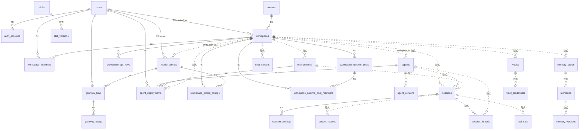

# Maple 数据库 ER 分析（live MySQL `maple` @ `vedbm-qkydajdkqldu-0`）

> 快照时间 2026-06-08。共 **31 张表**。本文按主题整理表名/作用/核心字段/关联，给出 ER 图，并评估结构合理性。
> 数据来源：`information_schema`（列 / 外键 / 行数）实查，非 DDL 文件推断。

## 0. 先澄清「找不到 tenants/workspaces 表」

它们**确实存在**于 live 库（`SHOW TABLES` 可见，上轮还 JOIN 出过数据）。你没找到，几乎肯定是看了：

- DEAD 的本地 `.managed-agents/platform.sqlite`（CLAUDE.md 明示已废弃），或
- GUI / 客户端连到了别的库 / 别的实例。

真库连接由 `.env` 注入，helper：`echo '{"op":"query","mode":"all","sql":"SHOW TABLES","params":[]}' | node server/mysql_child.mjs`。

---

## 1. 按主题分组

### A. 身份 / 租户 / 工作区（多租户骨架）

| 表 | 作用 | 核心字段 | 关联 |
|---|---|---|---|
| `users` | 全局用户 | id, **email(UNI)**, name, auth_provider, role | 被几乎所有 owner/user 列引用 |
| `auth_sessions` | 登录态（cookie/bearer token hash） | id, **token_hash(UNI)**, user_id→users, expires_at, last_seen_at | FK→users |
| `tenants` | 租户 | id, name, description, status, metadata_json | 被 workspaces 引用 |
| `workspaces` | 工作区（资源边界） | id, **tenant_id→tenants(FK)**, name, status, runtime_provider, sandbox_provider, **config_json**, config_hash, **created_by_user_id→users(FK)** | FK→tenants, users |
| `workspace_members` | 用户↔工作区成员 + 角色 | id, workspace_id→workspaces(FK), user_id→users(FK), **role**(admin/member) | FK→workspaces, users |

- **slug 不是列**：`/w/<slug>` 路由用的 slug 埋在 `workspaces.config_json` 里，查重靠 app 扫全表 + JSON.parse（store.ts:543），**DB 无唯一约束**。
- **无 `tenant_members` 表**：租户「owner」靠 `workspace_members.role='admin'` 推导（store.ts `listAccessibleTenants` 的 `MAX(role='admin')`）。

### B. 模型配置 / 网关 / 计费

| 表 | 作用 | 核心字段 | 关联 |
|---|---|---|---|
| `model_configs` | 模型供应商配置（含密文 key） | id, **owner_user_id→users(FK)**, **workspace_id(可空,无FK)**, provider_type, base_url, model_name, api_key_ciphertext, api_key_hint, is_default | FK→users；workspace_id 隐式 |
| `workspace_model_configs` | 工作区↔模型 多对多 | (workspace_id, model_config_id) 复合 PK，双 FK | FK→workspaces, model_configs |
| `gateway_keys` | LLM 网关 API key（限流） | id, user_id→users(FK), key_hash(UNI), model_config_id→model_configs(FK), quota_tpm, quota_tpd, enabled | FK→users, model_configs |
| `gateway_usage` | 网关用量埋点（**0 行**） | id, gateway_key_id→gateway_keys(FK), used_at, tokens, model_name | FK→gateway_keys |
| `workspace_api_keys` | 工作区级 API key | id, workspace_id→workspaces(FK), key_hash(UNI), scopes_json, enabled | FK→workspaces |

- **`model_configs` 双重归属**：同时有 `owner_user_id`(NOT NULL, FK) 和 `workspace_id`(可空, 无FK)，又通过 `workspace_model_configs` 多对多——三套归属并存，语义含糊。

### C. Agent 资产 / 版本 / 部署 / 环境 / 模板

| 表 | 作用 | 核心字段 | 关联 |
|---|---|---|---|
| `agents` | Agent 定义 | id, name, current_version, **workspace_id(可空,无FK)**, archived_at | workspace_id 隐式 |
| `agent_versions` | Agent 版本快照（append-only） | id, agent_id→agents(FK), version, config_json, config_hash | FK→agents |
| `agent_deployments` | Agent→环境 部署记录 | id, user_id→users(FK), agent_id→agents(FK), environment_id→environments(FK), version, manifest_json, bundle_json, status, **workspace_id(可空,无FK)** | 3 FK + 隐式 workspace |
| `environments` | 运行环境配置 | id, name, config_json, **workspace_id(可空,无FK)**, archived_at | workspace_id 隐式 |
| `templates` | **全局**模板目录（无 workspace/owner） | id, name, category, template_json | 无 |

### D. 会话 / 事件 / 工具调用 / 产物

| 表 | 作用 | 核心字段 | 关联 |
|---|---|---|---|
| `sessions` | 一次会话 | id, title, **agent_id(无FK)**, agent_version, agent_snapshot_json, **environment_id(无FK)**, status, workspace_path, **workspace_id(可空,无FK)** | 全部隐式 |
| `session_threads` | 会话内 agent 线程树 | id, session_id(无FK), agent_id(无FK), parent_thread_id, status | 全部隐式 |
| `session_events` | 事件流 | id, session_id(无FK,MUL), type, payload_json, provider_event_type | 隐式 |
| `tool_calls` | 工具调用审计 | id, session_id(无FK), tool_name, input_json, output_json, status, permission_policy | 隐式 |
| `session_artifacts` | 会话产物（对象存储指针） | id, **session_id→sessions(FK)**, object_key, public_url, sha256 | **唯一**有 FK 的 session 子表 |

- sessions 子表 4 张里只有 `session_artifacts` 声明了 FK；events/threads/tool_calls 全靠 app 维护完整性。

### E. 运行时池（veFaaS 预热池）

| 表 | 作用 | 核心字段 | 关联 |
|---|---|---|---|
| `workspace_runtime_pools` | 工作区运行时池 | id, workspace_id→workspaces(FK), provider, desired_size, cpu_milli, memory_mb, status | FK→workspaces |
| `workspace_runtime_pool_members` | 池内函数实例 | id, runtime_pool_id→pools(FK), workspace_id→workspaces(FK), cloud_function_id, invoke_url, status, weight, active_session_count | 双 FK |

### F. 记忆

| 表 | 作用 | 核心字段 | 关联 |
|---|---|---|---|
| `memory_stores` | 记忆库 | id, name, **workspace_id(可空,无FK)**, archived_at | workspace_id 隐式 |
| `memories` | 记忆条目 | id, memory_store_id(MUL,**无FK**), path, content, updated_at | 隐式 |
| `memory_versions` | 记忆版本（append-only） | id, memory_id(无FK), content, actor | 隐式 |

### G. 凭证库 / MCP

| 表 | 作用 | 核心字段 | 关联 |
|---|---|---|---|
| `vaults` | 凭证库 | id, display_name, **workspace_id(可空,无FK)**, archived_at | workspace_id 隐式 |
| `vault_credentials` | 凭证项（secret_ref 指向 secret store） | id, vault_id(无FK), name, mcp_server_url, auth_type, secret_ref | 隐式 |
| `mcp_servers` | 用户管理的 MCP 端点 | id, **workspace_id(NOT NULL,MUL,无FK)**, name, provider, mcp_url, auth_type, created_by_user_id(无FK) | 隐式 |

### H. 技能

| 表 | 作用 | 核心字段 | 关联 |
|---|---|---|---|
| `skills` | **全局**技能注册（name 全局 UNI） | id, name(UNI), source_type, source_path, current_version | 无 workspace |
| `skill_versions` | 技能版本（append-only） | id, skill_id(MUL,**无FK**), version, manifest_json, content_hash | 隐式 |

### I. 文件

| 表 | 作用 | 核心字段 | 关联 |
|---|---|---|---|
| `managed_files` | 托管文件（对象存储，**0 行**） | id, filename, media_type, bytes, sha256, object_key, public_url | **无任何归属列**（无 workspace/user/session） |

---

## 2. ER 图（实线=声明的 DB 外键；虚线=代码隐式关联，无 DB FK）



---

## 3. 整体结构评估

### 合理的地方
1. **三段式多租户骨架清晰**：tenants → workspaces →（成员 + 各类资源），`workspace_members` 做访问门控，思路标准。
2. **版本化模式统一且正确**：agents/skills + `*_versions`（append-only，仅 created_at + content_hash），memory 同理。可回溯、可去重。
3. **密钥不落明文**：`api_key_ciphertext`/`secret_ref`/`key_hash`/`token_hash`，凭证走 secret store 引用。
4. **对象存储解耦**：`managed_files`/`session_artifacts` 存指针（bucket/object_key/sha256），不塞 BLOB。
5. **utf8mb4 索引兼容**：varchar(191) 是经典 191 长度规避。

### 主要问题（按严重度）

**🔴 P0 — 多租户 scoping 靠纪律，不靠约束**
- 8 张资源表的 `workspace_id` **可空 + 无 DB 外键**（agents/environments/sessions/vaults/memory_stores/model_configs/agent_deployments，外加 mcp_servers 虽 NOT NULL 但无 FK）。
- 后果：① NULL workspace_id 的游离行（legacy/global）会绕过 `scopeByWorkspace` 泄漏给所有人——这正是 CLAUDE.md 反复警告的「leaked the whole table」类 bug；② 删工作区不会级联，留孤儿行（也是 CLAUDE.md 里要 `SET FOREIGN_KEY_CHECKS=0` 手删长链的原因）。

**🔴 P0 — 租户归属无一等公民表**
- 没有 `tenant_members` / 没有 `tenants.owner_user_id`。「是否拥有租户」靠 `workspace_members.role='admin'` 推导。
- 这就是上轮 onboarding bug 的根：**门控按「租户 owner（=某工作区 admin）」，switcher 按「工作区 member」**，两口径在 member-only 用户（michael=Dev Shared 的 member）上必然打架。

**🟠 P1 — slug 是隐藏身份键却埋在 JSON**
- slug 决定路由 `/w/<slug>`，本质是 workspace 的第二主键，却塞在 `config_json`，查重 O(n) 扫全表 + JSON.parse，**无唯一约束 → 并发 onboarding 有 slug 抢占竞态**。

**🟠 P1 — model_configs 三套归属并存**
- `owner_user_id`(NOT NULL) + `workspace_id`(可空) + `workspace_model_configs`(多对多)。到底「谁能用这个模型」有三条路径，逻辑分散、易冲突。建议收敛到一条主路径。

**🟡 P2 — sessions 子表完整性不一致**
- 4 张子表只有 `session_artifacts` 有 FK，events/threads/tool_calls 无。要么统一加 FK，要么明确「高写入审计表故意不加 FK」并文档化。

**🟡 P2 — 时间戳用 varchar(40)**
- 全表时间是字符串（ISO8601 尚可字典序排序，但无法做 DB 端时间运算、TZ、范围索引最优）。可接受但非最佳。

**🟡 P2 — 游离表**
- `templates`/`managed_files` 无归属列；`managed_files`/`gateway_usage` 0 行（疑似未启用功能）。明确是全局目录还是漏了 scoping。

---

## 4. 与「onboarding / switcher 矛盾」的关系（承接上轮）

数据模型层面的根因 = **缺 tenant 归属表 + workspace_id 弱约束**：
- 「required」按推导的租户 owner 判定；「switcher」按 workspace 成员判定 → 同一 member-only 用户两边不一致。
- 解决方向（下轮细聊）：
  1. 短期：前端 onboarding 时不渲染 switcher 选中态（最小改）。
  2. 中期：后端统一口径——onboarding required 与 switcher 都基于「用户可访问的活跃 workspace」；若要保留「member 也须开自己租户」语义，需引入显式 `tenant_members`/`tenants.owner_user_id` 把「拥有」和「被加入」彻底分开。
  3. 长期：给 workspace_id 加 NOT NULL + FK + 级联；slug 提为列加 UNIQUE。
```
