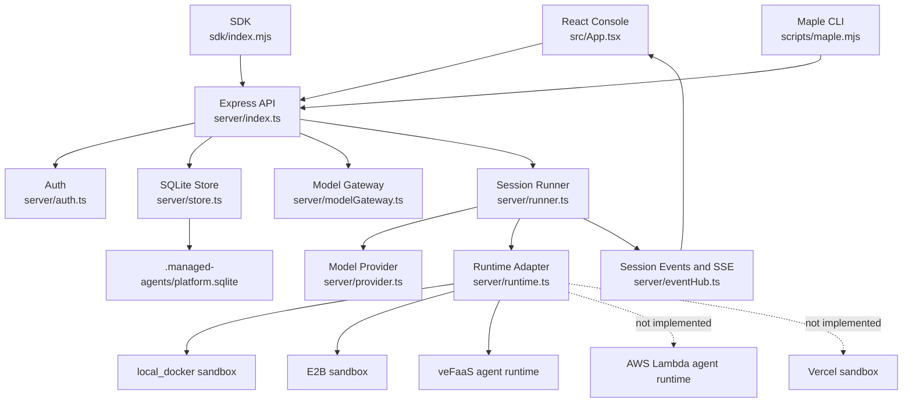
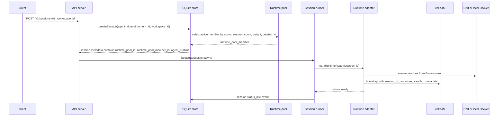
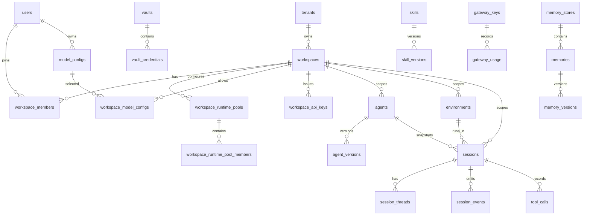
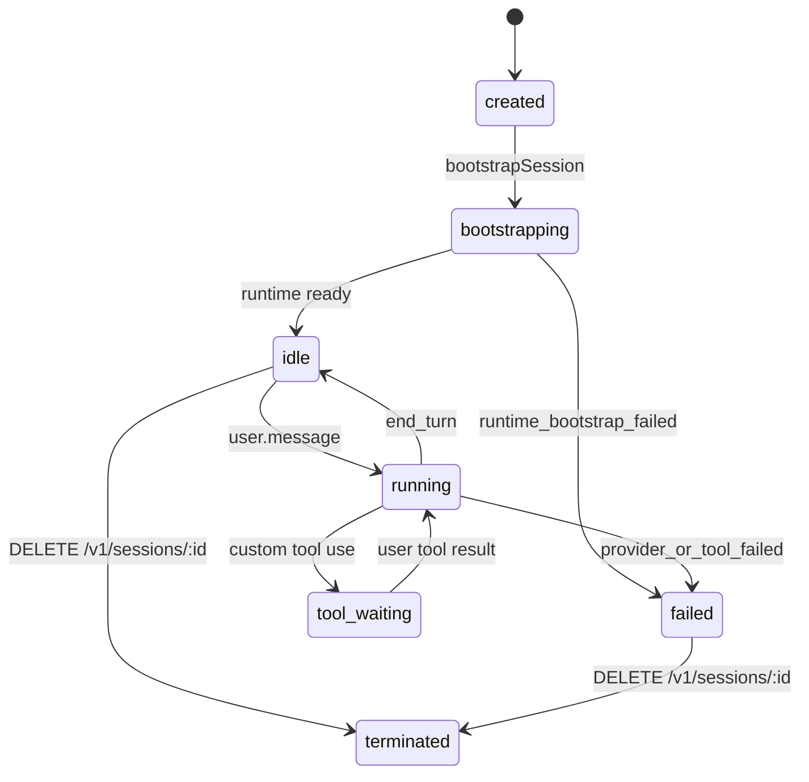

# Maple 当前代码校准架构设计

更新时间：2026-06-05

本文档按当前代码库扫描结果编写，目标是把架构设计和真实实现对齐，避免继续沿用旧文档中“Environment 管 AgentRuntime”的过期边界。当前实现的核心边界是：

- Workspace 负责租户隔离、Runtime Provider、Runtime Pool、Sandbox Provider、模型池和 workspace API key。
- Environment 对齐 Maple 的“手”定义，只描述工具执行 sandbox、网络、包和元数据，不再承载 AgentRuntime。
- Session 在创建时根据 workspace runtime pool 选择一个 veFaaS 函数成员，并把 `runtime_pool_id`、`runtime_pool_member_id`、`agent_runtime` 固化到 session metadata。
- Runtime 执行层由 `server/runtime.ts` 统一编排：E2B/local Docker/Vercel 是 sandbox provider；local/veFaaS/AWS Lambda 是 agent runtime provider。其中 Vercel 和 AWS Lambda 目前仅保留类型和占位错误。

## 1. 代码地图

| 层级 | 文件 | 当前职责 |
|---|---|---|
| Console | `src/App.tsx`, `src/api.ts`, `src/types.ts` | React 单页控制台、i18n、Agent/Environment/Session/Vault/Memory/Skill/Template/Gateway/Artifact 视图。Environment 创建面板只写 sandbox 配置。 |
| HTTP API | `server/index.ts` | Express API、Zod 入参校验、鉴权、workspace onboarding、资源 CRUD、session events、SSE、deployment invoke。 |
| Auth | `server/auth.ts` | 本地登录、OAuth/OIDC/ByteSSO/Lark provider 发现与 cookie session。`/v1` 下大部分接口走 `requireAuth`。 |
| Store | `server/store.ts` | SQLite schema、seed、workspace/runtime pool/model pool/API key、Agent/Environment/Session/Event/Vault/Memory/Skill/Template/Gateway 存储。 |
| Runtime | `server/runtime.ts`, `server/sandboxConfig.ts` | session runtime 准备、E2B/local Docker/veFaaS 执行、工具调用、资源同步、provider config 归一化。 |
| Agent loop | `server/runner.ts`, `server/provider.ts`, `server/agentLoops.ts` | bootstrap session、调用模型、执行内置工具或等待 custom tool result、产生 session events。 |
| Model gateway | `server/modelGateway.ts`, `server/secrets.ts` | 模型配置、网关 API key、quota usage、OpenAI-compatible chat completions 转发。 |
| SDK and CLI | `sdk/index.mjs`, `sdk/index.d.ts`, `scripts/maple.mjs` | Maple client surface、workspace API key、deployment manifest、CLI 初始化和 invoke。旧 HTTP shape 仅作为迁移兼容层保留。 |
| Contracts | `scripts/*contract*`, `scripts/e2e.mjs` | workspace runtime pool、veFaaS、project `.env`、CWC smoke、UI E2E 和构建验证。 |

## 2. 总体组件图



## 3. 资源归属模型

| 资源 | 归属边界 | 代码落点 | 当前状态 |
|---|---|---|---|
| Tenant | 平台租户 | `tenants` | onboarding 时创建，主要作为 workspace 上级实体。 |
| Workspace | 所有业务资源隔离单元 | `workspaces` | runtime provider、sandbox provider、runtime pool、model pool、API key 配置写入后不可改。`PATCH /v1/workspaces/:id` 返回 `workspace_config_immutable`。 |
| Runtime Pool | workspace 级函数池 | `workspace_runtime_pools`, `workspace_runtime_pool_members` | onboarding 后立即按 desired size 预热或绑定函数成员。session 创建时采用 least-active 策略选择成员。 |
| Model Pool | workspace 级可用模型集合 | `workspace_model_configs` | Agent 创建时必须使用 pool 中的 `model.config_id`，否则返回 `model_config_not_in_workspace_pool`。 |
| Workspace API Key | workspace 级控制面和数据面 key | `workspace_api_keys` | onboarding 生成 `lmap_ws_` 原文 key 并只存 hash。`requireAuth` 已支持 `Authorization: Bearer <lmap_ws_...>` 访问 `/v1` 控制面和数据面；scope 当前记录但尚未逐 endpoint 强制校验。 |
| Agent | workspace 可选作用域 | `agents`, `agent_versions` | 保存 Agent 定义和版本快照，兼容 Maple agent config surface。 |
| Environment | workspace 可选作用域 | `environments` | 只描述 sandbox、网络、包和 metadata。API 拒绝 `agent_runtime`、`agentRuntime`、`agent_runtime_provider`、`agentRuntimeProvider` 和 `type=managed_agent`。 |
| Session | workspace 可选作用域 | `sessions`, `session_threads`, `session_events`, `tool_calls` | 绑定 Agent、Environment、workspace runtime pool member，并持续写入事件流。 |
| Vault and Memory | workspace 兼容列已存在 | `vaults`, `vault_credentials`, `memory_stores`, `memories` | schema 已有 `workspace_id` 兼容列，API 当前仍以现有全局列表为主。 |
| Files and Artifacts | session and user scope | `server/files.ts`, `server/artifacts.ts` | 文件上传、resource materialization、artifact 下载已接入 session runtime。 |

## 4. Workspace Runtime Pool 设计

### 4.1 Onboarding 输入

`POST /v1/workspace_onboarding` 的 schema 已落在 `server/index.ts`：

```json
{
  "tenant": { "name": "Acme", "description": "" },
  "workspace": { "name": "Default Workspace", "description": "" },
  "runtime_provider": "vefaas",
  "runtime_pool": {
    "desired_size": 2,
    "max_instances_per_function": 100,
    "max_concurrency_per_instance": 100,
    "cpu_milli": 2000,
    "memory_mb": 4096
  },
  "sandbox_provider": "e2b",
  "model_config_ids": ["modelcfg_xxx"],
  "api_key": {
    "display_name": "Default workspace key",
    "scopes": ["control_plane", "data_plane"]
  }
}
```

当前支持的可选项是产品第一阶段的固定组合：

| 配置项 | 当前取值 | 说明 |
|---|---|---|
| Runtime Provider | `vefaas` | 默认且不可改。AWS Lambda 只作为未来能力占位。 |
| Runtime Pool | `desired_size`, `max_instances_per_function`, `max_concurrency_per_instance`, `cpu_milli`, `memory_mb` | 用于控制单 workspace 下的函数池容量、实例规格和理论并发上限。 |
| Sandbox Provider | `e2b` | 默认且当前唯一 onboarding 取值。Vercel 只作为未来能力占位。 |
| Model Pool | `model_config_ids` | Agent 的模型只能从该集合中选择。 |
| Workspace API Key | `display_name`, `scopes` | 创建后返回一次明文 key，后续只保存 hash。 |

### 4.2 池成员 provisioning

`runtimePoolMemberProvisioning()` 只支持直接 provisioning：workspace 创建时必须提供火山 AK/SK，后端调用 `infra/vefaas/deploy_vefaas_runtime.py` 创建 runtime function、发布函数、复用已有 APIG service 创建独立 prefix route，并把返回的 `invoke_url` 写入 `workspace_runtime_pool_members`。没有 env/fake 复用分支；provisioning 失败时 pool member 进入 `failed`。

项目环境变量只从项目根目录 `.env` 加载，加载逻辑在 `server/env.ts`。region 未配置时，veFaaS 默认 `cn-beijing`。

### 4.3 Session 绑定策略



当前实现会在 session 创建时把选中的 runtime pool member 写入 session metadata，并把该 member 的 `active_session_count` 加一。当前还没有在 session terminate/delete 时做 decrement，这是后续需要补齐的容量回收点。

## 5. Environment 定义边界

Environment 当前只描述 Maple 中“手”的环境，也就是工具执行环境。推荐 payload：

```json
{
  "workspace_id": "ws_xxx",
  "name": "maple-hand-env",
  "config": {
    "type": "e2b",
    "sandbox": {
      "provider": "e2b",
      "e2b": {
        "template": "base",
        "workspace_path": "/workspace"
      }
    },
    "networking": {
      "mode": "limited",
      "allowed_hosts": ["api.maple.local"]
    },
    "packages": [
      { "manager": "pip", "packages": ["pytest==8.0.0"] }
    ]
  }
}
```

API 拒绝下面这些旧形态字段：

```json
{
  "config": {
    "type": "managed_agent",
    "agent_runtime": { "provider": "vefaas" }
  }
}
```

拒绝错误码是 `environment_agent_runtime_forbidden`。当前 `server/store.ts` 的 `seedDefaults()` 和少量底层 contract 仍保留 legacy `volcengine-vefaas-runtime` Environment，这是兼容债，不代表新 API 允许继续创建这类 Environment。

## 6. Runtime Provider 状态矩阵

| 类型 | Provider | 当前实现 | 代码行为 |
|---|---|---|---|
| Agent Runtime | `local` | 已实现 | 在 API server 内部调度 agent loop；`anthropic_claude_code` 作为 Maple Code loop 配置值使用 NDJSON runner，`codex_open_source` 使用 `codex exec`，工具走 sandbox provider。 |
| Agent Runtime | `vefaas` | 已实现 | 由 workspace runtime pool 或 legacy config 提供 invoke url。bootstrap 和 tool 通过 HTTP action 调用。 |
| Agent Runtime | `aws_lambda` | 占位 | 类型存在，`ensureAwsLambdaRuntime()` 当前抛 not implemented。 |
| Sandbox | `e2b` | 已实现 | 创建或连接 E2B sandbox，准备 workspace，同步资源和 artifact。E2B 属于付费资源，测试完成必须清理。 |
| Sandbox | `local_docker` | 已实现 | 创建 `lmap_<session_id>` 容器，挂载 session workspace，支持受限网络。 |
| Sandbox | `vercel` | 占位 | 类型存在，当前抛 not implemented。 |

## 7. 当前 ER 图



## 8. 已实现 API 目录

| 域 | Endpoint |
|---|---|
| Health and platform | `GET /health`, `GET /v1/platform/version` |
| Auth | `GET /v1/auth/providers`, `GET /v1/auth/oauth/:provider/start`, `GET /v1/auth/oauth/:provider/callback`, `POST /v1/auth/login`, `POST /v1/auth/logout`, `GET /v1/auth/me` |
| Workspace | `GET /v1/workspace_onboarding/status`, `POST /v1/workspace_onboarding`, `GET /v1/workspaces`, `GET /v1/workspaces/:workspaceId`, `PATCH /v1/workspaces/:workspaceId`, `GET /v1/workspaces/:workspaceId/runtime_pool` |
| Model gateway | `GET /v1/model_configs`, `POST /v1/model_configs`, `POST /v1/model_configs/test`, `POST /v1/model_configs/:id/test`, `GET /v1/gateway_keys`, `POST /v1/gateway_keys`, `PATCH /v1/gateway_keys/:id`, `GET /v1/quota_usage`, `POST /v1/gateway/chat/completions` |
| Agents | `GET /v1/agents`, `POST /v1/agents`, `GET /v1/agents/:agentId`, `PATCH /v1/agents/:agentId`, `POST /v1/agents/:agentId`, `GET /v1/agents/:agentId/versions`, `POST /v1/agent_drafts` |
| Environments | `GET /v1/environments`, `POST /v1/environments`, `GET /v1/environments/:environmentId` |
| Sessions and events | `GET /v1/sessions`, `POST /v1/sessions`, `DELETE /v1/sessions/:sessionId`, `GET /v1/sessions/:sessionId`, `GET /v1/sessions/:sessionId/detail`, `GET /v1/sessions/:sessionId/events`, `POST /v1/sessions/:sessionId/events`, `GET /v1/sessions/:sessionId/events/stream` |
| Deployments | `GET /v1/deployments`, `GET /v1/deployments/:deploymentId`, `POST /v1/deployments`, `POST /v1/deployments/:deploymentId/invoke` |
| Files and artifacts | `POST /v1/files`, `GET /v1/files/:fileId`, `GET /v1/artifacts`, `GET /v1/sessions/:sessionId/artifacts`, `GET /v1/sessions/:sessionId/artifacts/*path/download` |
| Vaults | `GET /v1/vaults`, `POST /v1/vaults`, `GET /v1/vaults/:vaultId`, `GET /v1/vaults/:vaultId/credentials`, `POST /v1/vaults/:vaultId/credentials` |
| Memory | `GET /v1/memory_stores`, `POST /v1/memory_stores`, `GET /v1/memory_stores/:memoryStoreId/memories`, `PUT /v1/memory_stores/:memoryStoreId/memories/*path` |
| Skills and templates | `GET /v1/skills`, `POST /v1/skills/scan`, `POST /v1/skills`, `PATCH /v1/skills/:skillId`, `GET /v1/skills/:skillId/files`, `GET /v1/skills/:skillId/files/*path`, `PUT /v1/skills/:skillId/files/*path`, `GET /v1/templates`, `POST /v1/templates`, `GET /v1/templates/:templateId`, `PATCH /v1/templates/:templateId` |

## 9. Session 事件模型



主要事件类型：

- `session.status_bootstrapping`
- `agent.loop_selected`
- `session.status_idle`
- `user.message`
- `session.status_running`
- `agent.tool_use`
- `agent.custom_tool_use`
- `tool.result`
- `agent.message_delta`
- `agent.message`
- `session.status_failed`

`GET /v1/sessions/:id/events/stream` 提供 SSE。推荐平台 SDK/CLI 使用 `Authorization: Bearer <lmap_ws_...>`。带 `x-api-key`、`anthropic-version` 或 `anthropic-beta` header 时会启用兼容过滤，隐藏部分内部事件。

## 10. 当前验证门禁

| 命令 | 覆盖范围 |
|---|---|
| `bun run test:bun-runtime` | Bun runtime 基础兼容。 |
| `bun run test:project-env` | 项目根目录 `.env` 加载行为。 |
| `bun run test:vefaas-provisioner` | veFaaS provisioning 参数和输出契约。 |
| `bun run test:vefaas-contract` | veFaaS bootstrap/tool HTTP runtime contract。 |
| `bun run test:workspace-runtime-pool` | onboarding、workspace immutability、Environment runtime 拒绝、model pool、session pool 绑定。 |
| `bun run test:platform-sdk-cli` | Maple SDK、workspace API key、Maple CLI 登录、session message/events 数据面闭环，验证不依赖外部平台 API key。 |
| `bun run typecheck` | TypeScript 静态检查。 |
| `bun run build` | Bun frontend build。 |
| `bun run test:e2e` | Console + API 端到端 happy path 和关键按钮审计。 |
| `bun run test:all` | 当前主要回归门禁。 |

真实 E2B 测试可能产生费用。涉及 E2B sandbox 的测试完成后必须清理 sandbox，避免持续计费；当前 `DELETE /v1/sessions/:id` 只更新 session status，还没有自动 terminate E2B sandbox，这是必须补齐的可靠性缺口。

## 11. 当前差距和下一步

| 差距 | 影响 | 建议 |
|---|---|---|
| Workspace onboarding/配置 UI 未实现 | 后端能力已有，用户仍不能在 Console 完成租户开通和池化配置 | 增加首次登录 wizard、workspace settings 查看页、runtime pool 状态页。 |
| Workspace API key scope 尚未细分 | `lmap_ws_...` 已能替代 cookie auth 调用 `/v1` 控制面和数据面，但当前只记录 scopes，尚未逐 endpoint 强制校验 | 增加 scope 到 endpoint 的映射、审计日志和 key rotate/revoke UI。 |
| Runtime pool member 计数只增不减 | 长时间运行后 capacity 估算会偏高 | session terminated/archived 和 runtime cleanup 时做 decrement 或按活跃 session 定期重算。 |
| E2B sandbox 未自动释放 | 可能产生不必要费用 | 增加 `terminateSessionRuntime()`，DELETE session、测试 teardown 和失败回收都调用。 |
| Legacy veFaaS Environment seed 仍存在 | 文档和用户可能误以为 Environment 仍可配置 AgentRuntime | 保留兼容时加显式标记，最终迁移到 workspace runtime pool 后删除 legacy seed。 |
| AWS Lambda/Vercel 仅占位 | 用户在 UI 选择后会遇到 not implemented | UI 禁用并展示“敬请期待”，后端继续返回明确错误。 |
| Vault/Memory/Skill workspace scope 尚未全面强制 | workspace 隔离还不完整 | 列表和写操作逐步加 `workspace_id` 过滤和授权检查。 |
| Work queue、lease、heartbeat、webhook、A2A/inbound auth 尚未落地 | 生产级托管 agent 调度和对外暴露能力不足 | 下一阶段引入 run/work item 模型、runtime lease、webhook delivery 和 Agent inbound policy。 |

## 12. 架构变更规则

后续只要修改以下任一位置，必须同步更新本文档和飞书架构文档：

- `server/store.ts` 的 schema、workspace/runtime pool/session metadata。
- `server/index.ts` 的 API surface、auth boundary、Environment/Agent/Session 入参规则。
- `server/runtime.ts` 或 `server/sandboxConfig.ts` 的 provider 选择、bootstrap、tool contract。
- `src/App.tsx` 的 workspace onboarding、Environment、Session 或 runtime provider UI。
- `scripts/*contract*` 中任何被作为架构门禁的测试行为。
