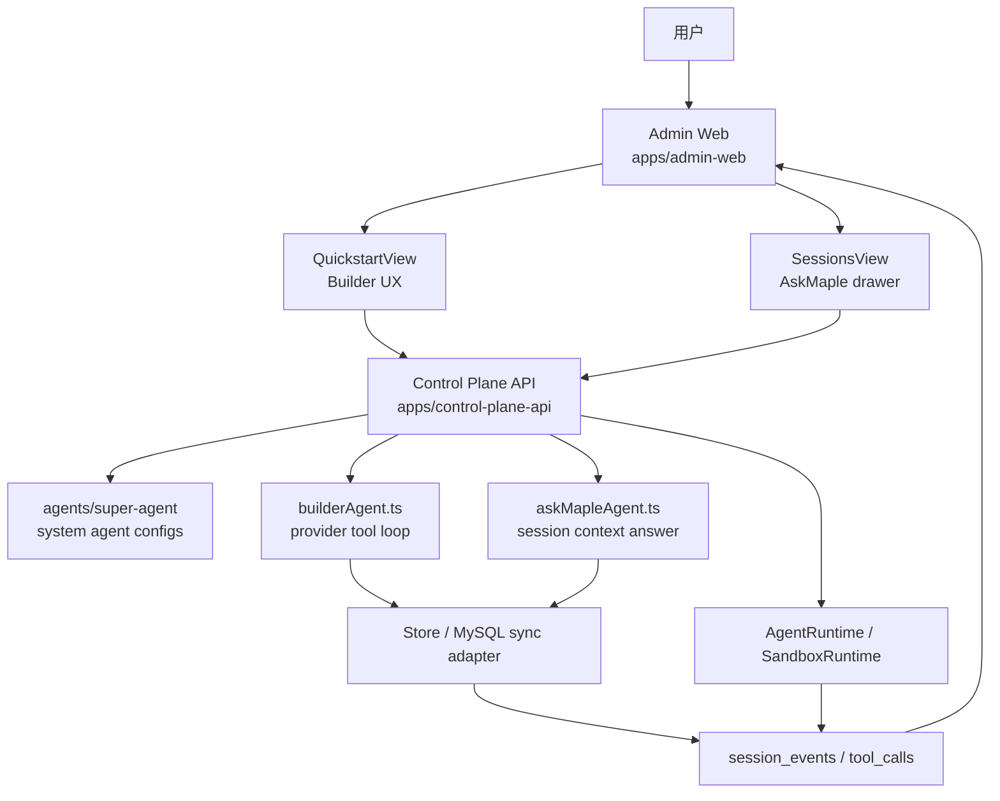
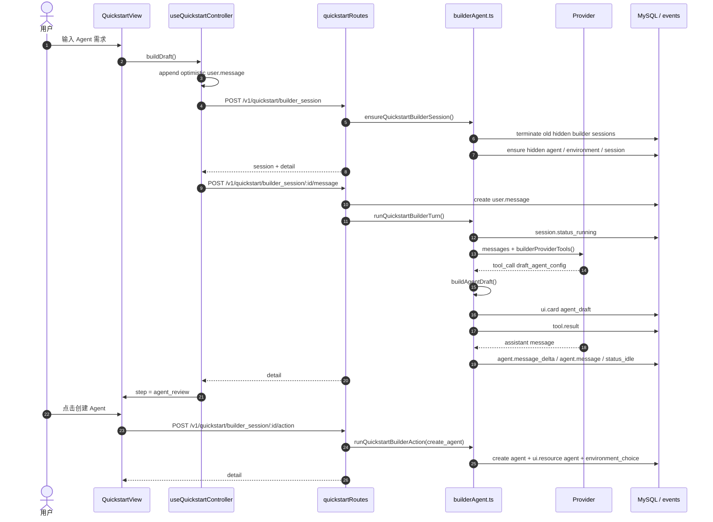
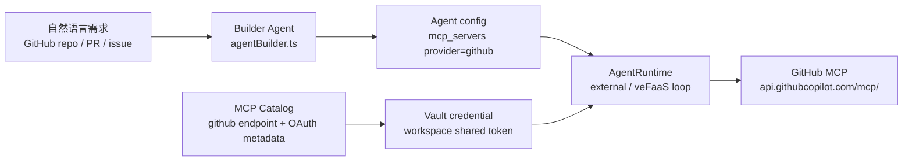
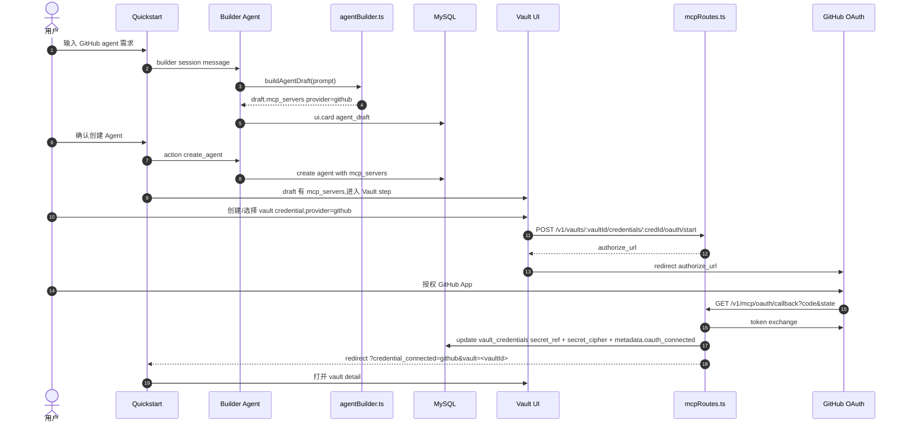
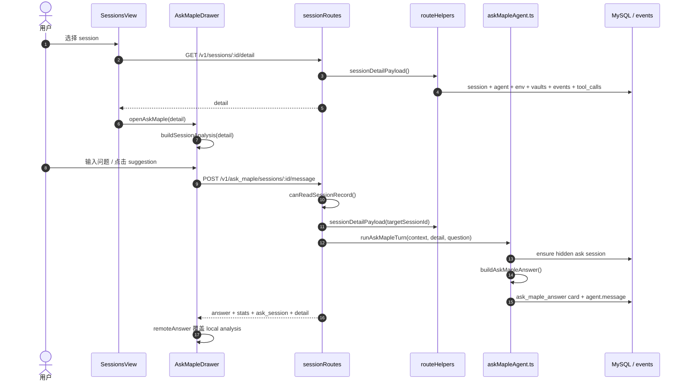

# Builder Agent 与 AskMaple Agent 设计说明

> 日期：2026-06-13
> 范围：Maple Admin Web、Control Plane API、`agents/super-agent` 系统 Agent 配置、Quickstart、Sessions / AskMaple drawer。
> 代码基线：`/Users/bytedance/workspace/managed-agents-platform` 当前工作区。
> 读者：平台研发、产品设计、前端、后端、运行时、验收同学。

## 1. 结论

Builder Agent 和 AskMaple 都是 Maple 的系统 Agent 能力，但两者职责不同：

- Builder Agent 面向创建闭环：把自然语言需求变成可审核的 `AgentConfig`，在用户确认后创建 Agent、Environment、Vault、Session。
- AskMaple 面向诊断闭环：读取目标 session 的 detail、events、tool_calls、artifacts 线索，回答当前状态、工具调用、失败原因、下一步。

当前实现有一个关键事实：

- Builder Agent 已经通过 provider tool loop 生成 draft，并用 hidden system session 保存对话与动作。
- AskMaple 当前是 control-plane 内的确定性 session 汇总器；`agents/super-agent` 已经声明 `maple_session_assistant` system agent 配置和 veFaaS runtime 元数据，但真正回答路径还没有调模型。

当前产品选择：

- 系统 Agent 走 hidden resources，不污染普通 Agent / Environment / Session 列表。
- Builder 所有写操作继续 confirmation-gated。
- AskMaple 优先低延迟、可解释、可回到事件事实，再演进到 LLM grounded answer。
- Builder 和 AskMaple 分开设计，避免一个“大助手”同时拥有创建权限和诊断权限。

## 2. 术语

| 术语 | 含义 | 源码证据 |
|---|---|---|
| Builder Agent | Quickstart 背后的系统 Agent，把用户需求转成 agent draft，再引导创建资源 | `CONTEXT.md:31`，`apps/control-plane-api/src/agents/builderAgent.ts` |
| AskMaple | session 内上下文问答助手，读 detail/events/tool_calls/artifacts 回答诊断问题 | `CONTEXT.md:35`，`apps/control-plane-api/src/agents/askMapleAgent.ts` |
| hidden system record | 系统 Agent / Environment / Session；普通列表默认过滤 | `apps/control-plane-api/src/agents/builderAgent.ts:42`、`:48`、`:54` |
| purpose handle | hidden system resource 的稳定识别字段 | `quickstart_builder`、`maple_session_assistant` |
| 事件即事实 | session 的状态、消息、工具、UI card、resource 都沉淀为事件 | `CONTEXT.md:41` |
| Control Plane | 资源、权限、配置归一、事件写入、密钥引用 | `CONTEXT.md:7` |
| AgentRuntime | 跑 Agent Loop 的地方 | `CONTEXT.md:15` |
| Sandbox | 跑工具、文件、包安装、副作用的地方 | `CONTEXT.md:19` |

## 3. 总体架构



分层：

- Web 层：负责即时反馈、loading、stepper、drawer、local fallback analysis、copy/integration code。
- Route 层：做 schema 校验、workspace/session 权限、hidden session owner 校验、错误映射。
- System Agent 层：封装 Builder / AskMaple 的 ensure session、tool/action、事件写入。
- Store 层：远程 MySQL 同步适配器；避免 route 里 N+1。
- Runtime 层：用户 session 的 AgentRuntime / SandboxRuntime；Builder/AskMaple 当前主要跑在 Control Plane。

## 4. 系统 Agent 配置包

核心包：`agents/super-agent/src/index.ts`

它定义两个 purpose：

```ts
export const QUICKSTART_BUILDER_PURPOSE = "quickstart_builder";
export const MAPLE_AGENT_PURPOSE = "maple_session_assistant";
```

### 4.1 Builder 配置

`createBuilderAgentConfig` 生成 hidden system agent：

- name：`Maple Agent Builder`
- system：只能做 control-plane actions，不执行用户 workload。
- tools：`builder_toolset`
- agent_loop：默认 `anthropic_claude_code`
- metadata：
  - `purpose: quickstart_builder`
  - `system_agent: true`
  - `hidden: true`
  - `super_agent: "builder"`
  - `runtime: builderRuntime`

`createBuilderEnvironmentConfig` 生成 control-plane-only hidden environment：

- `type: "control_plane"`
- `sandbox.provider: "none"`
- `networking.mode: "control_plane_only"`

`createQuickstartEnvironmentConfig` 生成真正给用户 Agent session 使用的 E2B environment：

- `type: "e2b"`
- `sandbox.provider: "e2b"`
- `workspace_root: ".managed-agents/sessions"`
- `networking` 由 `unrestricted` / `none` 决定。

### 4.2 AskMaple 配置

`createMapleAgentConfig` 生成 hidden system agent：

- name：`Maple Session Assistant`
- system：解释 session state、events、tool calls、artifacts、diagnostics。
- tools：`maple_session_toolset`
- agent_loop：默认 `anthropic_claude_code`
- metadata：
  - `purpose: maple_session_assistant`
  - `system_agent: true`
  - `hidden: true`
  - `super_agent: "maple"`
  - `priority: "p1"`
  - `runtime: askMapleRuntime`

### 4.3 当前实现和配置包关系

`agents/super-agent` 是系统 Agent 配置与未来 runtime contract 的源头。当前 Control Plane 中：

- Builder 使用 `createBuilderAgentConfig`、`createBuilderEnvironmentConfig`、`createQuickstartEnvironmentConfig`，实际对话由 `apps/control-plane-api/src/agents/builderAgent.ts` 驱动。
- AskMaple 使用 `createMapleAgentConfig` 创建 hidden agent，但回答由 `apps/control-plane-api/src/agents/askMapleAgent.ts` 中的 `buildAskMapleAnswer` 确定性生成。

这个拆法保留了后续把 AskMaple / Builder 搬到 centralized veFaaS system function 的入口，但当前不强依赖 runtime 函数可用性。

## 5. Builder Agent 设计

### 5.1 产品目标

Builder Agent 解决新用户从“有想法”到“能运行”的断点：

1. 用户描述 Agent 目标。
2. Builder 理解意图，必要时追问。
3. Builder 生成可审核 `AgentConfig`。
4. 用户确认创建 Agent。
5. 用户选择或创建 Environment。
6. 如有 MCP 凭证需求，进入 Vault。
7. 启动 Session，并在 Preview 里试跑。
8. Preview 完成后进入集成代码。

不是目标：

- 不替用户直接执行 workload。
- 不绕过确认创建 Agent / Environment。
- 不把 Builder 资源暴露在普通列表。

### 5.2 核心代码

| 模块 | 路径 | 职责 |
|---|---|---|
| system agent config | `agents/super-agent/src/index.ts` | hidden Builder agent / env / quickstart env config |
| Builder runtime | `apps/control-plane-api/src/agents/builderAgent.ts` | ensure hidden session、组织消息、provider tool loop、执行 actions |
| Builder prompt/tools | `apps/control-plane-api/src/agents/builderPrompts.ts` | system prompt、custom tool schema |
| Draft generator | `apps/control-plane-api/src/agents/agentBuilder.ts` | LLM JSON draft + fallback rule-based draft |
| Routes | `apps/control-plane-api/src/routes/quickstartRoutes.ts` | `/v1/agent_drafts`、builder_session、message、action |
| Frontend controller | `apps/admin-web/src/app/useQuickstartController.ts` | busy state、optimistic message、step transition、API calls |
| Frontend view | `apps/admin-web/src/pages/quickstart/QuickstartView.tsx` | chat、draft review、environment choice、preview、integration |
| Templates | `apps/admin-web/src/config/templates.ts` | 中文模板、package-heavy 场景 |

### 5.3 API

| API | 方法 | 作用 | 关键校验 |
|---|---|---|---|
| `/v1/agent_drafts` | POST | 直接根据 prompt 生成 draft | workspace access、model config |
| `/v1/quickstart/builder_session` | POST | 创建全新的 hidden Builder session | workspace access、model pool、model_config 属于 workspace |
| `/v1/quickstart/builder_session/:sessionId/message` | POST | 向 Builder 发消息 | session 是 quickstart builder、owner 是当前 user、workspace access |
| `/v1/quickstart/builder_session/:sessionId/action` | POST | 执行确认后的 UI action | session owner、workspace access、model pool |

### 5.4 Builder session 生命周期

`ensureQuickstartBuilderSession(context)` 做四件事：

1. 找到同一 user + workspace 下未 terminated 的 builder sessions。
2. 把旧 builder sessions 标记为 `terminated`。
3. 确保 hidden Builder Agent 和 hidden control-plane Environment 存在。
4. 创建新的 hidden session，metadata：

```json
{
  "purpose": "quickstart_builder",
  "hidden": true,
  "system_session": true,
  "owner_user_id": "<current-user-id>"
}
```

这个“进入 Quickstart 创建全新会话”的设计来自产品体验要求：用户每次打开 Quickstart，都应该从干净对话开始，避免旧上下文污染新 Agent 设计。代价是跨页面恢复草稿需要显式设计，不能偷偷复用旧 hidden session。

### 5.5 Provider tool loop

`runQuickstartBuilderTurn(sessionId, text, context)`：

1. session status -> `running`
2. 写入 `session.status_running`
3. `buildBuilderMessages` 组装上下文：
   - system prompt
   - 最新 `agent_draft` card
   - 最近 24 条 `user.message` / `agent.message`
4. 调 `callProvider(messages, userId, modelConfigId, builderProviderTools())`
5. 如果 provider 返回自然语言 message：
   - 写 `agent.message_delta`
   - 写 `agent.message`
   - session status -> `idle`
6. 如果 provider 返回 tool calls：
   - 写 `agent.tool_use`
   - `executeBuilderTool`
   - 写 `tool.result`
   - tool result 回填 provider messages
7. 最多 6 个 provider turns。
8. 异常进入 `runLegacyBuilderFallback`。

### 5.6 Builder tools

`builderProviderTools()` 当前暴露：

| Tool | 作用 | 写副作用 |
|---|---|---|
| `draft_agent_config` | 根据完整需求生成或修订 `AgentConfig` | 写 `ui.card card_type=agent_draft` |
| `list_environments` | 列当前 workspace 可复用环境 | 无写副作用 |
| `create_agent` | 明确确认后创建 Agent | 写 Agent、写 `ui.resource agent`、写 `environment_choice` |
| `create_environment` | Agent 就绪后创建 E2B Environment | 写 Environment、写 `ui.resource environment` |

`create_agent` 的 provider tool schema 要求 `confirmed: true`。同时前端路径还有 `/action` endpoint，由用户点击“创建这个 Agent”触发。也就是双层确认：

- provider 自主调用 create_agent 时必须带 `confirmed: true`
- UI action 只能由用户点击发起

这比“模型自己判断用户是否同意”更稳。代价是多一步按钮，但可避免误创建真实资源。

### 5.7 Draft 生成

`buildAgentDraft(prompt, userId, modelConfigId, agentLoopType, workspaceId)`：

1. `selectModelForPrompt` 选模型。
2. 确定 `agent_loop.type`，默认来自 `defaultAgentLoop`。
3. 调 `callProviderText`，要求只返回 JSON。
4. `parseJsonObject` 从 provider 输出中提取 JSON。
5. `normalizeAgentConfig` 补齐字段、绑定 selected model、规范 tools / mcp / skills。
6. 失败时 `buildRuleBasedAgentDraft` 兜底，并写 metadata：
   - `builder: "schema-fallback"`
   - `provider_fallback: true`
   - `provider_error: <message>`

超时由 `MAPLE_AGENT_DRAFT_TIMEOUT_MS` 控，默认 8000ms。这个选择优先保证 Quickstart 不长时间卡死。代价是弱模型或慢模型更容易进入 fallback，因此 UI 必须显式提示“这是兜底草稿”。

### 5.8 前端状态机

`useQuickstartController.applyQuickBuilderDetail(detail)` 以事件流推导 wizard step：

| 最新事件 | 前端状态 |
|---|---|
| `ui.card card_type=agent_draft` | `agent_review` |
| `ui.resource resource_type=agent` | `environment` |
| `ui.resource resource_type=environment` | `vault` 或 `session` |
| session created | `session` |
| preview 完成 | `integration` |

这里没有单独的后端 wizard state 表。原因：

- 事件流已经是事实来源。
- 前端可以从 detail 重建状态。
- E2E 和 debug 都能看到状态转移证据。

代价：

- 前端要小心“旧 draft 后出现的新 resource”顺序。
- 事件 schema 必须稳定。
- 后续增加分支时应引入显式 `builder.step` card 或 action plan schema，避免 UI 继续从事件顺序里猜。

### 5.9 Builder 交互

Quickstart 当前交互：

- 左侧是 Builder chat。
- 右侧是模板 / config / preview / integration。
- 发送消息时：
  - 乐观写入用户消息。
  - `busyAction = "builder_message"`。
  - 显示 `Agent 构建助手正在分析` typing card。
- 创建 Agent 时：
  - `busyAction = "create_agent"`。
  - 按钮显示 `正在创建 Agent...`。
- 启动 Session 时：
  - `busyAction = "start_session"`。
  - 按钮显示 `正在启动 Session...`。
- Preview 中 session `bootstrapping` 时显示沙箱启动提示。

模板当前是中文优先，覆盖数据分析、客服、舆情、事故、合规、研发、增长、财务、浏览器验收、Node 自动化。部分模板直接在 system prompt 中声明环境包需求，例如 `pandas`、`openpyxl`、`playwright`、`npm`、`pnpm`、`zx`。

### 5.10 Builder 数据流



### 5.11 Builder 安全边界

| 风险 | 当前防线 |
|---|---|
| hidden system agent 泄漏到普通列表 | `visibleAgents` / `visibleEnvironments` / `visibleSessions` 默认过滤 hidden |
| 读取他人 hidden session | `canReadSessionRecord` 对 hidden session 检查 `owner_user_id` |
| 跨 workspace model config | `workspaceIncludesModelConfig` |
| 跨 workspace environment reuse | `getEnvironment` 后校验 `environment.workspace_id === context.workspaceId` |
| 模型误创建资源 | provider tool schema + UI action confirmation |
| provider 慢或失败 | 8s draft timeout + rule-based fallback + UI warning |

### 5.12 Agent / Vault / MCP 架构关系

GitHub MCP 闭环里,Agent、MCP、Vault 的边界是:

- Agent config 只声明"需要哪个 MCP provider 和 endpoint",不保存 token。
- `mcp_servers[].provider` 是运行时找凭据的关联键。GitHub 例子:

```json
{
  "name": "github",
  "provider": "github",
  "url": "https://api.githubcopilot.com/mcp/",
  "type": "url"
}
```

- MCP Catalog 定义 provider 元数据:`provider=github`、MCP endpoint、OAuth authorize/token URL、scope、client env prefix。
- Vault 保存 workspace 级共享凭据。OAuth 成功后,`vault_credentials.metadata.provider=github`、`metadata.oauth_connected=true`;token bundle 加密后写 `secret_cipher`,并保留 `secret_ref` 文件回退。
- Runtime 只在执行前服务端注入 token,把 `mcp_servers[].type` 转为 `http`,并加 `headers.Authorization: Bearer <token>`。
- 当前是 ADR 0005 的共享凭据模型 A:同一 workspace 内任何人运行该 agent,都使用这条 workspace/vault token。per-user OAuth 是后续模型 B。



关键约束:

- 没有 `provider` 的 MCP server 不会自动注入凭据,只能按原样传给 runtime。
- token 不进入 Agent 持久配置,只进入当次运行时传给 sandbox 的 MCP 配置。
- `secret_cipher` 是云端稳定闭环必需项,因为 veFaaS `/tmp` 不持久且多实例不共享。

### 5.13 GitHub 创建时序

从"创建一个能查看 GitHub 仓库和 PR 的助手"到凭据连通,时序如下:



代码入口:

- Draft 生成:`apps/control-plane-api/src/agents/agentBuilder.ts`。prompt 明确要求 GitHub / Notion 这类 preset provider 产出 `provider` 字段;rule-based fallback 遇到 `github`、`repo`、`pr`、`issue` 也会生成 GitHub MCP。
- Catalog:`apps/control-plane-api/src/catalog/mcpCatalog.ts`。GitHub endpoint 为 `https://api.githubcopilot.com/mcp/`,OAuth scope 为 `repo read:user`,client env prefix 为 `MAPLE_MCP_GITHUB`。
- OAuth start/callback:`apps/control-plane-api/src/routes/mcpRoutes.ts`。callback 成功后带 `credential_connected` 和 `vault` query,前端回 Vault detail。
- Vault credential 读取:`apps/control-plane-api/src/storage/storeVaultMcpMemory.ts`。`readCredentialSecret` 优先解 `secret_cipher`,回退 `secret_ref`。

### 5.14 GitHub 运行时序

session 真正调用 GitHub MCP 时,凭据不是由 Builder 或前端传入,而是在运行前由 Control Plane 注入:

```mermaid
sequenceDiagram
  autonumber
  actor U as 用户
  participant S as Session
  participant Run as runner.ts / vefaasAgentRuntime.ts
  participant Inj as mcpCredentialInjection.ts
  participant Store as storeVaultMcpMemory.ts
  participant Loop as Claude external/veFaaS loop
  participant MCP as GitHub MCP
  participant DB as session_events

  U->>S: 发送 "列出最近 repo / PR / issue"
  S->>Run: runUserMessage(sessionId,text)
  Run->>Inj: withInjectedMcpCredentials(agent, workspace_id)
  Inj->>Store: findWorkspaceProviderToken(workspace_id,"github")
  Store->>Store: 查询 oauth_connected credential,解密 secret_cipher
  Store-->>Inj: access_token
  Inj-->>Run: mcp_servers headers.Authorization 已注入
  Run->>Loop: 启动 external / veFaaS agent loop
  Loop->>MCP: tools/list, tools/call get_me/search_repositories
  MCP-->>Loop: GitHub JSON result
  Loop->>DB: agent.external_loop_event tool_use/tool_result
  Loop-->>S: agent.message
```

执行入口:

- external loop:`apps/control-plane-api/src/runtime/runner.ts` 在 `runExternalAgentLoop` 前调用 `withInjectedMcpCredentials`。
- veFaaS loop:`apps/control-plane-api/src/runtime/vefaasAgentRuntime.ts` 在 `MAPLE_AGENT_TEMPLATE` 序列化前调用 `injectMcpCredentials`。
- 注入逻辑:`apps/control-plane-api/src/runtime/mcpCredentialInjection.ts`。只处理同时有 `provider` 和 `url` 的 MCP server;找不到 token 时 no-op,保留原 MCP 配置。
- token 查找:`findWorkspaceProviderToken(workspaceId, provider)` 按 workspace 内 `auth_type='oauth'`、`metadata.provider`、`metadata.oauth_connected` 找最近连接的凭据。

2026-06-15 云上 GitHub 验证结果:

- Vault credential `vcred_va9owsXCEI` 写入 `secret_cipher`,metadata 标记 `oauth_connected=true`。
- `findWorkspaceProviderToken("ws_g0VdNVB6th","github")` 命中 `vcred_va9owsXCEI`。
- 原始 GitHub MCP `initialize`、`tools/list`、`get_me`、`search_repositories` 成功。
- Maple session `sess_lvxLa-5Kvj` 的事件里出现 `mcp__github__get_me` 和 `mcp__github__search_repositories` tool_use/tool_result;最终回复 `login: dragonforce2010`,并返回 GitHub repo full_name 列表。

## 6. AskMaple 设计

### 6.1 产品目标

AskMaple 要把 session debug 变成产品能力：

- 用户不用复制 raw events。
- 用户不用理解每种 provider event。
- 用户能直接问“为什么失败”“工具做了什么”“现在卡在哪里”。
- 产品上同时展示答案、event mix、tool calls、links/images，降低黑盒感。

不是目标：

- 当前不修改 session。
- 当前不创建或删除用户资源。
- 当前不替用户自动重跑 session。

### 6.2 核心代码

| 模块 | 路径 | 职责 |
|---|---|---|
| system agent config | `agents/super-agent/src/index.ts` | `Maple Session Assistant` hidden agent config |
| AskMaple runtime | `apps/control-plane-api/src/agents/askMapleAgent.ts` | ensure hidden session、build answer、写 answer events |
| Session routes | `apps/control-plane-api/src/routes/sessionRoutes.ts` | `/v1/ask_maple/sessions/:sessionId/message` |
| session detail | `apps/control-plane-api/src/routes/routeHelpers.ts` | `sessionDetailPayload` 聚合 session/agent/env/vaults/events/tool_calls |
| Frontend drawer | `apps/admin-web/src/pages/sessions/AskMapleDrawer.tsx` | 输入、suggestions、loading、answer、stats、event mix、tool table、references |
| local analysis | `apps/admin-web/src/pages/sessions/SessionAnalysis.tsx` | drawer 打开即给本地分析兜底 |

### 6.3 API

`POST /v1/ask_maple/sessions/:sessionId/message`

Request：

```json
{
  "question": "解释这个 session 的上下文和工具调用"
}
```

兼容字段：

```json
{
  "text": "总结这个 session 的上下文"
}
```

Response：

```json
{
  "answer": "...",
  "suggested_actions": [
    { "id": "summarize", "label": "总结上下文", "question": "总结这个 session 的上下文和当前状态" }
  ],
  "stats": {
    "events": 12,
    "tool_calls": 3,
    "completed_tool_calls": 3,
    "non_completed_tool_calls": 0
  },
  "ask_session": {
    "metadata": {
      "purpose": "maple_session_assistant",
      "hidden": true,
      "system_session": true,
      "owner_user_id": "<current-user-id>",
      "target_session_id": "<target-session-id>"
    }
  },
  "events": [],
  "detail": {}
}
```

### 6.4 AskMaple session 生命周期

`ensureAskMapleSession(context)`：

1. 查找同一 user + workspace + target_session_id 下未 terminated 的 AskMaple hidden session。
2. 有则复用。
3. 无则确保 hidden AskMaple Agent 和 hidden control-plane Environment 存在。
4. 创建 title=`Ask Maple` 的 hidden session。
5. session status -> `idle`。

Builder session 每次进入 Quickstart 都刷新；AskMaple session 对同一个 target session 复用。原因：

- Builder 是创作流程，旧上下文会污染新需求。
- AskMaple 是诊断流程，同一个 target session 的多轮追问应共享问答历史。

### 6.5 当前 answer 构造

`buildAskMapleAnswer(detail, question)` 当前不调模型。它做确定性分析：

1. 取 session、agent、environment。
2. 统计 event types。
3. 统计 tool calls：
   - count
   - completed
   - non_completed
   - tool names
4. 根据 question 判断用户是否在问：
   - failure：`fail`、`error`、`失败`、`错误`、`异常`
   - tools：`tool`、`工具`、`调用`、`write_file`、`list_files`
5. 生成 answer：
   - 已读取哪个 session
   - 当前状态
   - Agent / Environment
   - events / tool calls 数量
   - 最后 event type
   - failure 或 tools 的针对性说明
   - event distribution
6. 返回 suggested actions 和 stats。

`runAskMapleTurn` 还会把 AskMaple 自身的问答写进 hidden AskMaple session：

- `session.status_running`
- `user.message`
- `agent.message_delta`
- `ui.card card_type=ask_maple_answer`
- `agent.message`
- `session.status_idle`

### 6.6 前端 drawer

`AskMapleDrawer` 交互：

- 打开 drawer 后，先用 `buildSessionAnalysis(detail, question)` 给本地分析。
- 用户点击 suggested action 或输入问题。
- `asking = true` 时 send button 显示 typing dots。
- 调 `/v1/ask_maple/sessions/:targetSessionId/message`。
- 成功后 `remoteAnswer` 覆盖 local analysis。
- 失败时显示 `askError`，本地分析仍可用。
- drawer 展示：
  - Answer
  - Events / Tools / Status 三个统计 tile
  - Event mix mini chart
  - Tool calls table
  - Links/images references

这是一个“先有即时诊断，再升级远端问答”的体验。它让 drawer 打开后不空白，也避免后端慢时用户看不到任何线索。

### 6.7 AskMaple 数据流



### 6.8 AskMaple 安全边界

| 风险 | 当前防线 |
|---|---|
| 读取无权限 session | route 先 `canReadSessionRecord(user.id, session)` |
| hidden AskMaple session 泄漏到 session list | `/v1/sessions` 默认过滤 `isHiddenSession` |
| 读取他人的 hidden AskMaple session | hidden session 需要 owner 匹配 |
| AskMaple 修改用户资源 | 当前无写用户资源 action，只写自身 hidden session events |
| 回答幻觉 | 当前 deterministic summary，只基于 detail/events/tool_calls |

## 7. Hidden resource 模型

系统 Agent 通过普通资源表建模，但默认隐藏：

| 类型 | Builder | AskMaple | 默认列表行为 |
|---|---|---|---|
| Agent | `purpose=quickstart_builder` | `purpose=maple_session_assistant` | `GET /v1/agents` 默认过滤 |
| Environment | control-plane-only hidden env | control-plane-only hidden env | `GET /v1/environments` 默认过滤 |
| Session | 每次进入 Quickstart 创建新 hidden session | 每个 target session 复用 hidden session | `GET /v1/sessions` 默认过滤 |

隐藏判断：

- Agent：`metadata.system_agent === true || metadata.hidden === true || metadata.purpose === quickstart_builder`
- Environment：`metadata.system_environment === true || metadata.hidden === true || metadata.purpose === quickstart_builder`
- Session：`metadata.hidden === true || metadata.system_session === true || metadata.purpose === quickstart_builder`

注意：`isHiddenSession` 当前只显式判断 `quickstart_builder` purpose，但 AskMaple session metadata 有 `hidden: true`，因此也被过滤。

## 8. Event contract

Builder 和 AskMaple 都把 UI 状态写成 session events。

### 8.1 Builder events

| Event type | provider_event_type | payload 关键字段 | 用途 |
|---|---|---|---|
| `session.status_running` | null | `reason=quickstart_builder.message` | 显示工作中 |
| `user.message` | null | `content[].text` | 用户输入 |
| `agent.tool_use` | `tool_use` | `id/name/input/permission_policy` | provider tool call |
| `tool.result` | `tool_result` | `id/name/status/output` | tool output |
| `ui.card` | `agent_draft` | `card_type=agent_draft`、`draft`、`actions` | 前端进入 agent_review |
| `ui.resource` | `agent_created` | `resource_type=agent`、`id`、`resource` | 前端进入 environment |
| `ui.card` | `environment_choice` | environments + actions | 环境选择卡 |
| `ui.resource` | `environment_created` / `environment_selected` | `resource_type=environment` | 前端进入 vault/session |
| `agent.message_delta` | `message_stop` | text | transcript 增量 |
| `agent.message` | `message_stop` | content | transcript |
| `session.status_idle` | null | reason、stop_reason | 一轮结束 |

### 8.2 AskMaple events

| Event type | provider_event_type | payload 关键字段 | 用途 |
|---|---|---|---|
| `session.status_running` | null | `reason=ask_maple.message`、`target_session_id` | hidden AskMaple turn 开始 |
| `user.message` | null | question、target_session_id | AskMaple 问题 |
| `agent.message_delta` | `message_delta` | `AskMaple 正在读取...` | loading / streaming hint |
| `ui.card` | `ask_maple_answer` | answer、stats、suggested_actions | drawer answer card |
| `agent.message` | `message_stop` | answer | hidden transcript |
| `session.status_idle` | null | `reason=ask_maple.answer_ready` | 一轮结束 |

## 9. 设计取舍

### 9.1 Hidden system resources vs 硬编码 wizard

| 方案 | 优点 | 缺点 | 当前结论 |
|---|---|---|---|
| hidden system Agent / Environment / Session | 复用 Agent/Session/Event 模型；debug 有证据；可逐步迁移到 runtime；权限可沿用 workspace/session | 需要过滤隐藏资源；ensure 逻辑重复；错误时可能留下 system session | 当前采用 |
| 纯前端 wizard + `/v1/agent_drafts` | 实现快；没有 hidden 资源；状态简单 | 没有对话记忆；无法沉淀 tool/result/action 证据；难演进多轮自然语言 | 只保留为基础 draft API |
| 用户可见 Builder Agent 模板 | 透明；普通资源模型无需 hidden filter | 污染 Agent 列表；用户可能误删/误改；权限含义混乱 | 不采用 |
| 完全外部 worker/service | 隔离好；可独立扩缩容 | 初期复杂；本地/云端依赖多；Quickstart 首屏容易被 runtime 可用性拖垮 | 作为 P2 演进 |

### 9.2 Confirmation-gated action vs autonomous action

| 方案 | 优点 | 缺点 | 当前结论 |
|---|---|---|---|
| 用户确认后创建 Agent/Environment | 安全；符合“创建真实资源”预期；UI 可展示即将发送的请求 | 多一步；模型不能一口气完成 | 当前采用 |
| 模型直接 tool call 创建 | 流程快；对 power user 省点击 | 容易误创建；审计困难；prompt injection 风险高 | 不采用 |
| dry-run plan + batch apply | 安全且批量；可审计 | 需要 ActionPlan schema 和 diff UI | P1/P2 演进 |

### 9.3 AskMaple deterministic answer vs LLM answer

| 方案 | 优点 | 缺点 | 当前结论 |
|---|---|---|---|
| deterministic summary | 低延迟；稳定；不会幻觉；本地测试容易 | 语义浅；复杂失败解释不够；不会综合长链路 | 当前采用 |
| LLM grounded answer | 能读复杂上下文；表达自然；可追问 | 成本、延迟、幻觉、上下文截断、权限引用都要管 | P1 演进 |
| 混合：先 deterministic，再 LLM | 首屏快；深问强；可降级 | 需要两阶段 UI 和状态 | 推荐演进 |

### 9.4 Builder 和 AskMaple 分开 vs 一个 Maple Copilot

| 方案 | 优点 | 缺点 | 当前结论 |
|---|---|---|---|
| 分开两个 system agent | 权限清晰；prompt/tool scope 小；产品心智明确 | hidden session ensure 逻辑重复；入口分散 | 当前采用 |
| 一个 Maple Copilot | 用户心智简单；可跨创建和诊断 | 创建权限和诊断权限混在一起；安全策略复杂；prompt 更容易漂移 | 暂不采用 |
| 统一 system-agent registry + 分 capability | 复用基础设施；保持权限隔离 | 需要 registry / policy / action schema | P1/P2 演进 |

### 9.5 Control-plane handler vs veFaaS system function

| 方案 | 优点 | 缺点 | 当前结论 |
|---|---|---|---|
| Control Plane 内处理 | 低延迟；少依赖；本地可跑；容易访问 store | API 进程承担推理编排；与 `agents/super-agent` runtime metadata 有落差 | 当前采用 |
| centralized veFaaS system function | 与生产 runtime 一致；可独立扩缩容；隔离系统 Agent 计算 | 首屏依赖函数冷启动/可用性；调试链路变长 | P2 演进 |
| 后台 job queue | 不阻塞 HTTP；可重试；可观测 | 前端要轮询或等待事件流；代码复杂 | 适合长任务 |

### 9.6 Event-as-truth vs 直接读 runtime logs

| 方案 | 优点 | 缺点 | 当前结论 |
|---|---|---|---|
| 读 `session_events` / `tool_calls` | Console、SDK、CLI 一致；可测试；可审计 | 如果 runtime 没写事件，AskMaple 看不到事实 | 当前采用 |
| 直接拉 runtime logs | 信息可能更全 | provider 差异大；权限和留存复杂；不适合作为产品主路径 | 只作为补充 |
| 事件 + runtime snapshot pack | 事实稳定且包含运行态 | 要定义 context pack schema | P1 演进 |

### 9.7 Fresh Builder session vs persistent Builder session

| 方案 | 优点 | 缺点 | 当前结论 |
|---|---|---|---|
| 每次进入 Quickstart 重置 | 干净；不会把旧需求带进新 Agent | 用户意外离开会丢草稿上下文 | 当前采用 |
| 长期持久 Builder session | 可恢复；适合复杂 Agent 设计 | 旧上下文污染概率高；多 workspace 切换复杂 | 暂不采用 |
| 显式“恢复上次草稿” | 兼顾干净和可恢复 | 需要 draft list / resume UI | P1 演进 |

## 10. 当前技术债

| 问题 | 影响 | 建议 |
|---|---|---|
| Builder 和 AskMaple 各自有 `modelFromWorkspace`、ensure hidden agent/env/session | 重复逻辑；未来增加 system agent 会继续复制 | 抽 `systemAgentRegistry.ts` |
| AskMaple metadata 声明 veFaaS runtime，但回答路径在 Control Plane | 读代码时容易误以为已经是 runtime agent | 文档标清当前态；P1/P2 做真实 system runtime |
| AskMaple answer deterministic | 复杂诊断深度不够 | 引入 `SessionContextPack` + grounded LLM |
| Builder action state 从事件顺序推导 | 新分支多时前端复杂 | 定义 `builder.state` / `action_plan` card |
| `apps/control-plane-api/src/builderAgent.ts` 等顶层文件只是 re-export | 新人容易找错入口 | 后续清理或保留并在 README 标注 |
| `activeBuilderSessions` / `activeAskMapleSession` 直接 `listSessions()` 后过滤 | session 多时有性能风险 | 加 workspace/purpose 查询函数 |
| provider tool `create_environment` 不要求 confirmed | 当前 route action 有 UI 确认；provider 直接调用时防线弱于 create_agent | tool schema 增 `confirmed`，服务端强校验 |

## 11. 演进计划

### P0：当前稳态

- Builder Agent 保持 confirmation-gated。
- AskMaple 保持 read-only deterministic summary。
- hidden system resources 不出现在普通列表。
- UI 保持 loading、typing、fallback warning。
- E2E 覆盖 builder draft/agent/env 和 AskMaple answer。

### P1：System Agent 基础设施收敛

新增 `apps/control-plane-api/src/agents/systemAgentRegistry.ts`：

- `ensureSystemAgent(workspaceId, purpose, configFactory)`
- `ensureSystemEnvironment(workspaceId, purpose, configFactory)`
- `ensureSystemSession({ workspaceId, userId, purpose, targetId?, reusePolicy })`
- `hideSystemRecord(record)`
- `assertSystemSessionOwner(session, userId)`

新增 `SessionContextPack`：

```ts
type SessionContextPack = {
  session: JsonRecord;
  agent: JsonRecord | null;
  environment: JsonRecord | null;
  events: Array<{ id: string; type: string; payload: JsonRecord; created_at: string }>;
  tool_calls: Array<{ id: string; name: string; status: string; input: unknown; output: unknown }>;
  artifacts: Array<{ id: string; kind: string; url?: string; name?: string }>;
  runtime?: JsonRecord;
  limits: { max_events: number; max_tokens: number; truncated: boolean };
};
```

AskMaple LLM 只吃 `SessionContextPack`，不直接自由查询 DB。这样权限、截断、引用、测试都可控。

### P2：ActionPlan 和 grounded AskMaple

Builder 输出结构化 plan：

```ts
type BuilderActionPlan = {
  draft_id: string;
  summary: string;
  proposed_resources: Array<"agent" | "environment" | "vault" | "session">;
  required_confirmations: Array<{
    action_id: string;
    label: string;
    risk: "low" | "medium" | "high";
    payload_ref: string;
  }>;
};
```

AskMaple 输出带引用 answer：

```ts
type AskMapleGroundedAnswer = {
  answer: string;
  citations: Array<{ kind: "event" | "tool_call" | "artifact"; id: string; label: string }>;
  confidence: "high" | "medium" | "low";
  next_actions: Array<{ id: string; label: string; command?: string; requires_confirmation: boolean }>;
};
```

P2 目标：

- Builder 不再让前端从事件顺序猜状态。
- AskMaple 可以解释复杂失败，但每句话可回到事件或 tool call。
- 所有 write action 都有 risk level 和 confirmation。

### P3：系统 Agent runtime 化

把 Builder / AskMaple 执行迁到 centralized veFaaS system function：

- `maple-super-agent-builder`
- `maple-super-agent-ask-maple`

前置条件：

- cold start 可接受，或有 warm pool。
- system-agent context pack 可序列化。
- action plan schema 稳定。
- e2e 覆盖本地和云上。
- 出错时 Control Plane fallback 仍可给低配答案。

### P4：跨 session / workspace 诊断

AskMaple 扩展为：

- 当前 session 诊断。
- 同 Agent 近 N 个 session 对比。
- 环境 / runtime pool 健康诊断。
- “为什么这个 Agent 最近变慢”的趋势分析。

Builder 扩展为：

- 从历史成功 Agent 模板提炼 draft。
- 基于 workspace package / sandbox 能力推荐 Environment。
- 自动生成 eval session。

## 12. 测试与验收

当前核心 E2E 覆盖：

| 场景 | 文件 | 断言 |
|---|---|---|
| Builder 创建 draft/agent/environment | `tests/e2e/e2e.mjs:569` | hidden builder session purpose、draft card、agent resource、environment resource |
| Builder hidden agent 不泄漏 | `tests/e2e/e2e.mjs:580` | 普通 `/v1/agents` 不出现 `quickstart_builder` |
| Builder hidden env 不泄漏 | `tests/e2e/e2e.mjs:615` | 普通 `/v1/environments` 不出现 `quickstart_builder` |
| AskMaple answer | `tests/e2e/e2e.mjs:1272` | answer 包含 AskMaple 和 session id，stats 看到 tool_calls |
| AskMaple hidden session 不泄漏 | `tests/e2e/e2e.mjs:1282` | 普通 `/v1/sessions` 不出现 ask_session |
| 浏览器 AskMaple drawer | `tests/e2e/e2e.mjs:1395` | 点击 Ask Maple，输入问题，看到 `AskMaple 已读取` |
| GitHub MCP 动态 OAuth 云上闭环 | cloud stable session `sess_lvxLa-5Kvj` | OAuth token 落 `secret_cipher`,session 事件出现 `mcp__github__get_me` 和 `mcp__github__search_repositories`,最终返回 GitHub repo |

建议补充：

- Builder provider 直接 tool call `create_environment` 未 confirmed 时应拒绝。
- GitHub MCP 动态 OAuth 闭环固化为 e2e fixture:builder draft 产 `provider=github`,Vault OAuth callback 写 `secret_cipher`,session 运行时注入 header 并产生 MCP tool_result。
- AskMaple 对 failed tool、failed event、无 tool session、超长 event session 的 answer snapshot。
- `include_system=1` 下 system records 可用于 admin debug，但普通视图永不泄漏。
- Fresh Builder session：连续两次进入 Quickstart，旧 hidden builder session terminated。
- AskMaple reuse：同 target session 连问两次复用同 ask_session。
- SessionContextPack 截断测试：events 超长时保留首尾、失败事件、最后 agent.message、tool errors。

## 13. 代码索引

### Backend

| 路径 | 入口 |
|---|---|
| `agents/super-agent/src/index.ts` | `createBuilderAgentConfig`、`createMapleAgentConfig` |
| `apps/control-plane-api/src/agents/builderAgent.ts` | `ensureQuickstartBuilderSession`、`runQuickstartBuilderTurn`、`runQuickstartBuilderAction` |
| `apps/control-plane-api/src/agents/builderPrompts.ts` | `builderProviderTools`、`builderSystemPrompt` |
| `apps/control-plane-api/src/agents/agentBuilder.ts` | `buildAgentDraft` |
| `apps/control-plane-api/src/agents/askMapleAgent.ts` | `ensureAskMapleSession`、`buildAskMapleAnswer`、`runAskMapleTurn` |
| `apps/control-plane-api/src/catalog/mcpCatalog.ts` | preset MCP provider endpoint、OAuth URL、scope、client env prefix |
| `apps/control-plane-api/src/routes/mcpRoutes.ts` | MCP server / vault credential OAuth start 和 callback |
| `apps/control-plane-api/src/storage/storeVaultMcpMemory.ts` | Vault credential secret 读取、`findWorkspaceProviderToken` |
| `apps/control-plane-api/src/runtime/mcpCredentialInjection.ts` | 运行前按 provider 注入 MCP Authorization header |
| `apps/control-plane-api/src/runtime/runner.ts` | external agent loop 运行前注入 MCP 凭据 |
| `apps/control-plane-api/src/runtime/vefaasAgentRuntime.ts` | veFaaS agent loop 序列化前注入 MCP 凭据 |
| `apps/control-plane-api/src/routes/quickstartRoutes.ts` | Builder HTTP endpoints |
| `apps/control-plane-api/src/routes/sessionRoutes.ts` | AskMaple endpoint、session events |
| `apps/control-plane-api/src/routes/routeHelpers.ts` | visible filters、session detail、hidden session owner check |

### Frontend

| 路径 | 入口 |
|---|---|
| `apps/admin-web/src/app/useQuickstartController.ts` | Quickstart state machine / API calls |
| `apps/admin-web/src/pages/quickstart/QuickstartView.tsx` | Builder chat / draft review / env / preview |
| `apps/admin-web/src/pages/quickstart/QuickstartParts.tsx` | side panel / API cards / preview |
| `apps/admin-web/src/config/templates.ts` | Chinese templates |
| `apps/admin-web/src/pages/sessions/AskMapleDrawer.tsx` | AskMaple drawer |
| `apps/admin-web/src/pages/sessions/SessionAnalysis.tsx` | local drawer analysis |

## 14. 最终建议

短期不要把 Builder 和 AskMaple 合成一个大 Copilot。先把两个 system agent 的基础设施抽象出来：

- 共享 hidden resource ensure。
- 共享 `SessionContextPack`。
- 共享 action plan / confirmation contract。
- 共享 eval fixtures。

Builder 的下一步是结构化 `ActionPlan`，减少 UI 猜状态。AskMaple 的下一步是 grounded LLM answer，保留 deterministic summary 作为首屏和 fallback。

这条路线能保持当前核心体验稳定，又给后续“系统 Agent runtime 化”和“跨 session 智能诊断”留出空间。
