# Maple 产品说明书

本文档面向两类读者：

- 普通用户：通过页面创建、运行和观察本地 Managed Agent。
- Developer：通过 API、模板、skills 和 E2E 验收扩展平台能力。

访问地址：

- Web Console: `http://127.0.0.1:5173/`
- API Server: `http://127.0.0.1:8787`

截图目录：`docs/product-manual/screenshots/`

## 1. 产品定位

Maple 是 Managed Agent Platform for Launch-ready Execution，是一个自研、本地优先、开箱即部署的 Agent 控制台，用来完成从自然语言需求到可运行 agent 的闭环：

1. 在 Quickstart 中选择模板或输入需求。
2. 生成并审核 agent config。
3. 配置运行环境、凭证 vault、memory store。
4. 启动 session，查看 transcript、debug events 和 runtime 状态。
5. 通过 Templates 与 Skills 扩展团队默认能力。

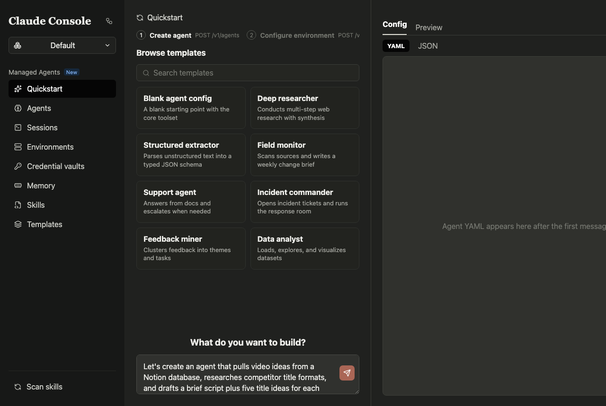

## 2. Quickstart：创建 Agent

Quickstart 是新建 agent 的主入口。

用户使用方式：

1. 点击左侧 `Quickstart`。
2. 在 `Browse templates` 选择一个模板卡片，例如 `Deep researcher` 或 `Data analyst`。
3. 下方 `What do you want to build?` 输入具体需求。
4. 点击右下角发送按钮，页面会立即显示 `Generating agent definition...`，按钮进入禁用和旋转态，避免用户误以为点击无效。
5. 生成后在右侧 `Config / Preview` 审核 YAML/JSON。
6. 点击 `Create this agent` 后进入环境配置和 session 启动流程。

发送按钮 loading 态：

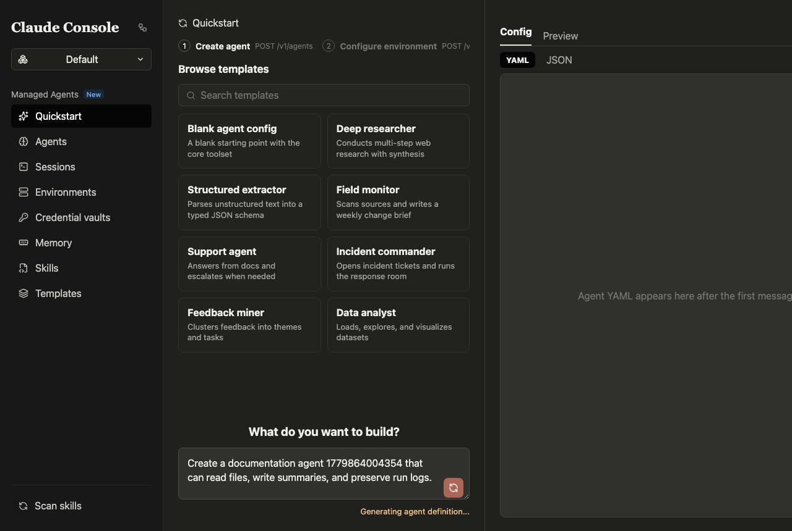

Developer 使用方式：

- Natural-language draft API: `POST /v1/agent_drafts`
- Agent 创建 API: `POST /v1/agents`
- 页面逻辑位于 `src/App.tsx` 的 Quickstart 视图。
- 发送体验由 `busyLabel`、`.send-button.sending` 和 `.action-status` 控制。
- E2E 覆盖点：点击所有模板卡片、发送按钮即时反馈、生成后展示创建按钮。

## 3. Agents：Agent 列表与配置查看

`Agents` 页面展示已创建 agent 的 ID、名称、模型和工具数量，适合确认配置是否落库。

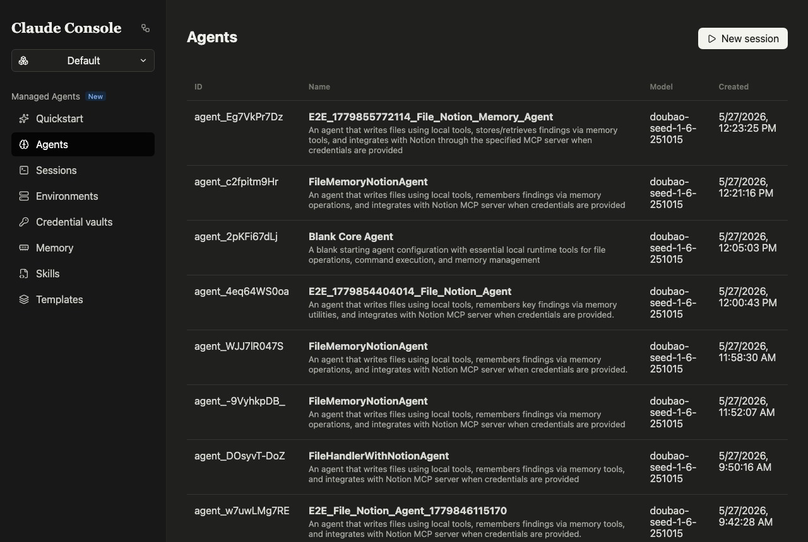

用户使用方式：

1. 点击左侧 `Agents`。
2. 扫描 agent 名称、模型、工具数量。
3. 对照 Quickstart 生成内容，确认配置是否符合预期。

Developer 使用方式：

- 列表 API: `GET /v1/agents`
- 创建 API: `POST /v1/agents`
- Store 实现位于 `server/store.ts`。

## 4. Sessions：运行、聊天与调试

`Sessions` 页面用于查看 agent 的运行详情。页面包含 session 列表、事件时间线、Transcript/Debug/All events 和右侧事件详情。

本次优化后，底部聊天入口固定可见，并支持回车发送消息。

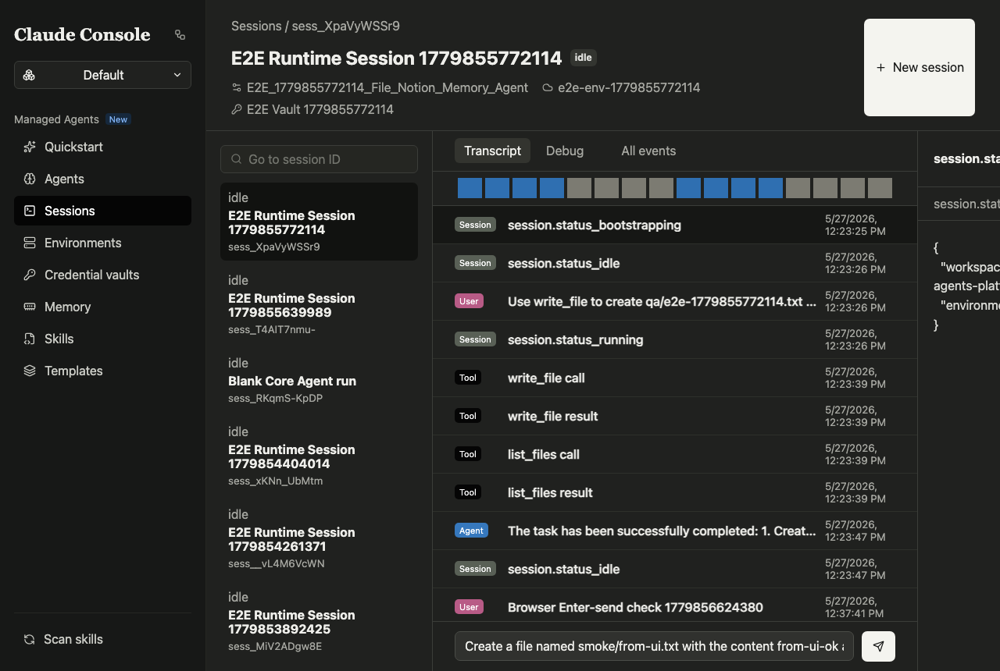

用户使用方式：

1. 点击左侧 `Sessions`。
2. 在左侧列表选择一个 session。
3. 中间查看 `Transcript` 或切换到 `Debug`、`All events`。
4. 右侧查看当前选中事件的 JSON 详情。
5. 底部输入框输入消息，按 `Enter` 发送。
6. 如需输入多行内容，使用 `Shift+Enter` 保留换行。
7. 点击右上角 `New session` 可启动新的运行。

Developer 使用方式：

- 创建 session: `POST /v1/sessions`
- 查询详情: `GET /v1/sessions/:sessionId/detail`
- 发送事件: `POST /v1/sessions/:sessionId/events`
- 运行事件以 `session.status_*`、`user.message`、`agent.message_delta`、`tool.call_*` 等类型落库。
- 页面布局通过 `.session-screen`、`.session-body`、`.composer` 保证在视口内可见。
- E2E 覆盖点：composer 可见、输入后按 `Enter` 发送、发送后输入框清空。

## 5. Environments：运行环境

`Environments` 页面管理 agent session 的运行环境，例如本地 Docker 环境、网络策略和包管理开关。

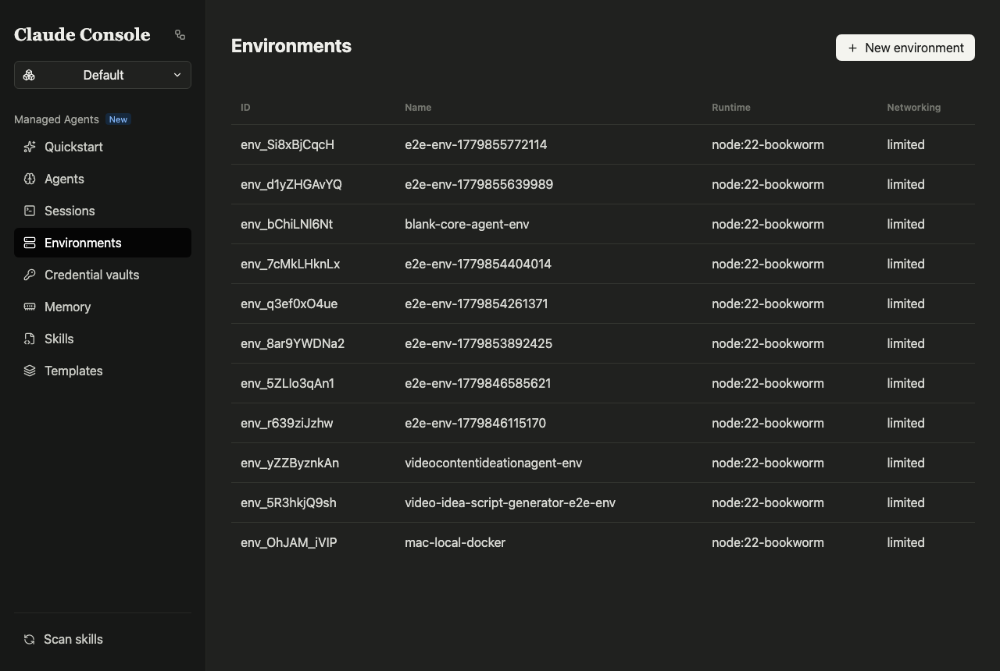

用户使用方式：

1. 点击左侧 `Environments`。
2. 查看环境 ID、名称和 runtime 类型。
3. 在 Quickstart 创建 agent 后选择或创建环境。

Developer 使用方式：

- 创建 API: `POST /v1/environments`
- 列表 API: `GET /v1/environments`
- 关键配置字段：
  - `type`: 例如 `local_docker`
  - `image`: Docker image
  - `networking.mode`
  - `allow_mcp_servers`
  - `allow_package_managers`

## 6. Credential Vaults：凭证托管

`Credential vaults` 页面用于管理 MCP/OAuth/API key 等敏感凭证引用。页面不展示明文 secret。

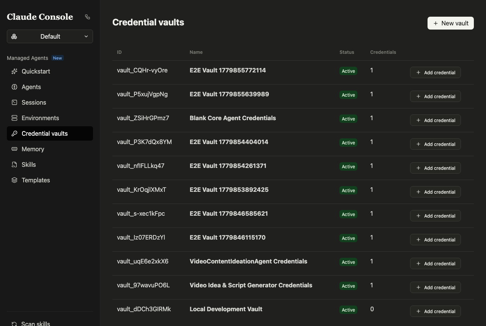

用户使用方式：

1. 点击左侧 `Credential vaults`。
2. 查看可用 vault。
3. 在创建 session 时选择需要挂载的 vault。

Developer 使用方式：

- 创建 vault: `POST /v1/vaults`
- 写入 credential: `POST /v1/vaults/:vaultId/credentials`
- Secret 文件保存在 `.managed-agents/secrets/`，测试会校验返回体不泄露明文。

## 7. Memory：长期记忆

`Memory` 页面展示 memory store，用于让 agent 跨 session 保存可检索上下文。

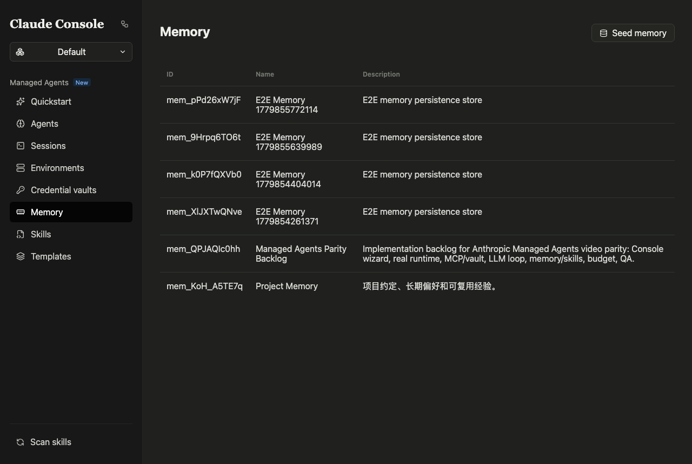

用户使用方式：

1. 点击左侧 `Memory`。
2. 查看 memory store 名称和描述。
3. 在 agent 或 session 配置中挂载对应 memory store。

Developer 使用方式：

- 创建 store: `POST /v1/memory_stores`
- 写入 memory: `PUT /v1/memory_stores/:storeId/memories/:path`
- 查询 memory: `GET /v1/memory_stores/:storeId/memories?query=...`

## 8. Templates：模板创建与编辑

`Templates` 页面用于维护 agent 配置模板。本次已新增创建和编辑能力。

模板列表：

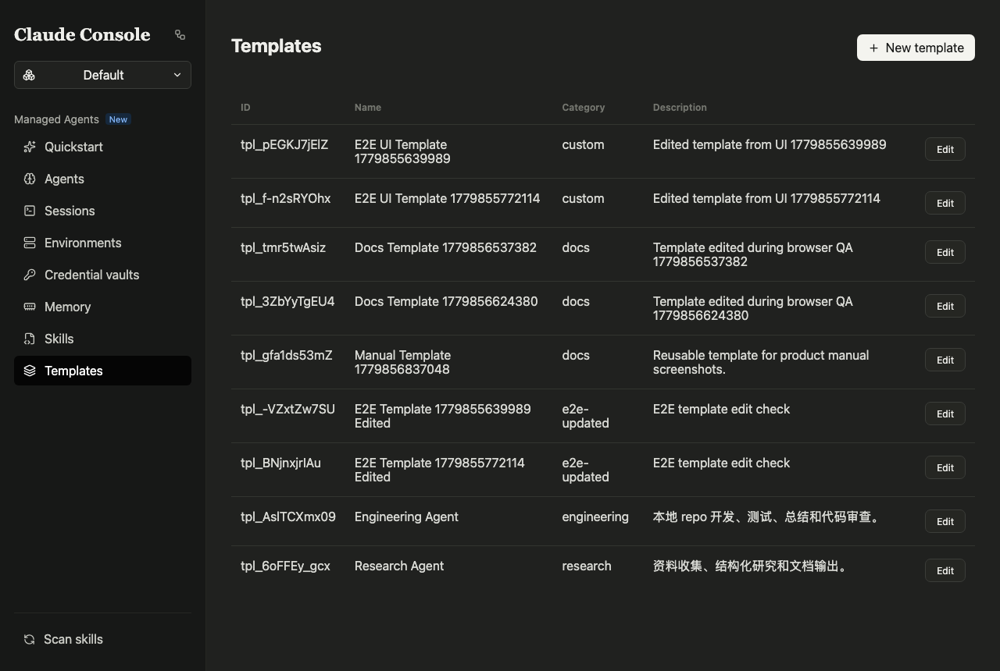

创建模板：

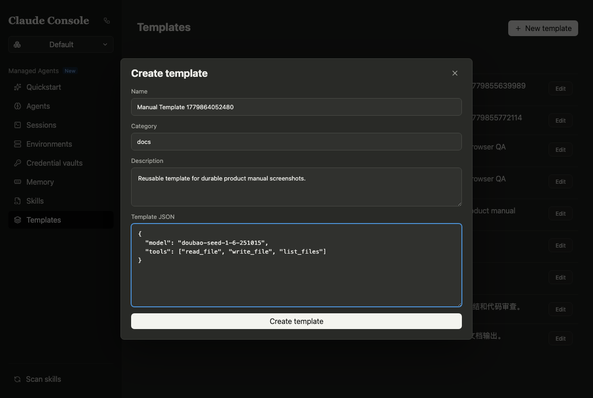

编辑模板：

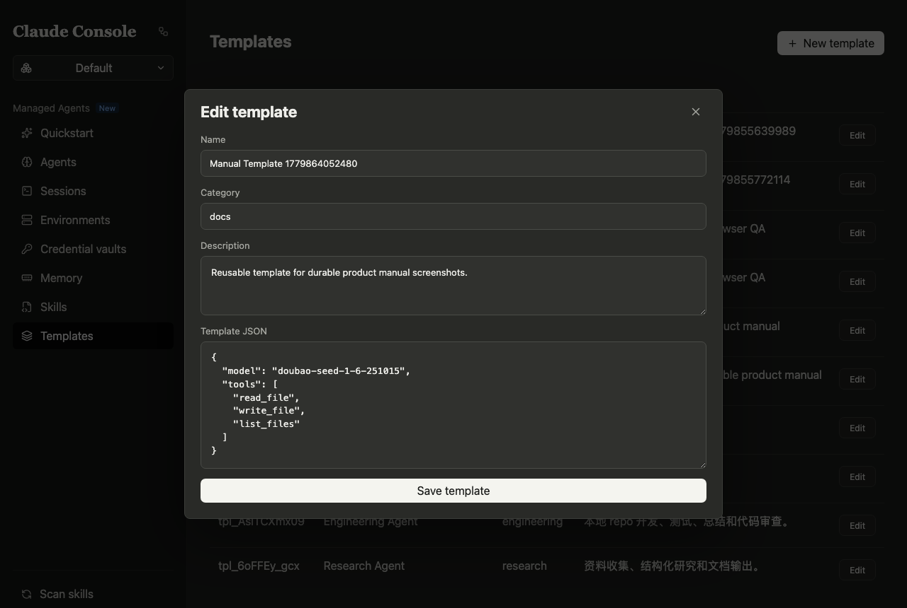

用户使用方式：

1. 点击左侧 `Templates`。
2. 点击 `New template` 创建模板。
3. 填写：
   - `Name`: 模板名称。
   - `Category`: 分类，例如 `engineering`、`research`、`docs`。
   - `Description`: 用途说明。
   - `Template JSON`: 默认模型、工具、MCP 或其他配置片段。
4. 点击 `Create template` 保存。
5. 在列表中点击 `Edit` 修改已有模板。

Developer 使用方式：

- 创建 API: `POST /v1/templates`
- 查询单个模板: `GET /v1/templates/:templateId`
- 更新 API: `PATCH /v1/templates/:templateId`
- 数据存储在 SQLite `templates` 表。
- E2E 覆盖点：API create/edit、UI create/edit、保存后列表更新。

## 9. Skills：本地 Skill 创建与编辑

`Skills` 页面索引 `~/.agents/skills` 下的本地 skill。本次已新增创建和编辑能力。

Skills 列表：

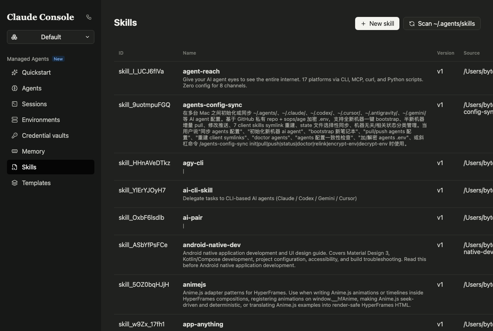

创建 Skill：

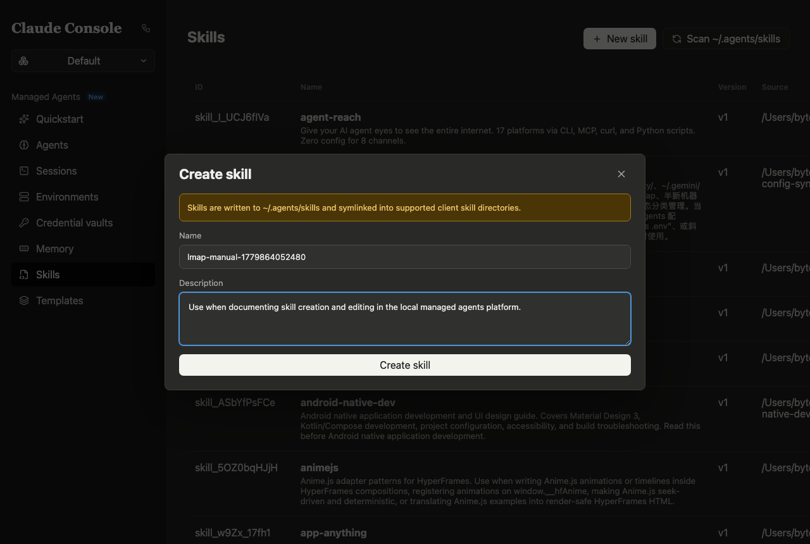

编辑 Skill：

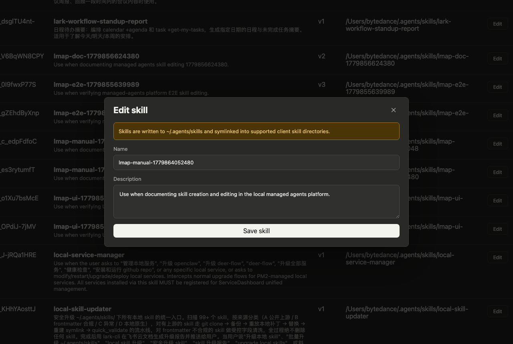

用户使用方式：

1. 点击左侧 `Skills`。
2. 点击 `Scan ~/.agents/skills` 刷新本地 skill 索引。
3. 点击 `New skill` 创建 skill。
4. 填写：
   - `Name`: lowercase kebab-case，例如 `team-release-checker`。
   - `Description`: 触发条件和用途说明。
5. 点击 `Create skill` 保存。
6. 在列表中点击 `Edit` 修改 description。

Developer 使用方式：

- 创建 API: `POST /v1/skills`
- 更新 API: `PATCH /v1/skills/:skillId`
- 扫描 API: `POST /v1/skills/scan`
- Skill 源文件写入 `~/.agents/skills/<name>/SKILL.md`。
- frontmatter 只包含 `name` 和 `description`。
- 创建时同步 7 个客户端目录 symlink：
  - `~/.claude/skills`
  - `~/.codex/skills`
  - `~/.cursor/skills`
  - `~/.antigravity/skills`
  - `~/.gemini/antigravity/skills`
  - `~/.gemini/antigravity-ide/skills`
  - `~/.gemini/skills`
- 如果目标路径已存在且不是正确 symlink，平台会跳过该路径，不会删除或覆盖用户文件。

## 10. Developer API 总览

常用 API：

| 功能 | Method | Path |
|---|---|---|
| 健康检查 | GET | `/health` |
| 自然语言生成 draft | POST | `/v1/agent_drafts` |
| Agent 列表 | GET | `/v1/agents` |
| Agent 创建 | POST | `/v1/agents` |
| Environment 创建 | POST | `/v1/environments` |
| Vault 创建 | POST | `/v1/vaults` |
| Credential 创建 | POST | `/v1/vaults/:vaultId/credentials` |
| Session 创建 | POST | `/v1/sessions` |
| Session 详情 | GET | `/v1/sessions/:sessionId/detail` |
| Session 事件发送 | POST | `/v1/sessions/:sessionId/events` |
| Memory store 创建 | POST | `/v1/memory_stores` |
| Memory 写入 | PUT | `/v1/memory_stores/:storeId/memories/:path` |
| Skills 扫描 | POST | `/v1/skills/scan` |
| Skill 创建 | POST | `/v1/skills` |
| Skill 更新 | PATCH | `/v1/skills/:skillId` |
| Template 创建 | POST | `/v1/templates` |
| Template 详情 | GET | `/v1/templates/:templateId` |
| Template 更新 | PATCH | `/v1/templates/:templateId` |

本地开发命令：

```bash
npm run dev
npm run typecheck
npm run build
npm run test:all
```

## 11. E2E 与按钮验收策略

验收规则：

1. 所有可见按钮都要点击。
2. 每次点击必须验证明确结果：页面跳转、modal 打开、保存成功、loading 态、输入框清空、列表更新或明确 no-op 理由。
3. 如果点击无效，先判断是产品行为缺陷还是 E2E 覆盖缺失。
4. 覆盖缺失则补测试，产品缺陷则修代码。
5. 修复后重跑 `npm run test:all` 和浏览器点击验收。

本次已覆盖：

- 8 个 Quickstart 模板卡片。
- Quickstart 发送按钮即时 loading/disabled。
- Templates 创建和编辑。
- Skills 创建和编辑。
- Sessions composer 可见和 Enter 发送。
- 主导航：Agents、Sessions、Environments、Credential vaults、Memory、Skills、Templates。

## 12. 常见问题

### 发送按钮点击后看起来没有反应

已优化为点击后立即显示 `Generating agent definition...`，按钮禁用并旋转。真实生成接口仍可能耗时较长，但用户不会再看到“无反馈”的空白等待。

### Session 页面底部看不到 chat 入口

已优化为视口内固定可见 composer。若窗口过小，内容区滚动，composer 仍保留在底部。

### Templates 无法创建或编辑

已支持 `New template` 和行级 `Edit`。保存后列表即时刷新。

### Skills 无法创建或编辑

已支持 `New skill` 和行级 `Edit`。创建会写入 `~/.agents/skills/<name>/SKILL.md` 并同步 symlink。

### Skill 创建时某些客户端目录没有 symlink

如果目标路径已存在但不是预期 symlink，平台不会删除或覆盖。需要手动处理该路径后重新创建或编辑 skill。

## 13. 本次验收证据

- `npm run typecheck`: 通过。
- `npm run build`: 通过。
- `npm run test:all`: 通过。
- In-app Browser 点击验收：通过，控制台无 error。
- 截图目录：`docs/product-manual/screenshots/`
