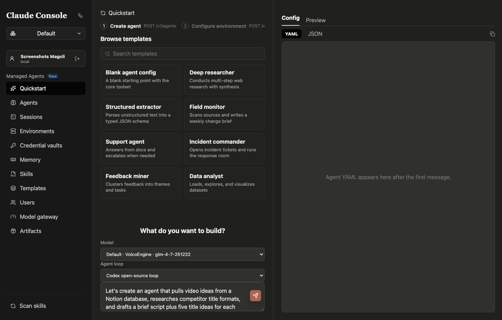
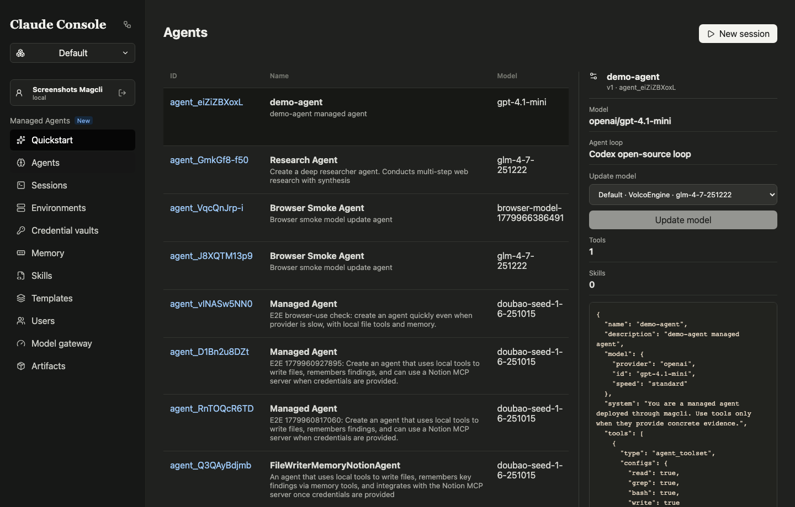
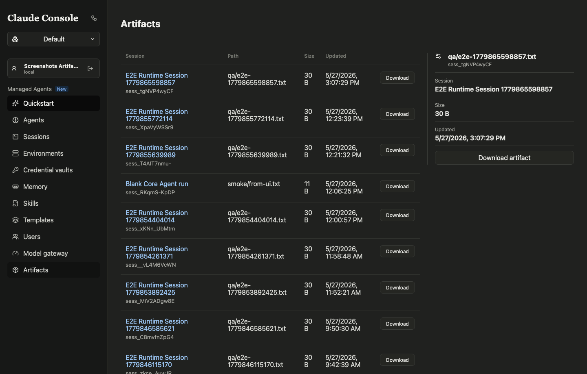

# Maple 新手说明书

> 版本：2026-06-10。面向第一次接入 Maple 的业务方、平台管理员、Agent 研发同学。

## 1. Maple 是什么

Maple 是一个托管 Agent 平台。你可以把它理解成“Agent 的控制台 + 运行时 + 沙箱 + 凭证库 + 调用入口”：

- 控制台：创建 Agent、开通工作区、查看 session、配置模型和凭证。
- Runtime：真正运行 Agent Loop。
- Sandbox：隔离执行命令、文件操作、MCP 工具。
- Vault：保存 API key、OAuth token、MCP 凭证，不把明文暴露给 Agent。
- API/SDK/CLI/Skill：让业务系统、研发脚本、其他 AI Agent 都能接入 Maple。

当前稳定环境：

```text
https://sd8ihq8v316pc5mf9c1j0.apigateway-cn-beijing.volceapi.com
```

## 2. 基础概念

| 概念 | 含义 |
|---|---|
| Tenant | 租户。组织级边界，通常对应一个业务团队或产品线。 |
| Workspace | 工作区。Agent、Session、Environment、Vault、API Key 的资源边界。 |
| Agent | 智能体定义。包含名称、说明、system prompt、model、tools、skills、agent_loop。 |
| Agent Version | Agent 每次更新后的快照。旧 session 仍能复盘旧版本。 |
| Environment | 运行环境。主要配置 sandbox provider、workspace path、timeout、envs。 |
| AgentRuntime | 跑 Agent Loop 的运行时。生产主路径是 veFaaS runtime pool。 |
| Sandbox | 跑工具和文件操作的隔离环境。当前可选 E2B 或 VeFaaS sandbox。 |
| Session | 一次 Agent 运行或对话。所有事件、工具调用、产物都挂在 session 下。 |
| Vault | 凭证库。保存 MCP/OAuth/API key 的 secret 引用。 |
| Model Config | 模型配置。OpenAI-compatible 或预置模型，绑定到工作区模型池。 |
| Skill | 给其他 AI Agent 使用的操作说明，让它能通过 CLI 控制 Maple。 |

## 3. 页面和基础功能

### 3.1 登录

进入 Maple 后先登录。开发/演示环境支持本地登录；生产环境按配置接 OAuth/OIDC/Lark SSO/ByteSSO。


登录后，如果你还没有租户，会进入开通流程；如果已有权限，会进入 Dashboard。

### 3.2 Dashboard

Dashboard 看整体资源：Agent、Session、Environment、Vault、运行状态和近期活动。


### 3.3 租户和工作区

Tenant 页面用于管理租户下的工作区、成员、管理员。工作区是最常用的资源边界：一个业务线可以有 dev/prod 两个 workspace。


常用动作：

- 创建工作区。
- 查看当前用户可访问的 workspace。
- 添加成员：普通成员可以使用资源。
- 添加管理员：管理员可以配置模型、API key、成员、运行时。
- 查看 runtime pool。

### 3.4 首次开通

首次开通按 5 步走：

1. 租户信息：租户名称、管理员、描述。
2. 默认工作区：工作区名称、描述、slug。
3. Runtime Provider：当前生产路径是 VeFaaS，配置 AK/SK/region 和 runtime pool。
4. Sandbox Provider：选择 E2B 或 VeFaaS sandbox。
5. 模型池和 API Key：选择或新增模型，生成 workspace API key。


Sandbox 配置：

| Provider | 必填配置 |
|---|---|
| E2B | `E2B_API_KEY` |
| VeFaaS Sandbox | `VEFAAS_SANDBOX_FUNCTION_ID`, `VEFAAS_SANDBOX_GATEWAY_URL`, 可选 `VEFAAS_SANDBOX_TIMEOUT_MS` |

Runtime 配置：

| 配置 | 说明 |
|---|---|
| `VOLCENGINE_ACCESS_KEY` | 创建/调用 veFaaS runtime pool 所需 AK |
| `VOLCENGINE_SECRET_KEY` | 创建/调用 veFaaS runtime pool 所需 SK |
| `VEFAAS_REGION` | 区域，默认 `cn-beijing` |
| `desired_size` | 预热函数数 |
| `min_instances_per_function` | 单函数最小实例数 |
| `max_instances_per_function` | 单函数最大实例数 |
| `max_concurrency_per_instance` | 单实例并发 |
| `cpu_milli` / `memory_mb` | 函数规格 |

开通完成后，务必保存 workspace API key。完整 key 只在创建响应或创建成功页面出现一次。

### 3.5 Quickstart / Builder Agent

Quickstart 是最快路径：你用自然语言描述需求，Builder Agent 帮你生成 Agent 草稿。


流程：

1. 输入需求，比如“帮我创建一个能检查仓库测试状态、总结失败原因的 Agent”。
2. Builder Agent 返回草稿：名称、说明、system prompt、model、tools、skills、agent_loop。
3. 点击 `Create this agent`。
4. 选择或创建 Environment。
5. 可选绑定 Vault/MCP。
6. 创建 Session，开始对话。

旧版产品手册截图也覆盖了 Quickstart 的加载态：


### 3.6 Agents

Agents 页面管理所有智能体。你可以查看列表、打开详情、看版本、配置 agent_loop、启动 session。


Agent 详情页：


Agent 常见字段：

| 字段 | 说明 |
|---|---|
| `name` | Agent 名称 |
| `description` | Agent 简介 |
| `model` | 模型 provider、model id、model config id |
| `system` | system prompt |
| `tools` | 内置工具定义 |
| `mcp_servers` | 绑定的 MCP server |
| `skills` | 绑定的 skill |
| `agent_loop.type` | `codex_open_source` 或 `anthropic_claude_code` 等 |

Agent Loop 选择器：



列表里的 Loop 列：



### 3.7 Environments

Environment 决定 session 用哪个 sandbox provider、workspace path、timeout、envs。


环境详情：


建议：

- 生产工作区优先创建明确命名的 environment，例如 `prod-e2b`、`prod-vefaas-sandbox`。
- 不把模型 key、业务 key 放到 Environment 明文 env，放进 Vault。
- timeout 根据任务类型配置，长任务要配合 session 事件观察。

### 3.8 Vaults / MCP

Vault 保存凭证；MCP Server 提供工具入口。


Vault 常见动作：

- 创建凭证库。
- 添加 credential：API key、OAuth、MCP server token。
- 启动 OAuth 授权。
- 在 Agent 或 Session 中引用 Vault。

规则：

- 明文凭证写入 secret store。
- API 返回只展示 hint，不返回完整密钥。
- OAuth token 由 callback 写入 credential。

### 3.9 Sessions

Sessions 页面是排查和验收最重要的页面。你可以看到 transcript、debug events、tool calls、artifacts、AskMaple。


会话输入区：


Session 里重点看：

| 区域 | 用途 |
|---|---|
| Transcript | 用户消息、Agent 回复 |
| Events | 原始事件流 |
| Tool calls | 工具调用输入、输出、状态 |
| Runtime | AgentRuntime / SandboxRuntime 绑定信息 |
| Artifacts | 文件产物下载 |
| AskMaple | 基于当前 session 上下文问答 |

### 3.10 AskMaple

AskMaple 用来回答 session 相关问题。典型问题：

- “这个 session 卡在哪里？”
- “最后一次工具调用为什么失败？”
- “这个 Agent 已经生成了哪些文件？”
- “下一步该怎么处理？”

AskMaple 不需要用户复制日志，它直接读取 session detail、events、tool calls、artifacts。

### 3.11 Models

Models 页面管理工作区模型池。Agent 创建时必须选择工作区模型池里的模型。


支持：

- 预置模型。
- OpenAI-compatible 自定义模型。
- Anthropic 协议模型。
- 模型连通性测试。
- 默认模型设置。

### 3.12 API Keys

API Keys 页面创建 workspace API key。CLI、SDK、Curl 都推荐用 workspace API key 接入。

注意：

- 完整 key 只展示一次。
- 自动化脚本使用 `X-Maple-API-Key: maple_ws_...`。
- CI 建议单独创建 key，方便吊销。

### 3.13 Users

Users 页面管理租户和工作区用户。

能力：

- 查看用户列表。
- 添加 workspace member。
- 添加 workspace admin。
- 从工作区移除用户。
- 从租户移除用户。

### 3.14 Docs

Docs 页面内置 API、Runtime、Workspace、SDK 文档。


### 3.15 Usage

Usage 页面用于观察用量。当前重点看平台资源和趋势，后续会继续接真实计费和运行时指标。


### 3.16 Memory

Memory stores 保存长期记忆。Agent 可以把可复用上下文写入记忆库，后续 session 再读取。


### 3.17 Templates

Templates 保存可复用 Agent 配置模板。适合把常用能力沉淀成标准入口。


创建模板：


编辑模板：


### 3.18 Skills

Skills 页面管理平台可见的 skill。Skill 用来让其他 AI Agent 理解如何操作 Maple。


创建 Skill：


编辑 Skill：


### 3.19 Artifacts

Artifacts 汇总 session 产物，支持下载。



常见产物：

- Agent 生成的文件。
- 测试报告。
- 构建产物。
- 截图。
- 调试日志。

## 4. 新手上手流程

### 4.1 开通租户、配置工作区、授权用户

按这个顺序走：

1. 登录 Maple。
2. 进入开通页。
3. 填租户名称和描述。
4. 填默认工作区名称、描述、slug。
5. 配置 VeFaaS runtime provider：AK/SK、region、runtime pool。
6. 选择 sandbox provider：
   - 只想最快跑通：选 E2B，填 `E2B_API_KEY`。
   - 要接内部云沙箱：选 VeFaaS，填 sandbox function id 和 gateway url。
7. 选择模型池或新增自定义模型。
8. 创建 workspace API key。
9. 进入 Tenant/Users，添加成员或管理员。

角色建议：

| 角色 | 权限建议 |
|---|---|
| 平台管理员 | tenant admin + workspace admin |
| Agent 研发 | workspace admin |
| 使用方 | workspace member |
| CI/CD | workspace API key，最小 scopes |

### 4.2 用 Builder Agent 创建 Agent 并对话

1. 打开 Quickstart。
2. 输入需求：

```text
创建一个仓库巡检 Agent。它能读取项目目录，运行测试，定位失败原因，并输出修复建议。
```

3. 等 Builder Agent 返回草稿。
4. 检查 system prompt、model、agent_loop、tools。
5. 点击 `Create this agent`。
6. 选择已有 Environment，或创建一个 E2B/VeFaaS sandbox environment。
7. 如需外部 API，绑定 Vault/MCP。
8. 点击创建 Session。
9. 在 Sessions 页面发送第一条消息：

```text
检查当前项目测试是否全绿，失败时给出证据和下一步。
```

10. 打开 AskMaple，问：

```text
总结这个 session 做了什么，是否有 blocker？
```

验收标准：

- Agent 出现在 Agents 列表。
- Session 出现在 Sessions 列表。
- Session detail 有 `user.message`、`agent.message` 或 tool call。
- Runtime 区域能看到 AgentRuntime/SandboxRuntime 信息。
- 如有文件输出，Artifacts 能看到。

### 4.3 基于模板快速创建 Agent 并对话

模板适合标准化常见场景，例如“仓库巡检”“客服知识库”“部署助手”。

流程：

1. 打开 Templates。
2. 选择已有模板。
3. 检查模板里的 agent config。
4. 创建 Agent，选择工作区模型。
5. 选择 Environment。
6. 创建 Session。
7. 发送业务问题。

API 模式下，模板通常这样用：

1. `GET /v1/templates` 获取模板列表。
2. `GET /v1/templates/:templateId` 获取模板详情。
3. 把 `template_json` 转成 Agent config。
4. `POST /v1/agents` 创建 Agent。
5. `POST /v1/sessions` 创建 Session。
6. `POST /v1/sessions/:sessionId/events` 发送 `user.message`。

## 5. Curl 接入

### 5.1 准备环境变量

```bash
export MAPLE_API_BASE_URL="https://sd8ihq8v316pc5mf9c1j0.apigateway-cn-beijing.volceapi.com"
export MAPLE_API_KEY="maple_ws_xxx"
export MAPLE_WORKSPACE_ID="ws_xxx"
export MAPLE_MODEL_CONFIG_ID="model_xxx"
```

通用 header：

```bash
-H "Content-Type: application/json" \
-H "X-Maple-API-Key: $MAPLE_API_KEY"
```

### 5.2 检查平台和身份

```bash
curl -sS "$MAPLE_API_BASE_URL/v1/platform/version"
```

```bash
curl -sS "$MAPLE_API_BASE_URL/v1/auth/me" \
  -H "X-Maple-API-Key: $MAPLE_API_KEY"
```

### 5.3 查看工作区和 runtime pool

```bash
curl -sS "$MAPLE_API_BASE_URL/v1/workspaces" \
  -H "X-Maple-API-Key: $MAPLE_API_KEY"
```

```bash
curl -sS "$MAPLE_API_BASE_URL/v1/workspaces/$MAPLE_WORKSPACE_ID/runtime_pool" \
  -H "X-Maple-API-Key: $MAPLE_API_KEY"
```

### 5.4 创建 Environment

E2B environment：

```bash
curl -sS "$MAPLE_API_BASE_URL/v1/environments" \
  -H "Content-Type: application/json" \
  -H "X-Maple-API-Key: $MAPLE_API_KEY" \
  -d '{
    "workspace_id": "'"$MAPLE_WORKSPACE_ID"'",
    "name": "prod-e2b",
    "config": {
      "type": "e2b",
      "sandbox": {
        "provider": "e2b",
        "e2b": {
          "template": "base",
          "workspace_path": "/workspace",
          "timeout_ms": 3600000
        }
      }
    }
  }'
```

VeFaaS sandbox environment：

```bash
curl -sS "$MAPLE_API_BASE_URL/v1/environments" \
  -H "Content-Type: application/json" \
  -H "X-Maple-API-Key: $MAPLE_API_KEY" \
  -d '{
    "workspace_id": "'"$MAPLE_WORKSPACE_ID"'",
    "name": "prod-vefaas-sandbox",
    "config": {
      "type": "vefaas",
      "sandbox": {
        "provider": "vefaas",
        "vefaas": {
          "function_id": "vefaas_function_xxx",
          "gateway_url": "https://your-sandbox-gateway.example.com",
          "workspace_path": "/workspace",
          "timeout_ms": 3600000
        }
      }
    }
  }'
```

记录返回的 `id`：

```bash
export MAPLE_ENVIRONMENT_ID="env_xxx"
```

### 5.5 创建 Agent

```bash
curl -sS "$MAPLE_API_BASE_URL/v1/agents" \
  -H "Content-Type: application/json" \
  -H "X-Maple-API-Key: $MAPLE_API_KEY" \
  -d '{
    "workspace_id": "'"$MAPLE_WORKSPACE_ID"'",
    "name": "repo-checker",
    "description": "检查仓库状态并总结失败原因",
    "model": {
      "provider": "openai",
      "id": "doubao-seed-1-6-251015",
      "config_id": "'"$MAPLE_MODEL_CONFIG_ID"'"
    },
    "system": "你是一个仓库巡检 Agent。先收集证据，再给结论。输出必须包含执行过的命令和关键日志。",
    "tools": [],
    "mcp_servers": [],
    "skills": [],
    "agent_loop": {
      "type": "codex_open_source",
      "config": {},
      "hooks": []
    }
  }'
```

记录返回的 `id`：

```bash
export MAPLE_AGENT_ID="agent_xxx"
```

### 5.6 创建 Session 并发送消息

```bash
SESSION_RESPONSE=$(curl -sS "$MAPLE_API_BASE_URL/v1/sessions" \
  -H "Content-Type: application/json" \
  -H "X-Maple-API-Key: $MAPLE_API_KEY" \
  -d '{
    "workspace_id": "'"$MAPLE_WORKSPACE_ID"'",
    "agent": "'"$MAPLE_AGENT_ID"'",
    "environment_id": "'"$MAPLE_ENVIRONMENT_ID"'",
    "title": "repo checker smoke"
  }')

printf '%s\n' "$SESSION_RESPONSE"
```

如果机器有 `jq`：

```bash
export MAPLE_SESSION_ID=$(printf '%s\n' "$SESSION_RESPONSE" | jq -r '.id')
```

发送用户消息：

```bash
curl -sS "$MAPLE_API_BASE_URL/v1/sessions/$MAPLE_SESSION_ID/events" \
  -H "Content-Type: application/json" \
  -H "X-Maple-API-Key: $MAPLE_API_KEY" \
  -d '{
    "events": [
      {
        "type": "user.message",
        "content": [
          { "type": "text", "text": "检查当前项目，并总结是否可以部署。" }
        ]
      }
    ]
  }'
```

### 5.7 查看事件流和详情

```bash
curl -N "$MAPLE_API_BASE_URL/v1/sessions/$MAPLE_SESSION_ID/events/stream" \
  -H "X-Maple-API-Key: $MAPLE_API_KEY"
```

```bash
curl -sS "$MAPLE_API_BASE_URL/v1/sessions/$MAPLE_SESSION_ID/detail?summary=1" \
  -H "X-Maple-API-Key: $MAPLE_API_KEY"
```

AskMaple：

```bash
curl -sS "$MAPLE_API_BASE_URL/v1/ask_maple/sessions/$MAPLE_SESSION_ID/message" \
  -H "Content-Type: application/json" \
  -H "X-Maple-API-Key: $MAPLE_API_KEY" \
  -d '{ "question": "这个 session 的当前状态、失败点和下一步是什么？" }'
```

## 6. SDK 接入

安装：

```bash
npm install maple-agent-sdk
```

示例：

```ts
import { MapleClient } from "maple-agent-sdk";

const client = new MapleClient({
  baseUrl: process.env.MAPLE_API_BASE_URL,
  apiKey: process.env.MAPLE_API_KEY
});

const session = await client.createSession({
  workspace_id: process.env.MAPLE_WORKSPACE_ID,
  agent: process.env.MAPLE_AGENT_ID,
  environment_id: process.env.MAPLE_ENVIRONMENT_ID,
  title: "SDK smoke"
});

await client.sendSessionMessage(session.id, "总结当前工作区状态。");

for await (const event of client.streamSessionEvents(session.id)) {
  console.log(event);
}
```

SDK 适合服务端集成。前端页面不建议直接持有 workspace API key。

## 7. CLI 接入

安装：

```bash
npm install -g maple-agent-cli
```

或在仓库内使用：

```bash
bun run maple version --json
```

配置：

```bash
maple config set api.baseUrl "$MAPLE_API_BASE_URL"
maple config login --api-key "$MAPLE_API_KEY"
maple status --json
```

创建、构建、部署 Agent 项目：

```bash
maple init \
  --name repo-checker \
  --loop codex_open_source \
  --runtime e2b \
  --directory ./repo-checker \
  --yes

maple build --project ./repo-checker
maple deploy --project ./repo-checker --json
```

调用部署：

```bash
maple invoke "检查这个项目是否可部署，输出证据。" \
  --deployment <deployment_id> \
  --stream
```

常用资源命令：

```bash
maple workspace list --json
maple workspace members list <workspace_id> --json
maple workspace api-key create <workspace_id> --display-name "CI" --scopes control_plane,data_plane --json

maple agent list --workspace <workspace_id> --json
maple agent create --data @agent.json --json
maple agent runtime <agent_id> --json

maple environment list --workspace <workspace_id> --json
maple environment create --name e2b --runtime e2b --workspace <workspace_id> --json

maple session create --agent <agent_id> --environment <environment_id> --title smoke --json
maple session message <session_id> "Continue" --json
maple session stream <session_id>
maple session ask <session_id> "What failed?" --json

maple vault create --display-name "MCP credentials" --workspace <workspace_id> --json
maple mcp catalog --json
maple memory-store list --workspace <workspace_id> --json
maple artifact session <session_id> --json
```

Raw API fallback：

```bash
maple api GET /v1/agents --query workspace_id=<workspace_id> --json
maple api POST /v1/agents --data @agent.json --json
maple api GET /v1/sessions/<session_id>/events/stream --stream
```

## 8. Skill 接入

Skill 是给其他 AI Agent 看的“操作说明”。Maple CLI 内置 `maple-managed-agent` skill，让 Codex、Claude、Cursor 这类 Agent 能用 CLI 操作 Maple。

查看内置 Skill：

```bash
maple skills list
maple skills read maple-managed-agent
maple skills read maple-managed-agent references/commands.md
```

Skill 建议工作流：

1. 上游 Agent 读 `maple-managed-agent`。
2. 先执行 `maple config get` 和 `maple workspace list --json`。
3. 如未登录，执行 `maple config login --api-key <maple_ws_...>`。
4. 用 `maple init/build/deploy` 创建 Agent。
5. 用 `maple invoke` 或 `maple session message` 交互。
6. 用 `maple status --session` 和 `maple session ask` 返回证据。

一条命令跑通 Skill-backed Agent：

```bash
maple skill deploy-run \
  --name repo-auditor \
  --description "Use when auditing a repository through Maple." \
  --project ./repo-auditor-agent \
  --loop codex_open_source \
  --runtime e2b \
  --prompt "Audit this repository and create a findings summary." \
  --json
```

适用场景：

- 用户让 Codex 帮忙创建 Maple Agent。
- 用户让 Claude 通过 Maple 创建 session、跑云端任务。
- CI 里用 CLI 创建环境、部署 Agent、执行 smoke。
- 现有 Agent 通过 Skill 把复杂云端部署交给 Maple。

## 9. 用户接入最佳实践

### 9.1 先跑最小闭环

最小闭环：

1. 创建 workspace。
2. 配置模型池。
3. 选择 E2B sandbox 或 VeFaaS sandbox。
4. 用 Builder Agent 创建一个简单 Agent。
5. 创建 session。
6. 发一条消息。
7. 查看 events、tool calls、AskMaple。
8. 用 CLI 再跑一次同样链路。

不要一开始就接所有 MCP、所有内部系统。先确认 session 能稳定跑完。

### 9.2 工作区分层

建议：

| 环境 | 做法 |
|---|---|
| dev | 单独 workspace，sandbox timeout 可短，模型可低成本 |
| staging | 接近生产配置，跑 E2E 和模板验收 |
| prod | 独立 API key、独立 Vault、明确 runtime pool |

### 9.3 凭证管理

- 业务 API key 放 Vault，不放 Agent system prompt。
- CI 用单独 workspace API key。
- 离职、泄露、任务结束后吊销 API key。
- OAuth 凭证尽量走 OAuth start/callback，不手动复制 token。

### 9.4 Runtime 和 Sandbox 选择

| 场景 | 推荐 |
|---|---|
| 快速 POC | veFaaS AgentRuntime + E2B sandbox |
| 内部云统一托管 | veFaaS AgentRuntime + VeFaaS sandbox |
| 长任务 | 增大 sandbox timeout，观察 session events |
| 高并发 | 提高 runtime pool desired size、max instances、concurrency |

### 9.5 Session 观察

每次验收至少看四项：

- session status 是否进入 idle/completed 或可解释状态。
- events 是否有 `user.message` 和 `agent.message`。
- tool_calls 是否成功，失败时是否有明确 output。
- artifacts 是否产生预期文件。

出问题先问 AskMaple，再看 raw events。

### 9.6 模板沉淀

一个 Agent 被复用超过 2 次，就应该沉淀模板：

- 固定 system prompt。
- 固定 agent_loop。
- 固定工具集和 MCP。
- 保留可参数化字段，比如模型、环境、Vault。

模板让业务方不用理解所有底层配置，也能快速创建标准 Agent。

### 9.7 Skill 化

当你希望“别的 Agent 也能操作 Maple”，就把流程写成 Skill：

- 写清触发条件。
- 写清先检查登录和 workspace。
- 所有命令优先 `--json`。
- 输出必须包含 resource id：`workspace_id`、`agent_id`、`environment_id`、`deployment_id`、`session_id`。
- 失败时返回 endpoint、status、error、session events。

## 10. 常见问题

### 10.1 创建 Agent 报 `model_config_not_in_workspace_pool`

原因：Agent 使用的 `model.config_id` 不属于当前 workspace 模型池。

处理：

1. 打开 Models，确认模型在当前 workspace。
2. 或调用 `GET /v1/model_configs` 查看可用模型。
3. 创建 Agent 时填正确 `model.config_id`。

### 10.2 创建 Environment 报 `environment_agent_runtime_forbidden`

原因：Environment 里直接写了 agent_runtime 配置。当前设计里 Environment 只管 sandbox；AgentRuntime 由 workspace runtime pool 或 session metadata 管。

处理：删除 Environment body 里的 `agent_runtime` 字段。

### 10.3 Session 没有回复

排查顺序：

1. 打开 session detail，看 status。
2. 看 events 是否有 error。
3. 看 tool_calls 是否卡住。
4. 看 Agent runtime 区域是否绑定到 veFaaS runtime。
5. 看 sandbox runtime 是否创建成功。
6. 问 AskMaple：“为什么没有回复？”

### 10.4 CLI 登录后还是 401/403

检查：

```bash
maple config get
maple config whoami
maple workspace list --json
```

常见原因：

- `api.baseUrl` 指向了错误环境。
- API key 不属于当前 workspace。
- API key 被禁用。
- 当前用户不是 workspace member。

### 10.5 VeFaaS sandbox 需要什么配置

开通时需要：

- veFaaS runtime provider：`VOLCENGINE_ACCESS_KEY`、`VOLCENGINE_SECRET_KEY`、`VEFAAS_REGION`。
- VeFaaS sandbox：`VEFAAS_SANDBOX_FUNCTION_ID`、`VEFAAS_SANDBOX_GATEWAY_URL`，可选 `VEFAAS_SANDBOX_TIMEOUT_MS`。

AK/SK 用于控制面创建或调用云资源；sandbox function id/gateway url 用于真正执行 sandbox API。

## 11. 新用户验收清单

开通后按这个清单验收：

- [ ] 能登录 Maple。
- [ ] 能进入正确 Tenant/Workspace。
- [ ] Workspace 有至少一个 model config。
- [ ] Workspace 有 workspace API key。
- [ ] Runtime pool 可查看。
- [ ] 能创建 Environment。
- [ ] 能用 Builder Agent 创建 Agent。
- [ ] 能创建 Session 并发消息。
- [ ] 能看到事件流。
- [ ] 能用 AskMaple 问 session 问题。
- [ ] 能看到 Artifacts。
- [ ] Curl 能请求 `/v1/auth/me`。
- [ ] CLI `maple status --json` 正常。
- [ ] Skill `maple-managed-agent` 可读取。

完成这些，说明 Maple 最小闭环已打通。
