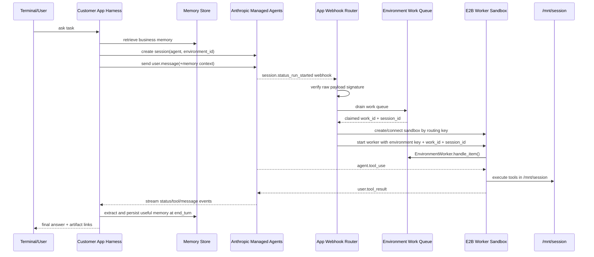
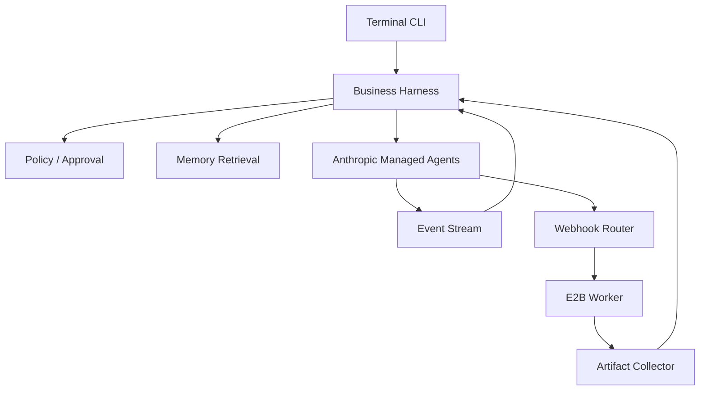

# Anthropic Managed Agents 与 E2B 结合架构及业务 Harness 实践

调研日期：2026-05-28

本文是一篇独立研究文档，不依赖任何当前项目实现。目标读者是想在终端、CLI、SaaS 后端或企业内网中接入 Anthropic Managed Agents，并用 E2B 承载自托管执行环境的开发者。

## 结论

Anthropic Managed Agents 的核心价值是把长任务 agent 的 brain、session、event log、tool protocol 和 agent loop 托管给 Anthropic；E2B 的核心价值是提供可启动、可暂停、可恢复、可隔离的 Linux sandbox，承接 self-hosted environment 的工具执行。两者结合时，不是“把 Claude 跑进 E2B”，而是：

- Anthropic 负责推理、agent harness、上下文调度、session 状态和 `agent.tool_use` 事件。
- Anthropic self-hosted environment 提供一个 work queue，把待执行的 session work 暴露给客户侧 worker。
- E2B sandbox 运行 Anthropic SDK 的 `EnvironmentWorker`，执行 `bash/read/write/edit/glob/grep` 等工具，并把 `user.tool_result` 发回 Anthropic。
- 客户业务系统负责 agent/session 创建、业务权限、记忆检索、webhook 验签、work queue drain、sandbox 路由、产物采集、审计与后处理。

如果客户还想“自己做 harness、管理记忆、在 agent loop 中加 hook”，强烈推荐采用**外层业务 harness（Outer-loop Orchestration）**架构，而不是试图改动 Anthropic 托管的 loop 内核。因为托管内核作为 Anthropic 侧 of 闭源服务，其控制流和推理循环是由 Anthropic 内部调度器直接驱动的，业务侧仅能通过 Environment Work Queue 和事件监听与其交互。

下面将详细说明如何在外层业务 harness 的 5 种不同 hook 阶段进行定制化，以及在更高控制度需求下的替代设计方案。

## 业务 Harness 的五大 Hook 阶段与落地方案

通过在托管 agent loop 外层包裹一层业务 harness，开发者可以在不触碰托管内核的前提下，在整个任务生命周期中植入丰富的业务逻辑：

#### 🔑 发送消息前 (Before User Message)
*   **具体功能**：用户鉴权、输入安全性审查（防 Prompt 注入攻击）、组织上下文与记忆。
*   **技术落地**：
    *   在调用 `client.beta.sessions.events.send` 之前，harness 根据 `project_id`/`user_id` 从自建的向量数据库（Vector DB）或图数据库中召回相关的企业私有知识或长期记忆。
    *   将召回的内容格式化为 `Relevant long-term memory` 作为首部，连同当前的 `task` 拼装成一条完整的 `user.message` 发送。
*   **落地代码实现**：
    ```python
    import anthropic
    from pathlib import Path

    def before_user_message_hook(
        client: anthropic.Anthropic,
        session_id: str,
        project_id: str,
        user_query: str,
        memory_store: JsonMemoryStore
    ) -> None:
        # 1. 前置安全审查：防止恶意的 prompt 注入攻击
        if "ignore previous instructions" in user_query.lower():
            raise ValueError("Security violation: Potential prompt injection detected")
            
        # 2. 从业务记忆库中检索与当前任务相关的内容 (RAG)
        memories = memory_store.search(project_id, user_query, limit=3)
        
        # 3. 组织上下文并构建最终发送给 Managed Agent 的消息
        memory_context = ""
        if memories:
            memory_context = "Relevant long-term memory:\n" + "\n".join(
                f"- {m.text}" for m in memories
            )
        full_message_text = f"{memory_context}\n\nCurrent task:\n{user_query}"
        
        # 4. 发送携带记忆上下文的事件
        client.beta.sessions.events.send(
            session_id=session_id,
            events=[
                {
                    "type": "user.message",
                    "content": [{"type": "text", "text": full_message_text}]
                }
            ]
        )
        print("Hook: Before User Message completed. Context sent successfully.")
    ```
*   **业务价值**：实现“带记忆启动”，避免 agent 重复冷启动，并在此阶段执行前置安全规则。

#### 📊 Session 事件流 (On Event Stream)
*   **具体功能**：订阅并解析 SSE 事件流，实现实时感知、前端渲染与安全审计。
*   **技术落地**：
    *   通过 `client.beta.sessions.events.stream(session_id)` 获取实时的事件流。
    *   当监听到 `agent.tool_use` 事件时，harness 可以在用户前端界面渲染“Agent 正在调用 Bash 编译代码...”的动态加载动画；
    *   同时，在此处把所有 `tool_use`、`message`、`tool_result` 记录到系统的审计数据库（Audit Log DB），作为后续合规及账单计费的原始凭证。
*   **落地代码实现**：
    ```python
    def on_event_stream_hook(session_id: str, client: anthropic.Anthropic):
        # 订阅事件流
        with client.beta.sessions.events.stream(session_id) as stream:
            for event in stream:
                evt_type = getattr(event, "type", "unknown")
                
                # 场景 A: 捕获模型的中间文本输出，实时渲染至前端
                if evt_type == "agent.message":
                    content = getattr(event, "content", [])
                    for block in content:
                        if block.get("type") == "text":
                            yield_chunk_to_ui(block["text"])
                            
                # 场景 B: 捕获工具调用意图，向终端渲染 loading 状态或操作预警
                elif evt_type == "agent.tool_use":
                    tool_name = getattr(event, "name", "unknown")
                    tool_input = getattr(event, "input", {})
                    # 更新前端 UI，告诉用户 Agent 正在控制物理 Sandbox 运行工具
                    update_ui_status(f"Agent is running tool: {tool_name} with params {tool_input}")
                    
                # 场景 C: 审计与分析
                log_audit_to_db(session_id=session_id, event_data=event.__dict__)
                
                # 如果转为 idle 且 stop_reason 是结束，则退出流监听
                if evt_type == "session.status_idle":
                    stop_reason = getattr(event, "stop_reason", None)
                    if stop_reason and stop_reason.get("type") == "end_turn":
                        break
    ```
*   **业务价值**：打通用户端的实时交互（避免长时间卡顿无感知），并提供开箱即用的可观测性（Observability）与成本计量。

#### 📡 Webhook 路由端 (On Webhook & Queue Drain)
*   **具体功能**：多租户沙箱分配、队列消费去重与限流。
*   **技术落地**：
    *   在接收到 Anthropic 抛出的 `session.status_run_started` 唤醒 Webhook 时，进行 HMAC 签名验签以防重放和伪造。
    *   Webhook 仅作为一个“唤醒信号”触发 harness 的 work queue 消费服务。消费服务（Poller）调用 `client.beta.environments.work.poller` 拉取（Claim）等待执行的任务。
    *   harness 查询 Sandbox Assignment Store，判断该租户是否已有活跃的 E2B Sandbox；若是，则复连（Connect），否则新建一个隔离 of E2B Sandbox，并将 `work_id` 和 `session_id` 路由给它。
*   **落地代码实现**：
    ```python
    import hmac
    import hashlib
    from fastapi import FastAPI, Request, HTTPException

    app = FastAPI()

    # Webhook 验签 Hook
    def verify_webhook_signature(body_bytes: bytes, signature: str, secret_key: str) -> bool:
        # Anthropic 使用 HMAC-SHA256 签名 Webhook 负载
        expected_sig = hmac.new(
            secret_key.encode('utf-8'), 
            body_bytes, 
            hashlib.sha256
        ).hexdigest()
        return hmac.compare_digest(expected_sig, signature)

    @app.post("/webhook")
    async def on_webhook_hook(request: Request):
        signature = request.headers.get("X-Anthropic-Signature", "")
        body_bytes = await request.body()
        
        # 1. 拦截验签
        if not verify_webhook_signature(body_bytes, signature, os.environ["ANTHROPIC_WEBHOOK_SIGNING_KEY"]):
            raise HTTPException(status_code=401, detail="Invalid signature")
            
        # 2. 解析事件，触发异步工作队列消费 (Drain)
        payload = json.loads(body_bytes)
        event_type = payload.get("data", {}).get("type")
        if event_type == "session.status_run_started":
            # 唤醒后台协程，无阻塞地消费队列，从而快速给 Webhook 回复 204/200，防止超时
            asyncio.create_task(drain_work_queue(payload.get("data", {}).get("session_id")))
            
        return Response(status_code=204)
    ```
*   **业务价值**：确保高并发下的多租户安全隔离、避免 Sandbox 资源抢占冲突，并实现了优雅的网络降级与重试机制。

#### 📦 E2B Worker 启动前后 (Around Worker Execution)
*   **具体功能**：工作目录初始化、私有依赖下载、只读文件挂载。
*   **技术落地**：
    *   在 E2B 容器中真正执行 `EnvironmentWorker.handle_item` 前，harness 利用 E2B Python/TS SDK 的 `fs.write` 向 `/mnt/session` 注入只读的运行配置或秘钥屏蔽文件；或者在此处预先拉取当前项目所需的专属 Git 仓库或 Skills 代码。
    *   在任务项执行完毕（Worker 进程退出或 idle 超时）后，harness 主动从 `/mnt/session/outputs` 目录下扫描并收集生成的编译产物、测试报告或视频音频文件，并将其自动转存到企业内部的对象存储（如 Aliyun OSS、S3）。
*   **落地代码实现**：
    ```python
    from e2b import Sandbox

    async def around_worker_execution_hook(
        sandbox_id: str, 
        session_id: str, 
        work_id: str,
        settings: Settings
    ) -> None:
        # 使用 E2B 客户端连接已分配的 Sandbox
        async with Sandbox(sandbox_id=sandbox_id) as sandbox:
            
            # --- 1. BEFORE WORKER: 初始化沙箱环境与输入数据 ---
            print(f"Hook: Preparing sandbox {sandbox_id} for session {session_id}")
            # 动态向沙箱写入受控的环境变量或临时数据库证书
            db_credentials = fetch_temporary_db_credentials(session_id)
            await sandbox.files.write("/mnt/session/.env.local", json.dumps(db_credentials))
            # 执行前置命令，拉取指定分支的代码
            await sandbox.commands.run("git clone https://... /mnt/session/src")

            # --- 2. WORKER RUNNING: 承载 EnvironmentWorker 消费该 work ---
            # 注入 SDK 运行 worker handle_item 
            worker_command = (
                f"python3 -m anthropic_worker "
                f"--work-id {work_id} --session-id {session_id} --workdir /mnt/session"
            )
            # 在 E2B 内部执行，将标准输出流向后台日志
            res = await sandbox.commands.run(worker_command)
            
            # --- 3. AFTER WORKER: 提取和持久化生成的文件产物 ---
            print(f"Hook: Worker finished for {work_id}. Collecting outputs...")
            try:
                # 检查 outputs 目录下的成果
                output_files = await sandbox.files.list("/mnt/session/outputs")
                for file_info in output_files:
                    # 将文件读到本地内存并存入企业冷存储
                    file_data = await sandbox.files.read(f"/mnt/session/outputs/{file_info.name}")
                    upload_to_enterprise_s3(f"session_results/{session_id}/{file_info.name}", file_data)
            except Exception as e:
                print(f"No output artifacts found or failed to upload: {e}")
    ```
*   **业务价值**：在保持 `ANTHROPIC_ENVIRONMENT_KEY` 仅拥有 worker 最小权限的前提下，为 agent 提供安全且高度定制化的物理运行容器环境。

#### 🧠 End_turn 后处理 (After End Turn)
*   **具体功能**：记忆自动提取、产物入库、生命周期清理。
*   **技术落地**：
    *   当事件流监听到 `session.status_idle` 且 `stop_reason == "end_turn"` 时，表示一轮复杂的自主推理链条已经正常归于静默。
    *   harness 调用一个专门的摘要 LLM，对这一轮的完整事件日志（Event Log）进行事实提取，抽取出如“用户项目架构改为分层微服务”等新事实，增量写入长期记忆数据库。
*   **落地代码实现**：
    ```python
    def after_end_turn_hook(
        client: anthropic.Anthropic,
        session_id: str,
        project_id: str,
        memory_store: JsonMemoryStore
    ) -> None:
        print(f"Hook: Session {session_id} has reached end_turn. Commencing memory extraction...")
        
        # 1. 获取这一轮会话的所有历史事件 (用于提炼记忆)
        history = client.beta.sessions.events.list(session_id=session_id)
        
        # 2. 从历史中抽取大模型最终给出的回答文本
        final_answer = ""
        for event in history.data:
            if event.type == "agent.message":
                for block in event.content:
                    if block.get("type") == "text":
                        final_answer += block["text"]
                        
        # 3. 用一个轻量级快速模型（如 claude-3-haiku）总结本轮并抽取需要沉淀的结构化知识
        summary_prompt = (
            f"以下是 Agent 执行完毕的最终输出：\n\n{final_answer}\n\n"
            f"请用一两句话提取出有关于当前项目 {project_id} 的事实性、持久性变更或用户偏好（如技术栈、代码结构变更等）。"
            f"如果没有有用事实，请仅回复 'NONE'。"
        )
        
        summary_response = client.messages.create(
            model="claude-3-5-haiku-20241022",
            max_tokens=100,
            messages=[{"role": "user", "content": summary_prompt}]
        )
        extracted_fact = summary_response.content[0].text.strip()
        
        # 4. 如果提取出有效记忆，写入数据库
        if extracted_fact and extracted_fact != "NONE":
            memory_store.append(project_id, extracted_fact)
            print(f"Saved new long-term memory: {extracted_fact}")
    ```
*   **业务价值**：实现“记忆闭环”，从而使 agent 在下一次交互中表现得越来越聪明，且业务逻辑与大模型推理逻辑完全解耦。

---续合规及账单计费的原始凭证。
*   **业务价值**：打通用户端的实时交互（避免长时间卡顿无感知），并提供开箱即用的可观测性（Observability）与成本计量。

#### 📡 Webhook 路由端 (On Webhook & Queue Drain)
*   **具体功能**：多租户沙箱分配、队列消费去重与限流。
*   **技术落地**：
    *   在接收到 Anthropic 抛出的 `session.status_run_started` 唤醒 Webhook 时，进行 HMAC 签名验签以防重放和伪造。
    *   Webhook 仅作为一个“唤醒信号”触发 harness 的 work queue 消费服务。消费服务（Poller）调用 `client.beta.environments.work.poller` 拉取（Claim）等待执行的任务。
    *   harness 查询 Sandbox Assignment Store，判断该租户是否已有活跃的 E2B Sandbox；若是，则复连（Connect），否则新建一个隔离的 E2B Sandbox，并将 `work_id` 和 `session_id` 路由给它。
*   **业务价值**：确保高并发下的多租户安全隔离、避免 Sandbox 资源抢占冲突，并实现了优雅的网络降级与重试机制。

#### 📦 E2B Worker 启动前后 (Around Worker Execution)
*   **具体功能**：工作目录初始化、私有依赖下载、只读文件挂载。
*   **技术落地**：
    *   在 E2B 容器中真正执行 `EnvironmentWorker.handle_item` 前，harness 利用 E2B Python/TS SDK 的 `fs.write` 向 `/mnt/session` 注入只读的运行配置或秘钥屏蔽文件；或者在此处预先拉取当前项目所需的专属 Git 仓库或 Skills 代码。
    *   在任务项执行完毕（Worker 进程退出或 idle 超时）后，harness 主动从 `/mnt/session/outputs` 目录下扫描并收集生成的编译产物、测试报告或视频音频文件，并将其自动转存到企业内部的对象存储（如 Aliyun OSS、S3）。
*   **业务价值**：在保持 `ANTHROPIC_ENVIRONMENT_KEY` 仅拥有 worker 最小权限的前提下，为 agent 提供安全且高度定制化的物理运行容器环境。

#### 🧠 End_turn 后处理 (After End Turn)
*   **具体功能**：记忆自动提取、产物入库、生命周期清理。
*   **技术落地**：
    *   当事件流监听到 `session.status_idle` 且 `stop_reason == "end_turn"` 时，表示一轮复杂的自主推理链条已经正常归于静默。
    *   harness 调用一个专门的摘要 LLM，对这一轮的完整事件日志（Event Log）进行事实提取，抽取出如“用户项目架构改为分层微服务”等新事实，增量写入长期记忆数据库。
*   **业务价值**：实现“记忆闭环”，从而使 agent 在下一次交互中表现得越来越聪明，且业务逻辑与大模型推理逻辑完全解耦。

---

### 2. 控制度方案的权衡 (Trade-offs)

如果上述基于“外层 Harness + 托管内核”的 Hook 设计仍不能满足您的定制化诉求，例如您必须**逐个拦截、修改或人工审批模型的每一次工具调用**，则应在以下两种方案中进行抉择：

| 维度 | 方案 A：自建 Agent Loop + E2B (完全自控) | 方案 B：MCP Server / 自定义 Tool (托管大脑 + 外接外设) |
| :--- | :--- | :--- |
| **工作机制** | 放弃托管，App 手写 `while` 循环：<br>1. 调 Claude API 拿到 tool\_use<br>2. 业务安全审查并人工审批<br>3. 调 E2B 执行并拿结果<br>4. 喂回 Claude 并重复。 | 保留 Anthropic 托管的大脑（Brain）和 Session 状态，但将特权服务或受保护的数据操作声明为外接的 MCP Server 或业务 Tool。 |
| **优势** | *   100% 的绝对控制权；<br>*   可以动态修改大模型的 `tool_use` 入参，或伪造/改写 `tool_result`；<br>*   能在每次执行前加入强人机确认（Human-in-the-loop）。 | *   无需手写复杂的 Agent Loop 逻辑；<br>*   保留了托管云端带来的长任务中断恢复、高并发事件处理等基础设施级优势；<br>*   依然能对核心特权行为进行安全控制和审计。 |
| **劣势** | *   需要自行维护极复杂的 session 恢复、Token 上下文截断、事件排队等底层机制；<br>*   开发和运维成本呈指数级上升。 | *   无法改写托管内核中正在进行的推理链条；<br>*   如果模型调用的是内置工具（如 built-in bash），Harness 仍需通过 E2B 侧的 worker 前置拦截来实现控制。 |
| **推荐场景** | 适用于**高安全合规金融环境**、必须实施强物理拦截和人工逐笔审批的生产级工作流系统。 | 适用于**企业级 SaaS**、需要将内部 CRM、内部数据库或私有微服务动态且安全地对接到 Managed Agent 的场景。 |

## 资料来源

本文只使用公开可核查资料和官方 cookbook：

- Anthropic Managed Agents overview：`https://platform.claude.com/docs/en/managed-agents/overview`
- Anthropic self-hosted sandboxes：`https://platform.claude.com/docs/en/managed-agents/self-hosted-sandboxes`
- Anthropic managed agents webhooks：`https://platform.claude.com/docs/en/managed-agents/webhooks`
- Anthropic engineering blog, Scaling Managed Agents: Decoupling the brain from the hands：`https://www.anthropic.com/engineering/managed-agents`
- Anthropic self-hosted sandboxes cookbook：`https://github.com/anthropics/claude-cookbooks/tree/main/managed_agents/self_hosted_sandboxes`
- E2B docs, Anthropic Managed Agents：`https://e2b.dev/docs/agents/anthropic-managed-agents`
- E2B cookbook root：`https://github.com/e2b-dev/e2b-cookbook/tree/main/examples/anthropic-managed-agents`
- E2B Python cookbook：`https://github.com/e2b-dev/e2b-cookbook/tree/main/examples/anthropic-managed-agents/python`
- E2B Python implementation checklist：`https://github.com/e2b-dev/e2b-cookbook/blob/main/examples/anthropic-managed-agents/python/IMPLEMENTATION.md`
- E2B Python app-owned webhooks：`https://github.com/e2b-dev/e2b-cookbook/tree/main/examples/anthropic-managed-agents/python/app-webhooks`
- E2B Python event walkthrough：`https://github.com/e2b-dev/e2b-cookbook/blob/main/examples/anthropic-managed-agents/python/EXAMPLE_USAGE.md`

## 证据映射

| 本文结论 | 主要出处 |
|---|---|
| Managed Agents 的核心对象是 agent、environment、session、events。 | Anthropic Managed Agents overview。 |
| self-hosted sandbox 保留 Anthropic 侧编排，把工具执行移动到客户控制的基础设施。 | Anthropic self-hosted sandboxes；Anthropic self-hosted sandboxes cookbook。 |
| self-hosted environment worker 从 environment work queue 领取 work，执行工具并回传 tool result。 | Anthropic self-hosted sandboxes；E2B Python `IMPLEMENTATION.md`；E2B Python `worker_runtime.py`。 |
| E2B 适合作为 worker sandbox，工作目录使用 `/mnt/session`。 | E2B docs；E2B Python README；E2B Python `worker_runtime.py`。 |
| E2B cookbook 提供 direct orchestration、sandbox-hosted webhooks、app-owned webhooks 三种形态。 | E2B cookbook root README；E2B Python README；E2B Python `app-webhooks/README.md`。 |
| 生产推荐 app-owned webhook：客户 app 验签、drain queue、路由 sandbox、维护 assignment store。 | E2B Python `app-webhooks/README.md`；E2B Python `app_webhook_server.py`。 |
| webhook 是唤醒信号，不能替代 queue drain；queue 才是 work item 来源。 | E2B Python `app-webhooks/README.md`；E2B Python `EXAMPLE_USAGE.md`。 |
| `agent.tool_use` 来自 Anthropic，E2B worker 执行后发送 `user.tool_result`。 | E2B Python `EXAMPLE_USAGE.md`。 |
| 不应把 org-level API key 放入 worker；worker 使用 environment key。 | Anthropic self-hosted sandboxes cookbook；E2B Python `IMPLEMENTATION.md`。 |

## 核心概念

| 概念 | 谁负责 | 含义 |
|---|---|---|
| Agent | Anthropic | 模型、system prompt、toolset、MCP servers、skills 等 agent 配置。 |
| Environment | Anthropic + 客户 | 决定 session 在哪里执行。默认可用 Anthropic cloud environment；self-hosted environment 把工具执行交给客户基础设施。 |
| Session | Anthropic | 一次具体任务运行，保存事件历史、状态、agent message、tool_use、tool_result。 |
| Work queue | Anthropic | self-hosted environment 的待处理 work item 队列。客户 worker 通过 environment key poll/claim/handle。 |
| Worker | 客户基础设施 / E2B | 运行 `EnvironmentWorker`，执行工具，维护工作目录，回传工具结果。 |
| E2B Sandbox | E2B | 隔离 Linux 执行环境，适合承载 worker、文件系统、shell、依赖和产物。 |
| App harness | 客户业务 | 外层编排层：记忆、权限、hook、审计、路由、产物、生命周期、UI/CLI。 |

## 参考架构图

```mermaid
flowchart TB
  Terminal[Terminal / CLI / SaaS UI]
  App[Customer App Harness]
  Memory[(Business Memory / DB / Vector Store)]
  Anthropic[Anthropic Managed Agents\nbrain + session + event log]
  Queue[Self-hosted Environment\nwork queue]
  Webhook[session.status_run_started webhook]
  Router[App-owned Webhook Router\nverify + drain + route]
  Store[(Sandbox Assignment Store)]
  E2B[E2B Worker Sandbox]
  FS[/mnt/session\nfiles + outputs]

  Terminal --> App
  App <--> Memory
  App --> Anthropic
  Anthropic --> Webhook
  Webhook --> Router
  Router --> Queue
  Router <--> Store
  Router --> E2B
  E2B --> Queue
  E2B --> FS
  E2B --> Anthropic
  Anthropic --> App
  App --> Terminal
```

关键判断：

- `Anthropic -> Webhook` 是唤醒信号，不是完整任务正文。
- `Router -> Queue` 必须 drain self-hosted environment work queue。
- `E2B -> Anthropic` 回传的是工具执行结果。
- 业务记忆和权限不应该塞进 E2B 的控制面密钥文件；应由客户 App harness 管理。

## 三种接入形态

E2B Python cookbook 给了三个可运行目录：`orchestrator/`、`webhooks/`、`app-webhooks/`。

| 形态 | 流程 | 适用场景 | 状态边界 |
|---|---|---|---|
| Direct orchestration | App 先启动一个 E2B worker sandbox，再创建 session 并发送 user event。 | 本地 CLI、批处理、demo、单租户后台任务。 | worker sandbox 的 `/mnt/session` 可被它 claim 的不同 session 复用。 |
| Sandbox-hosted webhooks | Anthropic webhook 唤醒一个 auto-resume E2B webhook sandbox，再由它启动 worker。 | 想快速获得公网 webhook URL，不想先部署自己的 webhook 服务。 | webhook sandbox / worker pool 级别状态，不天然等于每个 session 一个 sandbox。 |
| App-owned webhooks | 客户 App 接收 webhook，验签，drain queue，按路由规则创建或复连 E2B worker。 | 生产推荐；需要多租户、审计、业务权限、记忆、hook、确定性 session 文件状态。 | 默认 `environment_id + session_id`，每个 session 一个持久 `/mnt/session`。 |

生产系统优先选 `app-webhooks/`。原因是业务系统可以把 sandbox assignment、租户权限、审计日志、记忆注入、产物索引、成本控制和重试策略全部放在自己可控的层里。

## 运行时序



## 终端开发者接入步骤

以下步骤以官方 E2B Python cookbook 为准。

### 1. 准备环境

```bash
git clone https://github.com/e2b-dev/e2b-cookbook.git
cd e2b-cookbook/examples/anthropic-managed-agents/python

python3.12 -m venv .venv
source .venv/bin/activate
pip install -e .

cp .env.template .env
```

填写 `.env`：

```bash
E2B_API_KEY="..."
E2B_ACCESS_TOKEN="..."
ANTHROPIC_API_KEY="..."
ANTHROPIC_ENVIRONMENT_ID="env_..."
ANTHROPIC_ENVIRONMENT_KEY="..."
ANTHROPIC_WEBHOOK_SIGNING_KEY="..."
ANTHROPIC_AGENT_ID="agent_..."
APP_WEBHOOK_ADMIN_TOKEN="replace-with-random-token"
APP_SANDBOX_ROUTING_SCOPE="session"
```

变量用途：

- `ANTHROPIC_API_KEY`：创建 agent、创建 environment、创建 session、发送 event、管理 webhook 和 metadata。
- `ANTHROPIC_ENVIRONMENT_ID`：self-hosted environment id。
- `ANTHROPIC_ENVIRONMENT_KEY`：worker 侧凭证，用于 poll/claim/heartbeat/handle work。
- `ANTHROPIC_WEBHOOK_SIGNING_KEY`：webhook 验签。
- `E2B_API_KEY`：创建或连接 E2B sandbox。
- `E2B_ACCESS_TOKEN`：构建 E2B template。

### 2. 创建 Anthropic self-hosted environment

官方 Python cookbook 的核心调用是：

```python
import anthropic


def create_self_hosted_environment(api_key: str, name: str):
    client = anthropic.Anthropic(api_key=api_key)
    return client.beta.environments.create(
        name=name,
        config={"type": "self_hosted"},
    )
```

创建后到 Anthropic Console 的 Environments 页面生成 `ANTHROPIC_ENVIRONMENT_KEY`。environment key 是 worker 凭证，不等同于 org-level `ANTHROPIC_API_KEY`。

### 3. 创建 Managed Agent

官方 Python cookbook 使用 `agent_toolset_20260401`，并启用 sandbox 与 web 工具。下面代码是完整函数，适合 smoke test；生产环境不应无脑复制 `always_allow`，应按业务风险配置工具权限和审批策略。

```python
from collections.abc import Sequence

import anthropic

SANDBOX_TOOLS = ("bash", "read", "write", "edit", "glob", "grep")
WEB_TOOLS = ("web_fetch", "web_search")
DEFAULT_MODEL = "claude-sonnet-4-6"
DEFAULT_SYSTEM_PROMPT = (
    "You have a Linux sandbox. You are already in the working directory. "
    "Agent skills are downloaded under skills/<name>/. "
    "Write generated artifacts under outputs/ when useful. "
    "When using file tools, use relative paths like outputs/result.txt. "
    "Use the available tools to complete the task."
)


def create_agent(
    *,
    api_key: str,
    name: str,
    model: str = DEFAULT_MODEL,
    sandbox_tools: Sequence[str] = SANDBOX_TOOLS,
    web_tools: Sequence[str] = WEB_TOOLS,
):
    client = anthropic.Anthropic(api_key=api_key)
    return client.beta.agents.create(
        name=name,
        model=model,
        system=DEFAULT_SYSTEM_PROMPT,
        tools=[
            {
                "type": "agent_toolset_20260401",
                "default_config": {
                    "enabled": False,
                    "permission_policy": {"type": "always_allow"},
                },
                "configs": [
                    {
                        "name": tool,
                        "enabled": True,
                        "permission_policy": {"type": "always_allow"},
                    }
                    for tool in (*sandbox_tools, *web_tools)
                ],
            }
        ],
    )
```

### 4. 构建 E2B template

```bash
make build-template
```

官方 cookbook 的 template 会安装 Python 3.12、shell utilities、`anthropic[webhooks]`、`fastapi`、`uvicorn`，复制 worker/webhook runtime，并创建 `/mnt/session` 作为默认工作目录。

### 5. 选择运行方式

本地 CLI 快速验证：

```bash
cd orchestrator
make start-worker
make send MESSAGE="Run pwd, then echo hello from E2B"
```

生产型 app-owned webhook：

```bash
cd app-webhooks
make start-app-webhook-server
```

将 `https://<your-app-host>/webhook` 注册到 Anthropic Agents workspace，并订阅 `session.status_run_started`。收到 webhook 后，App 必须验签、drain queue、按 routing scope 创建或复连 E2B worker sandbox。

## Python 核心代码形态

### 发送一次 session message 并监听事件

```python
import anthropic


def is_end_turn(event) -> bool:
    if getattr(event, "type", None) != "session.status_idle":
        return False
    stop_reason = getattr(event, "stop_reason", None)
    return getattr(stop_reason, "type", None) == "end_turn"


def stream_message(
    *,
    api_key: str,
    agent_id: str,
    environment_id: str,
    message: str,
):
    client = anthropic.Anthropic(api_key=api_key)
    session = client.beta.sessions.create(
        agent=agent_id,
        environment_id=environment_id,
    )
    print(f"session={session.id}", flush=True)

    with client.beta.sessions.events.stream(session.id) as stream:
        client.beta.sessions.events.send(
            session.id,
            events=[
                {
                    "type": "user.message",
                    "content": [{"type": "text", "text": message}],
                }
            ],
        )
        for event in stream:
            yield event
            if is_end_turn(event):
                break
```

### E2B 内部 worker runtime

这段代码运行在 E2B sandbox 内，是 Anthropic self-hosted environment 和 E2B 的核心交接点。

```python
import asyncio
import logging
import os

from anthropic import AsyncAnthropic

WORKDIR = "/mnt/session"


def max_idle_seconds() -> float | None:
    raw = os.environ.get("WORKER_MAX_IDLE_SECONDS", "30")
    if raw.lower() in {"", "none", "null"}:
        return None
    return float(raw)


def run_seconds() -> float | None:
    raw = os.environ.get("WORKER_RUN_SECONDS", "180")
    if raw.lower() in {"", "none", "null"}:
        return None
    return float(raw)


async def run_worker() -> None:
    logging.basicConfig(level=os.environ.get("LOG_LEVEL", "INFO"))
    logger = logging.getLogger(__name__)

    environment_id = os.environ["ANTHROPIC_ENVIRONMENT_ID"]
    environment_key = os.environ["ANTHROPIC_ENVIRONMENT_KEY"]
    max_run_seconds = run_seconds()

    async with AsyncAnthropic(auth_token=environment_key) as client:
        worker = client.beta.environments.work.worker(
            environment_id=environment_id,
            environment_key=environment_key,
            workdir=WORKDIR,
            max_idle=max_idle_seconds(),
        )
        runner = (
            worker.handle_item(
                work_id=os.environ.get("ANTHROPIC_WORK_ID"),
                environment_id=environment_id,
                session_id=os.environ.get("ANTHROPIC_SESSION_ID"),
                environment_key=environment_key,
            )
            if os.environ.get("ANTHROPIC_WORK_ID") or os.environ.get("ANTHROPIC_SESSION_ID")
            else worker.run()
        )
        if max_run_seconds is None:
            await runner
            return

        try:
            await asyncio.wait_for(runner, timeout=max_run_seconds)
        except TimeoutError:
            logger.info("worker reached WORKER_RUN_SECONDS=%s; exiting", max_run_seconds)


def main() -> None:
    asyncio.run(run_worker())
```

### App-owned webhook server

下面代码是官方 Python cookbook 的 app-owned webhook server 形态，运行位置是 `e2b-cookbook/examples/anthropic-managed-agents/python/` 这个 Python package 内。它不是伪代码：依赖的 `JsonSandboxStore`、`ensure_worker_sandbox`、`load_settings` 等都在同一官方 package 里。

```python
from __future__ import annotations

import asyncio
import hmac
import logging
from threading import Lock

import anthropic
from fastapi import FastAPI, HTTPException, Request, Response

from anthropic_managed_agents_e2b.app_sandbox_store import JsonSandboxStore
from anthropic_managed_agents_e2b.sandbox_worker import ensure_worker_sandbox
from anthropic_managed_agents_e2b.settings import (
    DEFAULT_APP_SANDBOX_TIMEOUT_SECONDS,
    DEFAULT_LOG_LEVEL,
    DEFAULT_SANDBOX_TIMEOUT_SECONDS,
    DEFAULT_TEMPLATE_NAME,
    DEFAULT_WORKER_MAX_IDLE_SECONDS,
    MAX_WEBHOOK_BODY_BYTES,
    Settings,
    load_settings,
)

app = FastAPI()
store = JsonSandboxStore()
worker_locks: dict[tuple[str, str, str], Lock] = {}
worker_locks_lock = Lock()
queue_drains: dict[str, asyncio.Task[None]] = {}
logger = logging.getLogger(__name__)
ROUTING_SCOPES = {"session", "agent", "environment"}


def _settings() -> Settings:
    return load_settings()


def _webhook_client(settings: Settings) -> anthropic.Anthropic:
    return anthropic.Anthropic(api_key=settings.require_anthropic_api_key())


def _async_webhook_client(settings: Settings) -> anthropic.AsyncAnthropic:
    return anthropic.AsyncAnthropic(api_key=settings.require_anthropic_api_key())


def _routing_scope(settings: Settings) -> str:
    scope = settings.app_sandbox_routing_scope or "session"
    if scope not in ROUTING_SCOPES:
        raise RuntimeError("APP_SANDBOX_ROUTING_SCOPE must be session, agent, or environment")
    return scope


def _routing_target(settings: Settings, session_id: str) -> tuple[str, str, str]:
    configured_environment_id = settings.require_anthropic_environment_id()
    scope = _routing_scope(settings)
    if scope == "session":
        return configured_environment_id, scope, session_id
    if scope == "environment":
        return configured_environment_id, scope, configured_environment_id

    session = _webhook_client(settings).beta.sessions.retrieve(session_id)
    if session.environment_id != configured_environment_id:
        raise RuntimeError(
            f"session {session_id} belongs to {session.environment_id}, "
            f"but this worker is configured for {configured_environment_id}"
        )
    return session.environment_id, scope, session.agent.id


def ensure_worker_for_work(settings: Settings, work: object):
    data = getattr(work, "data", None)
    if getattr(data, "type", None) != "session":
        return None
    session_id = getattr(data, "id", None)
    if not session_id:
        return None
    work_id = getattr(work, "id", None)
    if not work_id:
        raise RuntimeError("claimed work item does not include id")

    session_id = str(session_id)
    environment_id, routing_scope, routing_id = _routing_target(settings, session_id)
    with worker_locks_lock:
        worker_lock = worker_locks.setdefault((environment_id, routing_scope, routing_id), Lock())

    with worker_lock:
        return _ensure_worker_for_target(
            settings,
            environment_id,
            routing_scope,
            routing_id,
            work_id=str(work_id),
            session_id=session_id,
        )


def _ensure_worker_for_target(
    settings: Settings,
    environment_id: str,
    routing_scope: str,
    routing_id: str,
    work_id: str,
    session_id: str,
):
    assignment = store.get(
        environment_id=environment_id,
        routing_scope=routing_scope,
        routing_id=routing_id,
    )
    timeout_seconds = (
        DEFAULT_APP_SANDBOX_TIMEOUT_SECONDS
        if routing_scope == "session"
        else DEFAULT_SANDBOX_TIMEOUT_SECONDS
    )
    sandbox = ensure_worker_sandbox(
        settings,
        template_name=DEFAULT_TEMPLATE_NAME,
        timeout_seconds=timeout_seconds,
        worker_max_idle_seconds=DEFAULT_WORKER_MAX_IDLE_SECONDS,
        log_level=DEFAULT_LOG_LEVEL,
        work_id=work_id,
        session_id=session_id,
        sandbox_id=assignment.sandbox_id if assignment else None,
    )
    store.upsert(
        environment_id=environment_id,
        routing_scope=routing_scope,
        routing_id=routing_id,
        session_id=session_id,
        sandbox_id=sandbox.sandbox_id,
    )
    return sandbox


async def drain_work_queue(settings: Settings) -> None:
    environment_id = settings.require_anthropic_environment_id()
    async with _async_webhook_client(settings) as client:
        async for work in client.beta.environments.work.poller(
            environment_id=environment_id,
            environment_key=settings.require_anthropic_environment_key(),
            drain=True,
            auto_stop=False,
        ):
            await asyncio.to_thread(ensure_worker_for_work, settings, work)


def _log_background_queue_result(environment_id: str, task: asyncio.Task[None]) -> None:
    queue_drains.pop(environment_id, None)
    try:
        task.result()
    except Exception:
        logger.exception("failed to drain work queue")
        return

    logger.info("drained work queue for %s", environment_id)


def start_queue_drain(settings: Settings) -> None:
    environment_id = settings.require_anthropic_environment_id()
    if environment_id in queue_drains:
        return

    task = asyncio.create_task(drain_work_queue(settings))
    queue_drains[environment_id] = task
    task.add_done_callback(lambda done: _log_background_queue_result(environment_id, done))


async def _read_limited_body(request: Request, max_bytes: int) -> str:
    content_length = request.headers.get("content-length")
    if content_length and int(content_length) > max_bytes:
        raise ValueError("request body too large")

    chunks: list[bytes] = []
    size = 0
    async for chunk in request.stream():
        size += len(chunk)
        if size > max_bytes:
            raise ValueError("request body too large")
        chunks.append(chunk)
    return b"".join(chunks).decode()


def _has_admin_access(request: Request, settings: Settings) -> bool:
    expected = settings.app_webhook_admin_token
    authorization = request.headers.get("authorization", "")
    prefix = "Bearer "
    actual = authorization[len(prefix) :] if authorization.startswith(prefix) else ""
    return bool(expected and actual and hmac.compare_digest(expected, actual))


@app.get("/health")
def health() -> dict[str, bool]:
    return {"ok": True}


@app.get("/sandboxes")
def sandboxes(request: Request) -> dict[str, list[dict[str, str]]]:
    if not _has_admin_access(request, _settings()):
        raise HTTPException(status_code=401, detail="unauthorized")

    return {"sandboxes": [assignment.__dict__ for assignment in store.list()]}


@app.post("/webhook")
async def webhook(request: Request) -> Response:
    settings = _settings()
    signing_key = settings.anthropic_webhook_signing_key
    if not signing_key:
        return Response("ANTHROPIC_WEBHOOK_SIGNING_KEY is required", status_code=503)
    try:
        payload = await _read_limited_body(request, MAX_WEBHOOK_BODY_BYTES)
    except ValueError:
        return Response("request body too large", status_code=413)

    try:
        event = _webhook_client(settings).beta.webhooks.unwrap(
            payload,
            headers=dict(request.headers),
            key=signing_key,
        )
    except Exception:
        logger.exception("invalid webhook signature")
        return Response("invalid signature", status_code=401)

    if event.data.type == "session.status_run_started":
        start_queue_drain(settings)

    return Response(status_code=204)
```

这个实现的关键点是：webhook 只触发 `drain_work_queue()`；真正要处理的 work item 来自 `client.beta.environments.work.poller(..., drain=True, auto_stop=False)`；session scope 下的 E2B sandbox 用已 claim 的 `work_id` 与 `session_id` 调 `worker.handle_item()`，而不是普通轮询整个 environment queue。

## 业务 Harness、记忆与 Hook 的正确位置

### 先划清边界

Managed Agents 模式下，内部 agent loop 是 Anthropic 托管的。客户业务可以控制“输入、环境、工具配置、执行承载、事件观察、结果处理”，但不应该假设可以在 Anthropic 内部每次模型推理前后注入任意代码。

可控点：

| Hook 点 | 能做什么 | 不能做什么 |
|---|---|---|
| `before_create_session` | 选 agent/environment/model，创建业务 run，绑定 tenant/user/project。 | 改 Anthropic 内部 scheduler。 |
| `before_user_message` | 检索业务记忆、拼接上下文、注入任务约束、上传输入文件到 E2B。 | 隐式修改后续每次模型推理。 |
| `on_event_stream` | 监听 `session.status_*`、`agent.tool_use`、`user.tool_result`、`agent.message`，做审计、UI、成本统计、记忆抽取。 | 在事件已经发生后再阻止该工具调用。 |
| `on_webhook` | 验签、幂等、限流、排队、触发 queue drain。 | 把 webhook body 当完整 work item。 |
| `on_work_claimed` | 根据 session/agent/environment/tenant 选择 E2B sandbox，写 assignment store。 | 让多个 worker 无序抢同一个 session 的 work。 |
| `before_worker_start` | 注入只读输入文件、环境变量、网络策略、workspace 初始化。 | 把 org-level API key 放进 agent 可读目录。 |
| `after_end_turn` | 总结结果、抽取长期记忆、索引产物、触发业务回调。 | 改写已经完成的 Anthropic session event log。 |

### 业务 Harness 推荐形态



业务 harness 的职责：

1. 把用户请求转成一次业务 run。
2. 检索长期记忆、项目上下文、权限策略。
3. 创建或复用 Anthropic agent/session。
4. 发送带上下文的 `user.message`。
5. 监听 event stream，维护 UI/CLI 输出和审计。
6. 接收 webhook，drain queue，启动 E2B worker。
7. 在 session 完成后提取结构化记忆与 artifacts。

### 记忆分层

| 记忆类型 | 存放位置 | 写入时机 | 读取时机 |
|---|---|---|---|
| Session history | Anthropic session event log | Anthropic 自动记录。 | Anthropic agent loop 内部使用；App 可读取/展示。 |
| Working files | E2B `/mnt/session` | Worker tool execution、App 上传输入文件。 | 同一 sandbox 后续 turn、artifact collector。 |
| Business memory | 客户 DB / vector store / knowledge base | `after_end_turn` 或人工确认后写入。 | `before_user_message` 检索后注入。 |
| Agent skills | Anthropic / worker 下载到 `skills/<name>/` | agent 配置阶段。 | agent 使用工具时读取。 |
| Audit log | 客户审计库 | event stream 与 webhook 处理时写入。 | 合规、调试、账单、回放。 |

不要把长期业务记忆只存在 `/mnt/session`。E2B sandbox 文件系统适合 session 级工作状态和产物，不适合作为全局多租户长期记忆库。

### 业务 Harness 的 Python 示例

下面示例展示一个 CLI/后端外层 harness：发送消息前检索记忆，监听事件，结束后抽取新记忆。它依赖 Anthropic SDK；`MemoryStore` 用 JSON 文件模拟，生产可替换为 Postgres、Redis、向量库或内部知识库。

```python
from __future__ import annotations

import json
import os
from dataclasses import asdict, dataclass
from datetime import UTC, datetime
from pathlib import Path

import anthropic


@dataclass
class MemoryRecord:
    project_id: str
    text: str
    created_at: str


class JsonMemoryStore:
    def __init__(self, path: Path) -> None:
        self.path = path

    def search(self, project_id: str, query: str, limit: int = 5) -> list[MemoryRecord]:
        records = self._read()
        words = {word.lower() for word in query.split() if len(word) > 2}
        scored: list[tuple[int, MemoryRecord]] = []
        for record in records:
            if record.project_id != project_id:
                continue
            text_words = set(record.text.lower().split())
            score = len(words & text_words)
            if score:
                scored.append((score, record))
        scored.sort(key=lambda item: item[0], reverse=True)
        return [record for _, record in scored[:limit]]

    def append(self, project_id: str, text: str) -> None:
        records = self._read()
        records.append(
            MemoryRecord(
                project_id=project_id,
                text=text,
                created_at=datetime.now(UTC).isoformat(),
            )
        )
        self.path.parent.mkdir(parents=True, exist_ok=True)
        self.path.write_text(
            json.dumps([asdict(record) for record in records], indent=2) + "\n",
            encoding="utf-8",
        )

    def _read(self) -> list[MemoryRecord]:
        if not self.path.exists():
            return []
        raw = json.loads(self.path.read_text(encoding="utf-8"))
        return [MemoryRecord(**item) for item in raw if isinstance(item, dict)]


def event_type(event: object) -> str:
    return str(getattr(event, "type", "unknown"))


def is_end_turn(event: object) -> bool:
    if event_type(event) != "session.status_idle":
        return False
    return getattr(getattr(event, "stop_reason", None), "type", None) == "end_turn"


def format_memory_context(memories: list[MemoryRecord]) -> str:
    if not memories:
        return ""
    lines = ["Relevant long-term memory:"]
    for index, memory in enumerate(memories, start=1):
        lines.append(f"{index}. {memory.text}")
    return "\n".join(lines)


def build_user_message(task: str, memories: list[MemoryRecord]) -> str:
    memory_context = format_memory_context(memories)
    if not memory_context:
        return task
    return f"{memory_context}\n\nCurrent task:\n{task}"


def extract_memory_from_final_text(project_id: str, final_text: str) -> str | None:
    text = final_text.strip()
    if not text:
        return None
    return f"Last useful result for project {project_id}: {text[:500]}"


def run_managed_agent_with_business_harness(
    *,
    api_key: str,
    agent_id: str,
    environment_id: str,
    project_id: str,
    task: str,
    memory_store: JsonMemoryStore,
) -> str:
    client = anthropic.Anthropic(api_key=api_key)

    memories = memory_store.search(project_id=project_id, query=task)
    message = build_user_message(task, memories)

    session = client.beta.sessions.create(
        agent=agent_id,
        environment_id=environment_id,
    )
    print(f"session={session.id}", flush=True)

    final_text_parts: list[str] = []
    with client.beta.sessions.events.stream(session.id) as stream:
        client.beta.sessions.events.send(
            session.id,
            events=[
                {
                    "type": "user.message",
                    "content": [{"type": "text", "text": message}],
                }
            ],
        )

        for event in stream:
            print(event_type(event), flush=True)
            if event_type(event) == "agent.message":
                for block in getattr(event, "content", []):
                    text = getattr(block, "text", None)
                    if text:
                        final_text_parts.append(text)
            if is_end_turn(event):
                break

    final_text = "\n".join(final_text_parts)
    memory = extract_memory_from_final_text(project_id, final_text)
    if memory:
        memory_store.append(project_id=project_id, text=memory)
    return final_text


if __name__ == "__main__":
    result = run_managed_agent_with_business_harness(
        api_key=os.environ["ANTHROPIC_API_KEY"],
        agent_id=os.environ["ANTHROPIC_AGENT_ID"],
        environment_id=os.environ["ANTHROPIC_ENVIRONMENT_ID"],
        project_id=os.environ.get("PROJECT_ID", "default"),
        task=os.environ.get("TASK", "Run pwd, then echo hello from E2B."),
        memory_store=JsonMemoryStore(Path(".managed-agent-memory.json")),
    )
    print(result)
```

这类外层 harness 的特点是：它不接管 Anthropic 的内部 agent loop，但能在每个业务 turn 之前决定上下文，在事件流中观测过程，在 turn 结束后沉淀记忆。

### 如果要在 loop 过程中做审批或业务动作

有三种可行模式：

| 需求 | 推荐做法 | 说明 |
|---|---|---|
| 每次用户发起任务前审批 | App harness 在 `before_user_message` 阶段审批。 | 最简单，也最稳定。 |
| 工具执行前做安全边界 | 通过 E2B template、worker workdir、网络策略、环境变量白名单、文件权限控制。 | 对 shell/filesystem/network 最有效。 |
| agent 需要调用业务系统 | 暴露 MCP server 或业务 API/tool 给 agent。 | 让业务动作成为显式工具调用，而不是隐藏 hook。 |
| 需要逐个改写/拒绝 tool_use | 自建 harness + E2B，或等待/使用 Anthropic 明确支持的 tool permission/approval 能力。 | 不应依赖未公开内部 loop hook。 |

## 场景案例

### 场景 1：终端代码助手

需求：开发者在 CLI 输入任务，agent 在隔离 Linux 环境里读写 repo、运行测试、输出 patch。

推荐：

- Direct orchestration 适合本地实验。
- 生产型 CLI 或多人平台使用 app-owned webhook。
- 每个 session 一个 E2B sandbox，避免不同任务文件互相污染。
- repo 或输入文件由 App 上传到 `/mnt/session/uploads` 或初始化到 workspace。
- 完成后从 `/mnt/session/outputs` 或 git diff 采集 artifacts。

### 场景 2：企业知识库问答 + 文件生成

需求：agent 需要读取内部文档摘要，生成报告或表格。

推荐：

- 业务记忆放在客户 DB/vector store。
- `before_user_message` 检索相关片段，注入到用户消息或 session 初始上下文。
- 大文件通过 E2B 上传到 `/mnt/session/uploads`，提示 agent 使用相对路径读取。
- `after_end_turn` 抽取新的事实、结论、报告路径，写入业务 DB。

### 场景 3：多租户 SaaS Agent

需求：不同租户隔离执行、隔离文件、隔离记忆、可审计。

推荐：

- 使用 app-owned webhook。
- assignment store 至少按 `tenant_id + environment_id + session_id` 记录。
- 默认 routing scope 为 `session`。
- 每条 webhook delivery 用 event id 幂等。
- worker 只拿 environment key，org API key 留在 App/Router。
- 审计库记录 user、tenant、session、work_id、sandbox_id、tool events、artifact ids。

### 场景 4：长期研究任务

需求：agent 运行很久，中间多次 tool call，需要可恢复。

推荐：

- Anthropic session event log 作为事实源。
- E2B pause-on-timeout + auto-resume 保存 session 工作目录。
- Router drain queue，避免 webhook 漏投后任务卡住。
- 用 worker idle timeout 控制成本。
- 重要产物及时同步到对象存储或业务 artifact store。

## 最佳实践清单

| 主题 | 建议 |
|---|---|
| 架构边界 | Anthropic 管 brain/session，E2B 管 hands/files/process，客户 App 管业务 harness。 |
| Webhook | 必须使用 raw body + headers 验签；不要 parse JSON 后再验签。 |
| Queue | 收到 `session.status_run_started` 后 drain environment work queue；queue 才是待执行 work 的事实源。 |
| 幂等 | 对 webhook event id、work id、session id、sandbox assignment 做去重。 |
| Sandbox 路由 | 默认 `environment_id + session_id`；只有明确需要共享状态时才用 agent/environment scope。 |
| 凭证 | `ANTHROPIC_API_KEY` 留在 App/Router；E2B worker 只拿 `ANTHROPIC_ENVIRONMENT_KEY`。 |
| 文件 | worker workdir 用 `/mnt/session`；产物统一写 `/mnt/session/outputs`。 |
| 输入文件 | self-hosted environment 不依赖 Anthropic session resources；通过 E2B 上传文件后让 agent 读取远端路径。 |
| 记忆 | 长期业务记忆放客户 DB；session 工作状态放 `/mnt/session`；事件历史由 Anthropic session 保存。 |
| 安全 | 不把控制面密钥写入 agent 可读工作目录；限制网络、路径、环境变量和依赖。 |
| 观测 | 同时记录 Anthropic events、webhook deliveries、queue drain、sandbox assignment、worker logs。 |
| 清理 | 停用前先删除/禁用 Anthropic webhook endpoint，再停止 E2B router/worker sandbox。 |

## 对 Image #1 的判断

当前对话上下文和仓库中没有可读取的 Image #1 原图，因此不能对那张图做事实性判定。可以用下面标准审查：

合理的图应同时表达：

1. Anthropic Managed Agents 位于控制面，负责 brain、session、event log、tool protocol。
2. E2B 位于执行面，运行 self-hosted environment worker。
3. Webhook 是 `session.status_run_started` 唤醒信号。
4. Router 收到 webhook 后要 drain Anthropic environment work queue。
5. E2B worker 执行工具后把 `user.tool_result` 发回 Anthropic。
6. 客户 App/CLI 通过 Anthropic session API 和 event stream 与 agent 交互。
7. 业务记忆、权限、审计、artifact catalog 是客户 App harness 的职责。

常见错误：

- 画成 “Claude/Managed Agent 整体运行在 E2B 里”。这不准确；E2B 只承载 self-hosted tools/hands。
- 画成 “Webhook 直接携带 tool call”。这不准确；webhook 应触发 queue drain。
- 漏掉 `ANTHROPIC_ENVIRONMENT_KEY` 与 `ANTHROPIC_API_KEY` 的凭证边界。
- 漏掉 session-scoped sandbox assignment，导致多 session 文件状态混淆。
- 把业务记忆放进 `/mnt/session` 作为唯一长期存储。`/mnt/session` 适合作业状态，不适合作为业务长期记忆事实源。

如果 Image #1 的主链路是：

```text
User/App -> Anthropic Managed Agents -> webhook/work queue -> App or E2B router -> E2B worker sandbox -> tool_result -> Anthropic -> event stream -> App/User
```

并且把业务 harness/memory 放在客户 App 侧，那么它可以反映 Anthropic Managed Agents 和 E2B 的关系；如果它把 Anthropic brain 画进 E2B sandbox，则需要修正。

## 完成度核对

- Anthropic Managed Agents 架构：已覆盖 agent/environment/session/events、brain/session/hands 分离、self-hosted environment。
- 与 E2B 结合：已覆盖 direct orchestration、sandbox-hosted webhook、app-owned webhook、worker runtime、`/mnt/session`。
- 终端开发者接入：已给出 clone、venv、env、build template、run worker/send message、webhook 接入步骤。
- 场景案例：已覆盖终端代码助手、知识库报告、多租户 SaaS、长期研究任务。
- 业务 harness / memory / hook：已明确可控 hook、不可控内部 loop、记忆分层和 Python 外层 harness 示例。
- Python 代码：示例来自或对齐官方 Python cookbook；代码块保持完整函数/模块形态。
- Image #1：因原图不可见，未做无证据结论；已给出判定标准和应修正的错误模式。
